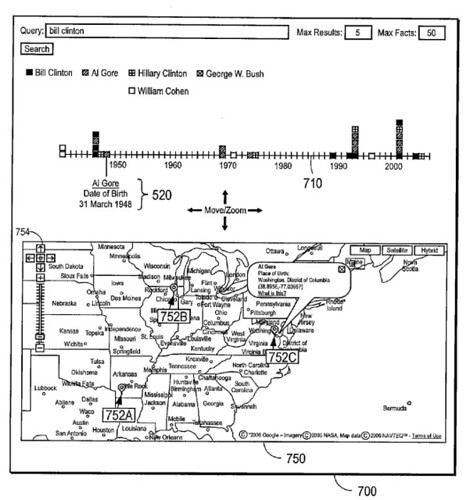
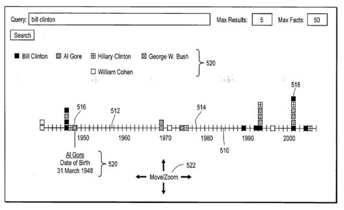

Sometimes a list of search results isn’t always the best way to present information found in a search.

Google has recently come up with a couple of other interesting ways to show results related to a query, that might make you reconsider how you present dates and addresses on the pages of your website.

A map pointing out different facts related to a query might provide some interesting results:

Likewise, a timeline could show you some things that you might not expect to see from a search engine, especially if the facts used in response to the query came from different web pages:

You can see something similar to these in action at [Google Labs Experimental Page](http://web.archive.org/web/20120523120019/http://www.google.com/experimental/), which currently shows off Timelines and Map View Searches.

A patent application from Google, published this week, describes a way of presenting search results in a timeline and in a map – [Displaying Facts on a Linear Graph](http://appft1.uspto.gov/netacgi/nph-Parser?Sect1=PTO2&Sect2=HITOFF&u=%2Fnetahtml%2FPTO%2Fsearch-adv.html&r=1&p=1&f=G&l=50&d=PG01&S1=20070179952.PGNR.&OS=dn/20070179952&RS=DN/20070179952).

The abstract from the filing may go beyond timelines and maps, but it mentions both types of displays explicitly:

> A set of objects having facts is established. Facts of objects having positions in a order are identified. Some facts explicitly describe the positions in the linear order, while are facts do not explicitly describe the positions. The facts are presented in the order on a linear graph, such as a timeline. Facts of the objects describing geographic positions are presented on a map.

It has me wondering what the next step might be past Universal Search. How might data from Web pages and other sources be visualized in different ways on a computer in the future? What is the best way to present some information, so that the person looking for it might have a great experience?

Google timelines may possibly make a biographical search much more interesting than a list of links to pages, and being able to see financial information and stock prices over time may also be enlightening if were presented graphically.

Having the ability to map out information about World War II by gathering information from multiple web sites that present information about the war over different periods of time may be beneficial if that information was presented in a “single, easy to understand format.”

To quickly summarize this method, it finds relevant facts across web pages that it can relate to values like time so that it can display those in a linear manner.

**Google Janitors and Fact Repositories**

I wrote a post not long ago about some of the programs that Google might use to make sense of data when it takes facts and tries to include them in a repository of data. Those programs are referred to by Google as [janitors](https://www.seobythesea.com/2007/06/google-janitors-clean-up-facts-on-the-web/), and they play a role in organizing and cleaning up the information to be gathered in the creation of visual graphs like the one described here.

The short version of this approach is that as facts are taken from web pages, to be included in the data repository that will be used to make graphs, the information is cleaned up, duplicates are removed, data is standardized and normalized so that different versions (birthplace, birthplace, place of birth, etc.) of the same information isn’t repeated, and other actions are taken to make the data included useful.

Follow my “janitor” link above, if you haven’t, for some examples of the different functions that those programs may perform.

**Determining Relevance for Facts**

If you searched for [world war II], which facts would be shown on a timeline? Which wouldn’t? A determination of which facts were the most relevant would be made to decide what to show. The patent application provides some insight into those decisions.

Facts that describe specific entities (people, places, events, etc.) are assigned object IDs that go with those entities. The ranking score for an object is a linear combination of relevance scores for each of the facts.

Facts can be broken down into attributes (a classification of different types of information that can be associated with a fact), and the values of those attributes. An attribute for a person might be “birthplace,” and the value that goes with it might be where that person was born.

**The relevance score for each fact is based on whether the fact includes one or more query terms (a hit) in either the attribute or value portion of the fact.**

The patent tells us that each of those hits is scored based on the frequency of the term that is hit, with more common terms getting lower scores, and rarer terms getting higher scores (e.g., using a [TD-IDF](http://web.archive.org/web/20090622032029/http://www.db.dk:80/bh/Core%20Concepts%20in%20LIS/articles%20a-z/tf_idf.htm) based term weighting model).

The fact score would then be adjusted based on some additional factors such as:

- The appearance of consecutive query terms in a fact,
- The appearance of consecutive query terms in a fact in the order in which they appear in the query,
- The appearance of an exact match for the entire query,
- The appearance of the query terms in the name fact (or other designated fact, e.g., property or category), and;
- The percentage of facts of the object containing at least one query term.

Each fact’s score would also be adjusted by its associated confidence measure and by its importance measure.

Confidence level — the likelihood that the fact is correct.

Importance level — the relevance of the fact to the object, compared to other facts for the same object.

This patent application doesn’t go into much more detail over how the confidence level and the importance level are calculated.

**Google Timelines Conclusion**

More and more services from Google involve the extraction of facts from pages and their display in ways that don’t immediately lead people to go to specific web pages to review the results of their search.

In [Local Search](https://www.seobythesea.com/2007/03/google-local-search-glossary/), business information tied to locations is the payoff for this kind of data extraction. In [Definitions](https://www.seobythesea.com/2006/02/google-definitions/) and [Question Answering](https://www.seobythesea.com/2007/01/google-qa-patent-applications/) results from Google, definitions and answers are provided without a real need to see the source of those results.

The Google Timelines and Map searches do provide reasons to click through to find out more about the facts cited. Will search interfaces like this cause you to think about how you present dates and locations on your web site?
