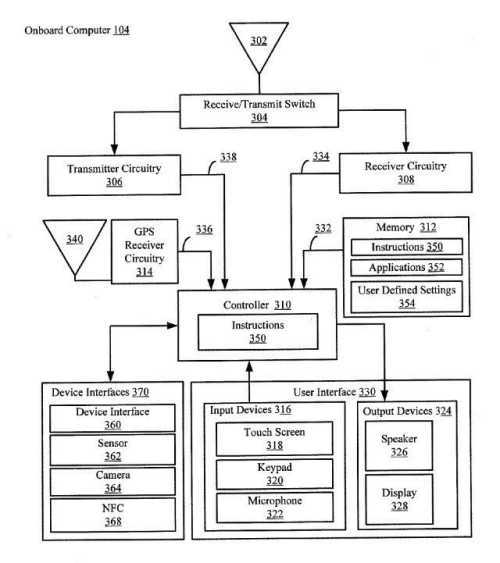
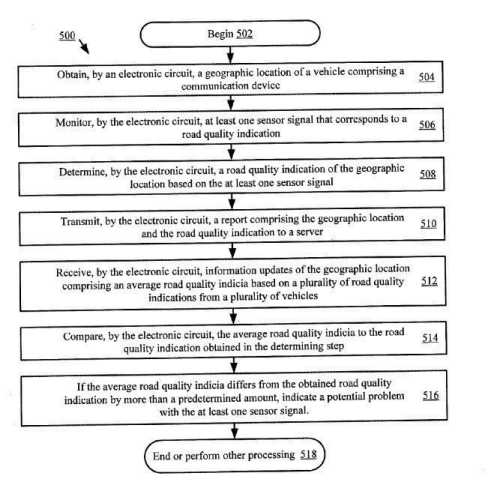

## Sensors and Road Quality

We’ve all read about Google building self-driving cars. I’ve written about Google building Maps programs to help people navigate to different places.

A Google patent application published this week looks closer at computers in cars and the many sensors connected to those. It discusses automotive computing systems that include such things as:

> … network-based applications including navigation, voice search, media streaming capabilities, and the like.

The road quality patent mentions On board diagnostics (OBD) standards in the automotive industry available with engine computer systems in the 1980s.

The patent discusses sensor systems within cars and how those are monitored. It tells us one of the failings of such systems is that information collected by vehicles doesn’t allow for that data to be aggregated across more than one vehicle.

There are diagnostic sensors that could be used to collect data quality information, but in a way that would make collecting data about many routes difficult, and the patent tells us it “would require such substantial resources as to be impractical.”

The Google patent describes an approach for “monitoring vehicle sensors to determine and report road quality using a communication device including an electronic circuit is provided.” This device might be built to a vehicle’s radio system and might use a GPS-enabled system that worked with mapping software.

The monitoring of road quality could be done using sensors, such as a sensor added to the shock absorbers of cars, or with a “vertical displacement sensor present in the head unit.” Other sensors might also be used and monitored and then analyzed to judge the quality of roads by vertical vibration. This information could then be used to help produce road quality reports and to “improve driving directions in mapping software.”

_A fairly complex networked system with different sensor devices could be involved in this system._

The road quality patent is:

[Systems and Methods for Monitoring and Reporting Road Quality](http://appft.uspto.gov/netacgi/nph-Parser?Sect1=PTO1&Sect2=HITOFF&d=PG01&p=1&u=%2Fnetahtml%2FPTO%2Fsrchnum.html&r=1&f=G&l=50&s1=%2220150183440%22.PGNR.&OS=DN/20150183440&RS=DN/20150183440)
Invented by Dean K. Jackson
Assigned to: Google
US Patent Application 20150183440
Published July 2, 2015
Filed: January 31, 2012

Abstract

> Systems and methods for monitoring vehicle sensors to determine and report road quality using a communication device are disclosed.
>
> The communication device determines the vehicle’s location on the road, such as using a GPS-enabled head unit or similar device and appropriate mapping software. Monitoring road quality may be achieved by adding a sensor to the shocks, using a vertical displacement sensor present on the head unit, and the like. Various combinations of sensors may be employed. For example, a horizontal displacement sensor may be used. The signals from the sensors are monitored by the head unit and analyzed to judge the quality of the road by the amount of vertical vibration that is encountered.
>
> Together with the vehicle’s location, this data may be transmitted through a mobile network to a central server for distribution in road quality reports and to improve driving directions in mapping software.

## Take-Aways

Some Google patents fall completely outside of the search scope but give us some hints at capabilities that they might have and describe things that they might do. For example, I’ve seen many Google patent filings about Google Maps and automobiles and will be writing about some of those in days to come.

The patent provides more details about On-Board Computer Systems More Complicated GPS systems and how such information might be built into mapping software.

The types of sensors built into such a system can include:

- Vertical displacement sensors
- Motion sensors
- An accelerometer
- An altimeter
- A velocity sensor and/or
- gyroscope

That seems not too different from the list of sensors that I’ve seen described as being built into smartphones.

Google is collecting a lot of information about roadways, and it’s not clear that they are doing this only to make roads safer for their self-driving cars.

There have been many patents involving Google Mapping software; the purpose of this one, to monitor and track the quality of roads, was a little surprising.

