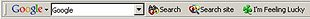
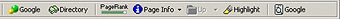
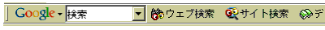
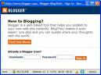
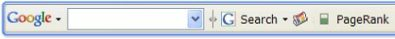

A new patent application came out last week for the “send to” function for email, IM, and blog posts on Google’s toolbar. It inspired me to take a look back at the history of the Google Toolbar.

*December 11, 2000* — [Google Launches The Google Toolbar](http://googlepress.blogspot.com/2000/12/google-launches-google-toolbar.html)

This first version of the Google toolbar let people search sites and the Web, find the location of search terms on pages, highlight those search terms, access cached versions pages, search for related pages, and view the toolbar PageRank for pages.

*December 11, 2000* — [Google product tracker could raise privacy concerns](https://www.cnet.com/news/google-product-tracker-could-raise-privacy-concerns/)

As the first version of the Google toolbar was released, privacy concerns were raised about the ability of the toolbar to track the travels of its users across the Web. Of course, for the PageRank function to work, the Google toolbar needed to secure information from a distant server to find the score of a page.

*March 15, 2002* — The Google Toolbar: a translator’s tool? (link no longer available)

I found this page from the Japan Association of Translators, which described some ways that their members were using the Google toolbar. It shows a Japanese version of the toolbar, which I thought was interesting. This was before a translation tool was built into the toolbar.

*March 21, 2002* — [Google ushers Web surfers into its labs](https://www.cnet.com/news/google-ushers-web-surfers-into-its-labs/)

I didn’t remember Google Labs launching back in 2002 and didn’t recall the Google Toolbar Experimental page, which is a place where experimental functions for the Google toolbar are available.

*March 22, 2002* — [Google takes on supercomputing](https://www.cnet.com/news/google-takes-on-supercomputing/)

A specialized version of the Google toolbar allowed people to donate computing cycles from their computers to the Folding@home project at Stanford University, benefitting many scientific and charitable endeavors.

*June 23, 2003* — [Google Toolbar ‘BlogThis’ Rankles Rivals](http://www.internetnews.com/dev-news/article.php/2228651)

The Beta version of the Google toolbar (2.0) allowed bloggers to press a button, and open a “blogthis” window, which would include a link to the page a browser was on when the button was pressed. Google had purchased Pyra Labs months earlier, and their Blogger software. I probably used this feature of the toolbar more than any other for a couple of years after it was introduced.

*June 26, 2003* — [Google tweaks toolbar to block pop-ups](https://www.cnet.com/news/google-tweaks-toolbar-to-block-pop-ups/)

New features of Version 2.0 of the Google toolbar also included a popup blocker to stop pop-up ads and an autofill button which can automatically fill out sections of Web forms with information stored locally on a user’s computer

*August 13, 2003* — [Google Adds New Features to Search Toolbar](http://googlepress.blogspot.com/2003/08/google-adds-new-features-to-search.html)

This press release not only told us about the new features of the Version 2.0 toolbar, but also informed us of some other new features from Google:

- Calculator
- Google News Alerts
- Tilde ~ Operator
- Advanced News Search

*July 15, 2004* — [Google Toolbar Can Browse By Name](https://www.eweek.com/enterprise-apps/google-toolbar-can-browse-by-name)

The [browse by name](http://toolbar.google.com/bbn_help.html) feature of the Google toolbar allows you to enter some words into your browser’s address bar, and if there is a domain name associated with those words, the browser will bring you to that page. While you enter words into the address bar instead of the toolbar, the way to turn this on and off is through the toolbar settings.

*February 16, 2005* — [Google Toolbar 3.0](http://googlepress.blogspot.com/2005/02/google-toolbar-30_16.html)

Adds a translation tool, an auto-link feature, and an integrated spell checker in this Beta version of Google toolbar 3.0.

*February 18, 2005* — [Google toolbar move raises online ire](https://www.cnet.com/news/google-toolbar-move-raises-online-ire/)

The auto-link feature wasn’t well received.

*July 7, 2005* — [Google to release Firefox toolbar](https://www.cnet.com/news/google-to-release-firefox-toolbar/)

After an Internet Explorer only version of the Google toolbar had been around for four years, Google announced that they would release a Firefox version.

*September 22, 2005* — [New, improved, and out of beta](https://googleblog.blogspot.com/2005/09/new-improved-and-out-of-beta_22.html)

While Firefox users had to wait so long, when the Firefox toolbar came it, it had a couple of Firefox-only features: [Google Suggest](https://support.google.com/websearch/answer/106230?hl=en), and a menu allowing people to customize icons on the toolbar.

*January 30, 2006* — [All buttoned up](https://googleblog.blogspot.com/2006/01/all-buttoned-up.html)

The announcement on the Official Google Blog, about the planned release of version 4.0 of the Google toolbar, included a hint of new features – custom buttons, and new looking versions of the bookmarking and Send-To interfaces.

*April 6, 2006* — [Toolbar v2 for Firefox fans](https://googleblog.blogspot.com/2006/04/toolbar-v2-for-firefox-fans.html)

Feeds (and feed integration with the Google personalized page), and safe browsing to fight phishing, were the major new features for this version of the Firefox toolbar.

*May 31, 2006* — [Mark this for future reference](https://googleblog.blogspot.com/2006/05/mark-this-for-future-reference.html)

The enhanced Search Box that I wrote about yesterday was added in this toolbar beta of Version 4.0 of the toolbar.

*June 7, 2006* — [Get in sync](https://googleblog.blogspot.com/2006/06/get-in-sync.html)

Version 2 of the Google Toolbar for Firefox came out of Beta, and [Google Browser Sync](https://web.archive.org/web/20190521053839/http://www.google.com/tools/firefox/browsersync/index.html) was released.

*December 12, 2006* — [Nifty Toolbar upgrades for Firefox](https://googleblog.blogspot.com/2006/12/nifty-toolbar-upgrades-for-firefox_12.html)

Functions added to the IE version – bookmarks, custom buttons, and the “send to” function for email and IM and Blogger – were incorporated into the Firefox version. And a unique Firefox feature, the ability to open Google Docs & Spreadsheets documents in the browser. The toolbar is made available in 26 languages.

*April 17, 2007* — [Searching without a query](https://googleblog.blogspot.com/2007/04/searching-without-query.html)

A recommendation button is added to the Google toolbar, looking like a pair of dice. These recommendations are based on Google’s Search History (Web history).

**Patents and patent applications**

Google has many granted patents and pending patent applications that appear to describe several features of the Google toolbar. These were the ones that I was able to find:

*December 13, 2000* — [Systems and methods for highlighting search results](http://patft.uspto.gov/netacgi/nph-Parser?Sect1=PTO2&Sect2=HITOFF&u=%2Fnetahtml%2FPTO%2Fsearch-adv.htm&r=1&p=1&f=G&l=50&d=PTXT&S1=6,839,702.PN.&OS=pn/6,839,702&RS=PN/6,839,702). Published on January 4, 2005.

*April 9, 2002* — [Method of spell-checking search queries](https://patents.google.com/patent/US7194684B1/en). Published March 20, 2007

*December 3, 2003* — [Methods and systems for personalized network searching](http://appft1.uspto.gov/netacgi/nph-Parser?Sect1=PTO2&Sect2=HITOFF&u=%2Fnetahtml%2FPTO%2Fsearch-adv.html&r=1&p=1&f=G&l=50&d=PG01&S1=20050131866.PGNR.&OS=dn/20050131866&RS=DN/20050131866). Published June 16, 2005. Bookmark manager.

*June 22, 2004* — [Anticipated query generation and processing in a search engine](http://appft1.uspto.gov/netacgi/nph-Parser?Sect1=PTO1&Sect2=HITOFF&d=PG01&p=1&u=%2Fnetahtml%2FPTO%2Fsrchnum.html&r=1&f=G&l=50&s1=%2220050283468%22.PGNR.&OS=DN/20050283468&RS=DN/20050283468). Published December 22, 2005. Google suggest

*November 12, 2004* — [Method and system for autocompletion for languages having ideographs and phonetic characters](http://appft1.uspto.gov/netacgi/nph-Parser?Sect1=PTO1&Sect2=HITOFF&d=PG01&p=1&u=%2Fnetahtml%2FPTO%2Fsrchnum.html&r=1&f=G&l=50&s1=%2220060106769%22.PGNR.&OS=DN/20060106769&RS=DN/20060106769). Published May 18, 2006. Google suggest in different alphabets.

*December 14, 2004* — [Providing useful information associated with an item in a document](http://appft1.uspto.gov/netacgi/nph-Parser?Sect1=PTO2&Sect2=HITOFF&u=%2Fnetahtml%2FPTO%2Fsearch-adv.html&r=1&f=G&l=50&d=PG01&p=1&S1=20060129910&OS=20060129910&RS=20060129910). Google’s Autolink patent application, published June 15, 2006.

*December 30th, 2005* — [Dynamic search box for web browser](http://appft1.uspto.gov/netacgi/nph-Parser?Sect1=PTO2&Sect2=HITOFF&u=%2Fnetahtml%2FPTO%2Fsearch-adv.html&r=1&p=1&f=G&l=50&d=PG01&S1=20070162422.PGNR.&OS=dn/20070162422&RS=DN/20070162422). I wrote about it in [yesterday’s post](https://www.seobythesea.com/2007/07/disagreeing-with-dr-nielsen-googles-dynamic-search-box/).

*December 30, 2005* — [Toolbar document content sharing](http://appft1.uspto.gov/netacgi/nph-Parser?Sect1=PTO2&Sect2=HITOFF&u=%2Fnetahtml%2FPTO%2Fsearch-adv.html&r=1&p=1&f=G&l=50&d=PG01&S1=20070157104.PGNR.&OS=dn/20070157104&RS=DN/20070157104). Published July 5, 2007. Describes the “Send to” function, for email, text message (SMS), or blog.
