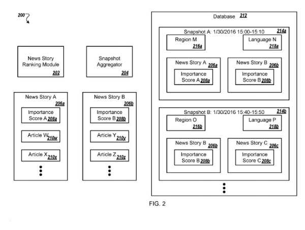
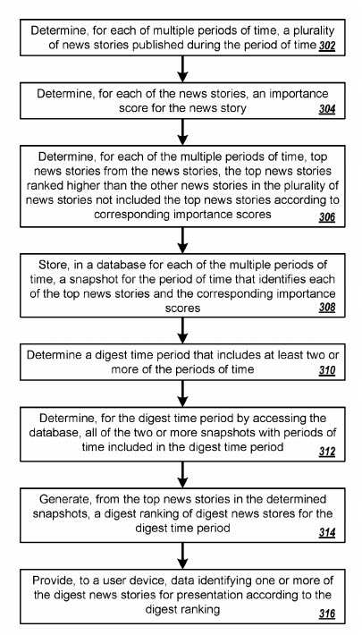

## Google has Changed Top Stories in Carousels in Search Results

Google made an announcement on its Keyword blog about top stories from non-news sites. They told us about this in [Smarter organization of top stories in Search](https://www.blog.google/products/search/smarter-organization-top-stories-search/).

They start the post by telling us:

> People come to Search for all types of information to help them better understand the world and the topics they care about most.
>
> We’ve continued to bring new improvements to Search to help people better orient themselves around a topic and easily explore related ideas, so they can more quickly go from having a question in mind to developing a deeper understanding.
>
> Now, we’re using the latest in machine learning to bring this approach to top stories in Google Search, making it easier for people to dive into the most useful, timely articles available.

We see top stories in carousels in organic search results when there are relevant and timely stories to share on a topic. Here is an example of the carousels about “top stories” involving artificial intelligence:

On hearing this news, I did what I do when I hear about a change at Google. I searched through Google’s patents to see if I could find a recent related patent. I searched for “top stories” in Google patents and found one granted in March of last year.

The blog post had more information, but the patent tells us about Google creating news digests filled with “top stories.” One thing the blog added was about machine learning approaches using tools like BERT:

> To generate these groups, we use various machine learning techniques, including BERT models, to examine the related articles and determine where one story ends and another begins.
>
> Our research has shown that clustering results into clearly defined stories are critical in helping people easily navigate the results and identify the best content for their needs.

In addition to the added use of machine learning, we were also told about these results being more well-rounded and diverse:

> We’re now also featuring key information, such as notable quotes and related opinion pieces, in the top stories carousel within Search.
>
> These different content types provide people a more well-rounded view of a news story to help them decide which angle to explore more deeply.

## Google News Digest Patent

This patent was granted in March of 2019, gives us a look at the framework behind the surfacing of these “top stories” results in what Google refers to as an “automated news digest.”

When Google indexes news information from news sources, the content providers of that information focus upon serving news articles for the current time to “allow a user to view the most shared news articles or news stories.”

So what does this new patent do to bring something new and different to show off news results?

We are told that what is innovative in the patent is capturing the most interesting stories from different times based upon an “importance score” for that period.

Top news stories are selected, and the second top news stories use those importance scores to rank what is shown as “top stories.”

Articles associated with the top news stories for those times are selected and displayed – a predetermined number of articles about each story may get decided upon beforehand. The stories that are shown may also depend upon categories of interest identified in a user profile for a searcher who may start looking at those (not mentioned in the patent, but this reminds me of Google Discovery, and Google collecting categories of interest when deciding what to show for a searcher, brings me thoughts of the post [How Google Might Predict Query Intent Using Contextual Histories](https://gofishdigital.com/query-intent-contextual-histories/).)

## Importance Scores for News Stories in the Automated News Digest

So how do “top stories” become “top stories?”

The news digest system, during a time, may rank each of the news stories from the snapshots of times/regions/languages. For instance, the news digest system determines a score for each of the news stories representing the news story’s importance. The news digest system may use an important score of each news story to determine the score.

Each snapshot in the database includes data that represents a region, a language, or both.

The news story ranking process may decide that the news stories A-B for snapshot A are specific to a region M and a language N, such as North America or the United States, and English.

The news story ranking process determines another snapshot for a different region, such as the United Kingdom, or another language, such as French or Spanish.

## Importance Scores for Top Stories

The importance score for a particular news story may get included in the same snapshot that identifies the particular news story. These are the things considered in the creation of such importance scores:

- A number of articles written about a news story (when each news story relates to a general event such as snow in Washington, D.C. and the separate articles were published by different news distributors)
- Clicks on articles about a news story
- Social actions (shares, likes, etc.)
- Queries received from user devices for which articles for a news story are responsive, are selected, or both
- Change of a metric for a news story (when the metric may become clicks, queries, social actions)
- A time, recency or freshness of publication related to a news story
- An expertise of a publisher in a certain news topic or geographic area (when the publisher published an article related to the news story)
- A historical click rate on articles from the publisher
- Citations made to the article and/or publisher
- Relevance of article to the news story
- Another appropriate metric
- A combination of two or more of these to determine the score for the news story

The news digest system may use any relevant signals to determine a score and corresponding ranking of the news stories.

The importance scores are used to rank new stories like this:

> The news digest system uses the scores to rank the news stories. For instance, the news digest system may determine that a news story A for the digest time, e.g., Jan. 30, 2016, has a lower score than the news stories B through H 108b-as indicated by the news story A not being presented in the news story ranking

## Advantages of this Automated News Digest Patent

A news digest system may provide:

- Users with more unbiased news. These may require little or no editorial judgment compared to systems that have an editorial review of news stories
- news digests irrespective of the digest period, the region for the news digest, the language for the news digest, or a combination of two or more of these
- Personalization of a news digest according to user settings. Such as personal interests of a user
- A news digest to a user device for a time during which a user was unable to check the news
- News digest to a user device that includes top stories for a historical period. Such as ten years ago
- News digest to a user device that includes top stories for a particular topic of interest. Such as when the particular topic of interest does not have frequent news stories

The Automated News Digest patent is at:

[Automated news digest](http://patft.uspto.gov/netacgi/nph-Parser?Sect1=PTO1&Sect2=HITOFF&d=PALL&p=1&u=%2Fnetahtml%2FPTO%2Fsrchnum.htm&r=1&f=G&l=50&s1=10,242,096.PN.&OS=PN/10,242,096&RS=PN/10,242,096)
Inventors: Pan Gu, Mayuresh Saoji, Yuqiang Guan, Maricia Scott, Vikas Sukla, and Anand Devraj Paka
Assignee: Google LLC
US Patent: 10,242,096
Granted: March 26, 2019
Filed: March 15, 2016

Abstract

> Methods, systems, and apparatus, including computer programs encoded on computer storage media, automatic generation of news digests. One of the methods includes accessing a database storing news snapshots, each snapshot identifying a predetermined quantity of top news stories for some time, each of the top news stories in a particular snapshot for a particular period ranked according to an importance score that measures the importance of the news story relative to other news stories for the particular time, determining a digest period, determining, for the digest time, all of the snapshots with periods included in the digest time, generating, from the top news stories in the determined snapshots, a digest ranking of digest news stories, and providing, to a user device, data identifying one or more of the digest news stories for presentation according to the digest ranking.

## Takeaways

The Google blog post told us a few things that weren’t mentioned in the Automated News Digest Patent.

For articles to appear in a top news carousel, they do not need to get registered as news sites with Google. So timely blog posts and articles aren’t at news sites, but cover one of the news stories for a specific time could get included in the carousels.

The blog post also told us that Google would include notable quotes and related opinion pieces in carousels. The purpose of those is to make sure that the news being shown is more detailed and diverse.

The importance score approach for particular news stories explains how certain stories are selected as top news. But not how the articles chosen for carousel slots are selected.

–
