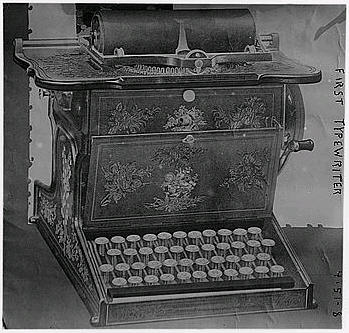
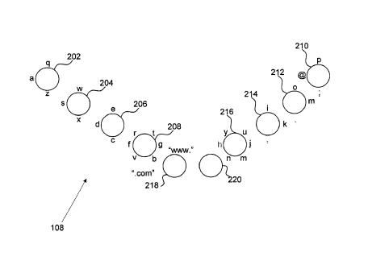
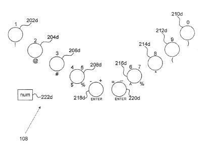

I remember the 10th-grade keyboarding class in high school, which was a required course for everyone. I’ve typed a lot more characters than I ever expected in the days since, but I’ve been wondering how much longer people would be typing, or at least typing on a physical device intended just for typing. I’ve tried the “sliding” method of typing on my phone, with limited results. Hunt and peck still seem to work better for me, and I’m getting less “big finger” errors on my phone’s small virtual keyboard.

The picture above is from the “Bain Collection” at the US Library of Congress Prints and Photographs Reading Room. I’m not sure if it’s the very first typewriter, but that’s what’s printed on the image, and that’s what the Library of Congress is calling it. The [Bain Collection](http://www.loc.gov/pictures/collection/ggbain/) contains images from one of the earliest news picture agencies. While looking through the pending patents from this week, I came across this patent filing for a touch screen keyboard, from Google. Are we seeing the last days of physical keyboards approaching?

The description and the patent application images show and describe something similar to a qwerty keyboard layout, likely much like the keyboard that you use with your desktop or laptop computer. Except instead of having the additional keys that a conventional keyboard might have to trigger additional characters, you would slide your fingers in different directions, as seen in the image from the patent filing below:

The pressing of another “button” would bring capital versions of letters, and the whole thing can switch over to numbers and symbols with the pressing of a different button:

The patent filing also provides for a keyboard that might display a Dvorak keyboard layout, or a layout that includes other “keyboard variations specific to foreign languages, including but not limited to Chinese, Japanese, Arabic, and Hebrew.”

The patent application is:

[Touch-Screen Keyboard Facilitating Touch Typing with Minimal Finger Movement](http://appft.uspto.gov/netacgi/nph-Parser?Sect1=PTO1&Sect2=HITOFF&d=PG01&p=1&u=%2Fnetahtml%2FPTO%2Fsrchnum.html&r=1&f=G&l=50&s1=%2220130027434%22.PGNR.&OS=DN/20130027434&RS=DN/20130027434)
Invented by Sean Paul
Assigned to Google
Mountain View
US Patent Application 20130027434
Published January 31, 2013
Filed: September 26, 2011

Abstract

> A system, method, and computer-readable medium for using a touch-screen keyboard. A keyboard operation module generates geometric shapes for display on a touch-screen display, each geometric shape corresponding to a respective finger of a user. Each geometric shape includes characters at predefined locations around the perimeter of the geometric shape. The keyboard operation module detects a sliding movement of a finger in contact with the touch-screen display from inside a geometric shape and toward the perimeter of the geometric shape.
>
> The keyboard operation module then determines that the sliding movement is in the direction of a particular character positioned around the perimeter of the geometric shape and selects the particular character for display in a text entry area of the touch-screen display.
