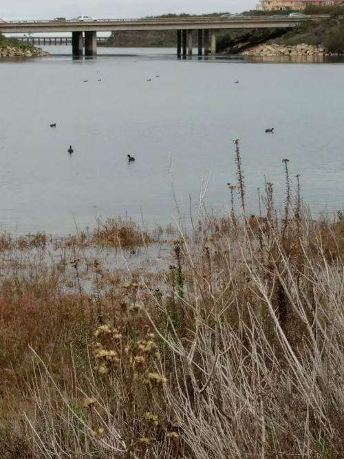
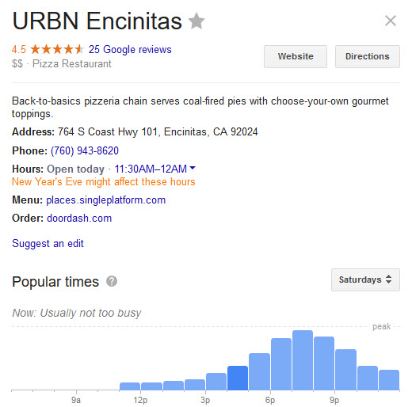
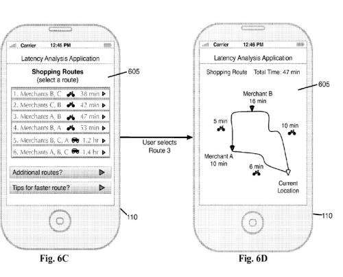
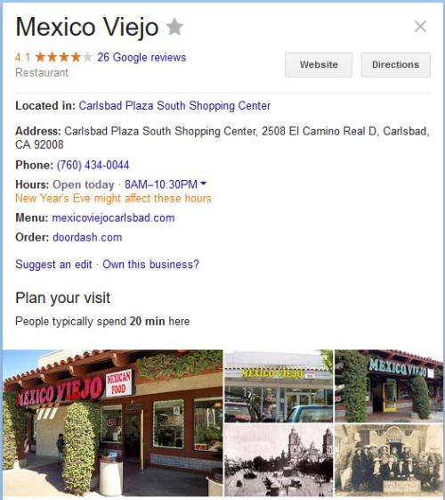

_Getting Ducks in a Row_

## Google’s Popular Times Patent

Google Maps helps people navigate from place to place and has been tracking how busy places are.

For it to work effectively, it’s helpful to track the location history of the device that someone may be using to help them navigate.

It’s interesting how Google tracks your location history. For example, after I take a photo near a business, I’ve noticed that Google will sometimes ask if I would like to upload that photo to the business listing for that business. Sometimes the photos aren’t relevant to the business I’ve taken them near, such as a photo of an Agave Plant that I took near a Seaside Market in Cardiff-by-the-Sea, California (it has nothing at all to do with the Sea Side Market.)

Google seems to like the idea of saving location history for people who might search for different types of businesses, and a recent patent that I wrote about described how Google might start using distances from a location history as a ranking signal (as opposed to a static distance from a desktop computer.) I wrote about that in [Google to Use Distance from Mobile Location History for Ranking in Local Search](https://gofishdigital.com/mobile-location-history/).

If you think about Google tracking individuals’ location histories differently, how else can that tracking history be useful to people? You may have noticed that Google now sometimes shows how busy a place might be at different points in the day. That is from tracked location history aggregated. I saw someone ask about this on Twitter today, and it set me trying to find a patent from Google that described how Google might be tracking how busy different businesses might be. I found one.

## Popular Times and Busy Hours

The patent I found tells us that it is about:

> The present disclosure generally relates to determining a latency period at a user destination. More particularly to methods and systems that rely on user-location histories, such as fine-grained user location data, to determine the latency period at a user’s destination. The present disclosure also relates to using latency period data in various applications, including the generation of a shopping route for a user.

Google is tracking how busy different businesses are, and popular times for those businesses are based on location history information.

It tells us that being able to provide someone with planning details about a shopping trip can be useful, such as how long the trip to a business might be and how long they might spend there. In addition, if someone asks for a chain business, knowing how busy the location is can also be helpful to a user, and the process described in this patent attempts to answer that problem as well.

I hadn’t thought of how helpful it could be in the context of chain businesses until I read the patent:

> While knowing the travel time and distance to a location is often helpful to a user, the user is left without knowing how busy the nearest location is or whether other, nearby locations are less busy. For example, the user does not know whether visiting a chain location that is slightly further away “but less busy or less crowded” may take less time overall than visiting the chain location that is nearby. Thus, based on travel time to the destination alone, the user may spend more time traveling to and visiting the nearest location than the user would if traveling to and visiting a location that is further away. And in some instances, a user may not care how long it takes to get to the point of interest. Rather, the user may desire only to know how long the wait is at a particular point-of-interest or how long it will take the user to pass through the point-of-interest, such as through a checkout line at a retailer. In addition to knowing how long a trip will take, a user may wish to know the fastest route or alternate routes in certain instances. For example, a user with a specific shopping list may desire the best route (or alternate routes) for obtaining the products on the shopping list.

Other information that might be provided includes wait times at restaurants and how long it is taking people to check out at grocery stores. Knowing about popular times for businesses can influence whether or not you might go somewhere.

Interestingly, fine-grained location history tracked could include the user device in a checkout line at a grocery store, or the entrance area of a restaurant, or a line at an amusement park. So, times spent waiting to buy groceries or waiting to be served a meal or time spent waiting for a ride could be reported to others who might consider going to that grocery store, or restaurant, or amusement park. Thus, mobile location information history looks like it could be useful.

I’m reminded of Google doing something similar with mobile devices and real-time traffic information, which I wrote about in 2006 in the post [Ending Gridlock with Google Driving Assistance (Zipdash Re-Emerges)](https://www.seobythesea.com/2006/07/ending-gridlock-with-google-driving-assistance-zipdash-re-emerges/). So I guess if it worked with traffic time estimates, it might be worth using in other contexts, like grocery store lines or amusement park ride lines.

The patent refers to this understanding of popular times for a business as a “latency analysis system” and tells us that it is based upon receiving location histories for multiple computing devices. The location history can tell how long each person was at a business and tell how busy a business is at different times of a day.

The patent also points out that this latency information can be “real-time” in providing current wait periods for restaurants and so on.

This system can also tell users whether or not a location they might be planning on traveling to is open or closed, or possibly closing soon (or maybe hasn’t opened yet.) For example, I’ve had Google Maps warn me that a place I’ve planned on going to might not open by the time I arrive or might close by then.

The location history patent also describes another feature involving having a shopping list for products on your phone and being able to identify merchants who offer those products and generating a shopping route based upon those products and merchants offering them, and how long it would take to buy each item on the list. I haven’t seen this feature yet, but it would be nice to see.

If it is compiling a shopping route from your shopping list with locations to buy from, it may attempt to calculate the most efficient route.

In addition to telling us popular times for a business, Google may also tell us how long we might take when we go some place, like averaging 20 minutes inside of this place:

There are aspects of this system that may use different data sources to reinforce the data being collected. For instance, if location history information is being used to track time waiting to check out in a grocery store line, that timing information could be checked upon by looking at electronic wallet information associated with purchases involved in the checkout at the grocery store.

The description of the popular times patent provides more details and more examples and is worth spending time with.

The patent is:

[Point-of-interest latency prediction using mobile device location history](https://patents.google.com/patent/US9470538)
Publication number US9470538 B2
Granted on: Oct 18, 2016
Filing date Mar 11, 2015
Priority date Jul 17, 2013
Inventors Dean Kenneth Jackson, Daniel Victor Klein
Original Assignee Google Inc.

Abstract

> A latency analysis system determines a latency period, such as wait time, at a user destination. To determine the latency period, the latency analysis system receives location history from multiple user devices. With the location histories, the latency analysis system identifies points of interest that users have visited and determines the amount of time the user devices were at a point of interest. For example, the latency analysis system determines when a user device entered and exited a point of interest. Based on the elapsed time between entry and exit, the latency analysis system determines how long the user device was inside the point of interest. By averaging elapsed times for multiple user devices, the latency analysis system determines a latency period for the point of interest. The latency analysis system then uses the latency period to provide latency-based recommendations to a user. For example, the latency analysis system may determine a shopping route for a user.

## Popular Times Take-Aways

People carrying their phones around with them are providing useful information to others. We have, in effect, become Googlebot crawling the world with our navigation devices turned on. The patent tells us that Google is careful by trying to avoid sharing and spreading personally identifiable information.

I am happy that Google asks for permission before it uses a photo that I’ve taken near a business before it assumes that the photo is of the business. When you opt-in to using location-based services on your phone, you are helping people decide which restaurants to choose to eat at, or grocery store to shop at, or amusement park to visit. In addition, you are helping track location history or how long people tend to be at a business. I find these popular times feature to be useful in helping me decide whether to go somewhere.

A Google Support page tells us about these features involving popular times, and other visit information: [Popular times, wait times, and visit duration](https://support.google.com/business/answer/6263531?hl=en)

What might Google do with Location history? I wrote about some other patents that use location history. These are about patents from Google that use location history:

- [Google’s Mobile Location History](https://www.seobythesea.com/2018/01/googles-mobile-location-history/)
- [Google Tracking How Busy Places are by Looking at Location History](https://www.seobythesea.com/2016/12/google-tracking-how-busy/)
- [Google Lifestreaming?](https://www.seobythesea.com/2013/02/google-searchable-life-experiences/)
- [Google Patents Identifying User Location Spam](https://www.seobythesea.com/2013/02/google-patents-identifying-user-location-spam/)
- [Google Patent Granted on Mobile Location Detection](https://www.seobythesea.com/2013/02/google-mobile-location-detection/)
- [Location Extensions Augmented Advertisements](https://www.seobythesea.com/2019/06/location-extensions-augmented-advertisements/)
