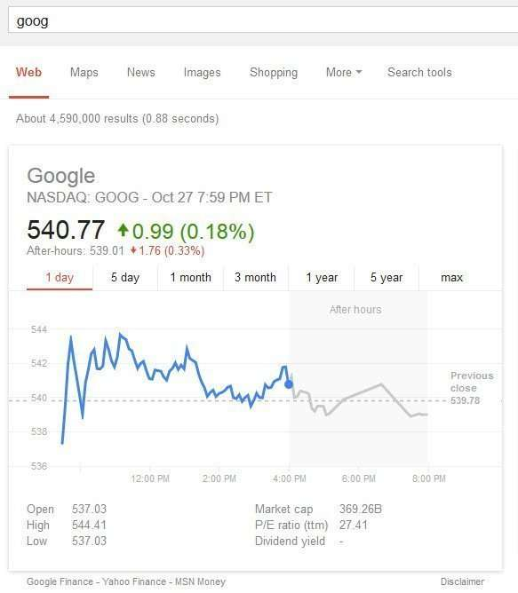
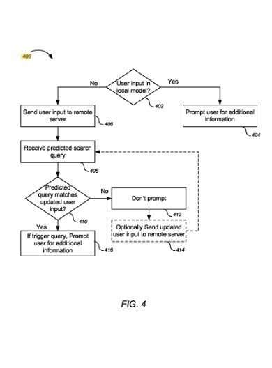

Trigger Queries are Queries that return specific responses from a search engine, such as specific rich results depending upon the trigger.

Recently I wrote about [Google’s Enriched Results Patent](https://www.seobythesea.com/2014/10/google-enriched-results-patent/), where Google looked at query terms searched for, and for some of them, the search engine returned special “enriched” search results that showed off things such as financial information when the query might have been something like a financial stock market term, such as “GooG” for Google.

At Search Engine Land in 2007, I wrote about [Google’s OneBox patent](https://searchengineland.com/googles-onebox-patent-application-10325), and much like Google looking for query terms that might return an enriched search result, under the one box patent, Google might decide among a range of seven different types of search results, including things such as news results, images, videos, local results, and others.

The patent tells us that a range of user behavior type signals over time might potentially lead to a choice of what kind of search result to show in one box for a query.

If you remembered Google back in 2008, there were times that it would ask you a question about your query, such as whether or not it was a local query. A patent from back then mentions those query questions or prompts. It tells us that the results of those questions might play a role in how Google responded to those queries. Interestingly, it referred to those queries as “Trigger terms.”

We’re going to be looking back at the history of queries like this at Google to get an idea of where Google was back then, and where they might be now, and how it possibly can impact the search results you see and could impact the rankings you might receive for some types of sites.

The patent was:

[Prompt for query clarification](https://patents.google.com/patent/US8484190)
Invented by Hisakazu Igarashi, Charles G. Bird, Andrew Moedinger
Assigned to Google
US Patent 8,484,190
Granted July 9, 2013
Filed: December 18, 2008

Abstract

> Systems, methods, and computer program products are provided for query clarification.
>
> In general, one aspect of the subject matter described in this specification can be embodied in computer-implemented methods that include the actions of receiving in a search interface a user input associated with a search query; determining whether the associated search query is a ***trigger query***, trigger queries are queries identified for clarification; when a search query is a trigger query, prompting a searcher for additional information to form a clarified search query, the clarified search query including the additional information, the prompting occurring before submission of the search query to a search system; and submitting the clarified search query to the search system.

By answering this question, yes, the query transformed into a trigger query, as it triggered special search results that added a local element to the query.

Just like an answer box result might potentially continue to show local search results, especially if people clicked upon a local result frequently when it appeared.

This patent refers to these queries showing local results as trigger queries. Much like queries that would return enriched results when they were the appropriate query terms that triggered such results.

The benefits that this trigger queries patent tells us it brings to us are:

1) Clarify queries to tell us they are local can reduce time lost due to overly broad search results.

2) A clarified query generated from a prompt can increase the likelihood of reaching the desired information in a comprehensive and customized way to a user’s need.

3) The search engine identifying the desired information can lead to additional operations such as separately searching for a map or directions to a particular address found on such sites returned in response to the trigger term.

Trigger queries show up a lot in Google, like a “what is XXXXX” triggers a dictionary result at Google. This is one of the secrets that Google uses to speed its results up. So if you choose the right words to use to speed up your search, like trigger queries, you win, and so does Google.
