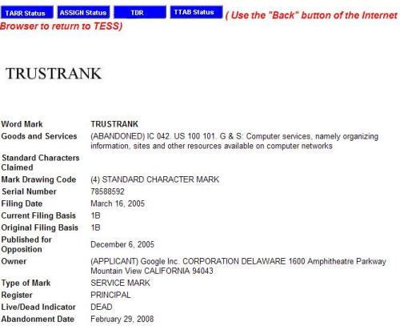

If you’ve ever heard or seen the phrase “TrustRank” before, it’s possible that whoever was writing about it, or referring to it was discussing a Yahoo/Stanford paper titled [Combating Web Spam with TrustRank](http://www.cs.toronto.edu/vldb04/protected/eProceedings/contents/pdf/RS15P3.PDF) (pdf). While that TrustRank paper was the joint work of researchers from Stanford University and Yahoo, many writers have referred to it as Google TrustRank since its publication date in 2004.

While Yahoo has a TrustRank approach, Google does not have a similar approach. Yahoo TrustRank is aimed at identifying Spam on the Web. It has been patented, under the name [Link Based Spam Detection.](http://appft1.uspto.gov/netacgi/nph-Parser?Sect1=PTO1&Sect2=HITOFF&d=PG01&p=1&u=%2Fnetahtml%2FPTO%2Fsrchnum.html&r=1&f=G&l=50&s1=%2220060095416%22.PGNR.&OS=DN/20060095416&RS=DN/20060095416) Because that Yahoo patent exists, Google could not be granted a patent that covers the same processes – the USPTO would not grant such a patent. However, there is a Google TrustRank.

The confusion over who came up with the idea of TrustRank wasn’t helped by Google trademarking the term “TrustRank” in 2005. That trademark was abandoned by Google on February 29, 2008, according to the records at the USPTO Tess database:

But it appears that Google has come up with a system for reordering the rankings of web pages based upon a Google TrustRank. This is not similar to Yahoo’s approach because it is not a method to fight Spam the way that the Yahoo TrustRank is.

## Does a Google TrustRank exist?

Google did not copy Yahoo’s TrustRank
because Yahoo patented the idea and could exclude Google from using their TrustRank process. It’s worth reading through both patents to understand how different they are from each other. Google TrustRank has to change the rankings of search results instead of finding Webspam like Yahoo TrustRank.

Last week, a patent granted to Google last week discussed how a TrustRank might be associated with people who apply labels to web pages through annotations while setting up a custom search engine. The idea of using annotations is kind of interesting considering Google’s recent release of [Sidewiki](http://web.archive.org/web/20111015154008/http://www.google.com:80/sidewiki/intl/en/learnmore.html) – but there’s no sign from Google that Sidewiki and the user trust system in this patent are related.

Some of the ideas in Google’s patent from inventor Ramanathan Guha seem a little similar to a paper that he co-authored when he was with IBM – [Propagation of trust and distrust](http://www.shibbo.ethz.ch/CDstore/www2004/docs/1p403.pdf) (pdf).

The Google TrustRank patent itself is:

[Search result ranking based on trust](http://patft.uspto.gov/netacgi/nph-Parser?Sect1=PTO2&Sect2=HITOFF&u=%2Fnetahtml%2FPTO%2Fsearch-adv.htm&r=1&p=1&f=G&l=50&d=PTXT&S1=7,603,350.PN.&OS=pn/7,603,350&RS=PN/7,603,350)
Invented by Ramanathan Guha
Assigned to Google
US Patent 7,603,350
Granted October 13, 2009
Filed: May 9, 2006

Abstract

> A search engine system provides search results that are ranked according to a measure of the trust associated with entities that have provided labels for the documents in the search results. A search engine receives a query and selects documents relevant to the query.
>
> The search engine also determines labels associated with selected documents and the trust ranks of the entities that provided the labels. The trust ranks are used to determine trust factors for the respective documents. The trust factors are used to adjust the information retrieval scores of the documents. The search results are then ranked based on the adjusted information retrieval scores.

One idea behind the patent is that experts on many subjects may be found at many sites, whether upon pages allowing individual experts or commentators to express themselves within blogs and news outlets and similar sources or at sites where communities interact, such as forums and rating sites.

Some members of a site where people provide their opinions may be seen as experts, while others may be viewed as less informed or somehow biased.

Examples of indications of trustworthiness for some individuals participating at a site might include things like auction sites that might use ratings to identify trusted buyers and sellers. Forums might use membership criteria and other factors to distinguish between the amount of trust that different posters might be perceived to have.

If there were a way to “reflect” the trustworthiness of web pages or of commentary or opinions which might be associated with pages showing up in search result documents, this kind of reputation-based information might help provide more “meaningful” search results to searchers. That’s the point behind Google’s TrustRank.

The Google TrustRank patent itself goes into some detail on how the search engine might use information from annotations and labels from experts to re-order the rankings of search results in response to queries.

The Official Google Blog uses some interesting terms when discussing the recently released Sidewiki in their post [Help and learn from others as you browse the web: Google Sidewiki](https://googleblog.blogspot.com/2009/09/help-and-learn-from-others-as-you.html). One common point between the two is how experts sharing their opinion of a site might be helpful to others who view that site:

> What if everyone, from a local expert to a renowned doctor, had an easy way of sharing their insights with you about any page on the web? What if you could add your insights for others who are passing through?
>
> Now you can. Today, we’re launching Google Sidewiki, which allows you to contribute helpful information next to any webpage. Google Sidewiki appears as a browser sidebar, where you can read and write entries along the side of the page.

But, one of the other projects that the inventor of this patent, Ramanathan Guha, has been working upon at Google is the custom search engines that people can build and add to their sites. In February of 2007, I wrote a post at Search Engine Land titled [Google Customized Search Engines to Harness The Wisdom of Experts?](https://searchengineland.com/google-customized-search-engines-to-harness-the-wisdom-of-experts-10542) on a series of five patent filings which listed Ramanathan Guha, the inventor. In that post, I noted that:

> In short, custom search engines at vertical sites allow people to search using content sources decided upon and possibly annotated by the site owners.
>
> Information collected from the source choices and the labeling and annotation of those sources, and the use of those custom searches may help inform results at other custom search engines involving related searches, and in query suggestions offered by Google on search results pages from regular Web searches.

The description of labeling and annotation of sources used in custom search engines fits in very well with the process described in the Google TrustRank patent.

It’s possible that Google may be learning about the trustworthiness of sites and people who annotate and label pages from many sources. They learn about those pages that may be used in a trust rank that can influence how pages may be ranked at the search engine. I wrote another post about the context files in Google Search Engines, and how the builders of those custom searches are considered topic experts, in the post [The Expertise of Google Custom Search Engines vs. the Wisdom of Crowds](https://www.seobythesea.com/2010/10/the-expertise-of-google-custom-search-engines-vs-the-wisdom-of-crowds/)

This Google TrustRank is very different from the TrustRank developed by the writers of the Stanford/Yahoo paper.

Next time you hear someone mention “TrustRank,” you may want to ask them if they mean the Google TrustRank or the Yahoo TrustRank. They are not the same thing.

Last Updated May 30, 2019.
