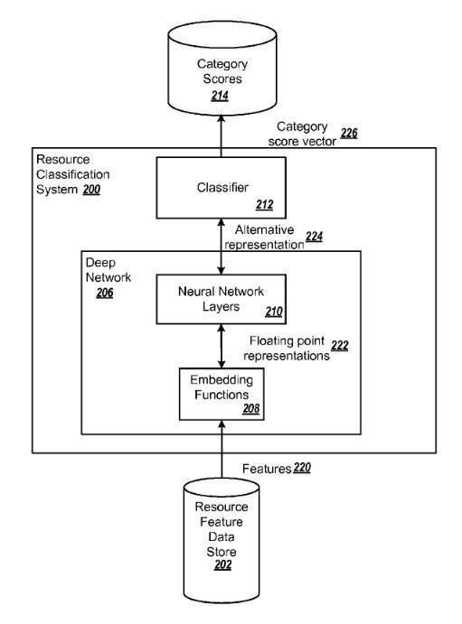
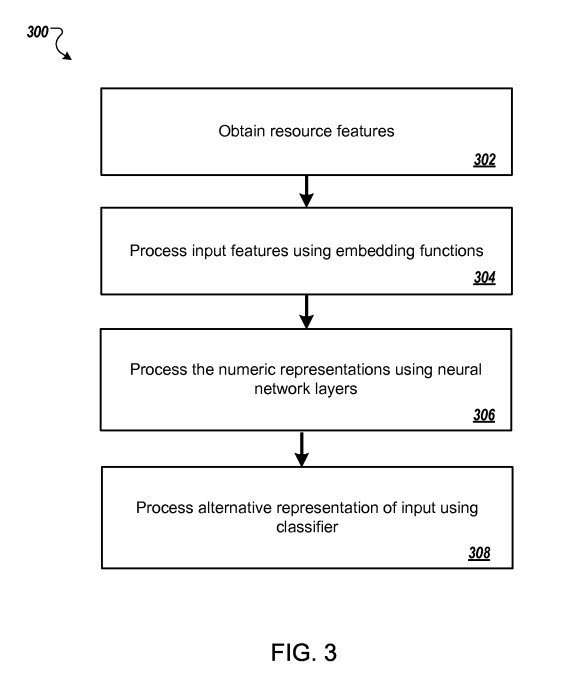

In the past few years, Google has been busy building what has become known as the Google Brain team, which started by having its deep learning approach [watching videos](http://www.dailymail.co.uk/sciencetech/article-2164832/Google-creates-artificial-brain--immediately-starts-watching-cat-videos.html) until it learned to recognize cats. Unsurprising that Google would start using something like Deep Learning Classification to fight webspam.

Google has been hiring many people to add to the abilities of their deep learning team, including a pricy acquihire in the UK earlier this year, as described in [More on DeepMind: AI Startup to Work Directly With Google’s Search Team](https://www.vox.com/2014/1/27/11622778/more-on-deepmind-ai-startup-to-work-directly-with-googles-search-team)

## Deep Learning Classification Patent

This patent describes methods that include:

> - Receiving an input comprising a plurality of features of a resource, wherein each feature is a value of a respective attribute of the resource
> - Processing each of the features using a respective embedding function to generate one or more numeric values
> - Processing the numeric values using one or more neural network layers to generate an alternative representation of the features of the resource, wherein processing the floating-point values comprises applying one or more non-linear transformations to the floating-point values
> - Processing the alternative representation of the input using a classifier to generate a respective category score for each category in a pre-determined set of categories, wherein each of the respective category scores measures a predicted likelihood that the resource belongs to the corresponding category

That “pre-determined set of categories” can include a **search engine spam category**. The category score for the “resource” measures a predicted likelihood that the resource is a search engine spam resource.

The pre-determined set of categories can include a respective category for each of a plurality of types of search engine spam. The pre-determined set of categories includes a respective category for each resource type in a group of resource types. Category scores can be used to:

- Determine whether or not index resources in a search engine index.
- Generate and order search results in response to received search queries.

A deep network can effectively use deep learning classification to understand web pam resources into categories. For example, resources can be effectively classified as being spam or not spam, as being one of several different types of spam, or as being one of two or more resource types. The patent tells us:

> Using the deep network to classify resources may result in a search engine being able to better satisfy users’ informational needs, e.g., by effectively detecting spam resources and refraining from providing search results identifying those resources to users or by providing search results that identify resources that belong to categories that better match the user’s informational needs.

[Classifying Resources Using a Deep Network](http://appft.uspto.gov/netacgi/nph-Parser?Sect1=PTO1&Sect2=HITOFF&d=PG01&p=1&u=%2Fnetahtml%2FPTO%2Fsrchnum.html&r=1&f=G&l=50&s1=%2220140279774%22.PGNR.&OS=DN/20140279774&RS=DN/20140279774)
Invented by Qingzhou Wang, Yu Liang, Ke Yang, and Kai Chen
Assigned to Google
US Patent Application 20140279774
Published September 18, 2014
Filed: March 13, 2013

Abstract

> Methods, systems, and apparatus, including computer programs encoded on computer storage media, for scoring concept terms using a deep network.
>
> One of the methods includes:
>
> - Receiving an input comprising a plurality of features of a resource, wherein each feature is a value of a respective attribute of the resource
> - Processing each of the features using a respective embedding function to generate one or more numeric values
> - Processing the numeric values using one or more neural network layers to generate an alternative representation of the features, wherein processing the floating-point values comprises applying one or more non-linear transformations to the floating-point values
> - Processing the alternative representation of the input using a classifier to generate a respective category score for each category in a pre-determined set of categories, wherein each of the respective category scores measures a predicted likelihood that the resource belongs to the corresponding category.

The patent tells us that this deep learning classification system could classify resources as “search engine spam resources or not search engine spam resources.” It doesn’t define web spam in much detail, but does tell us that it might look at typical types of spam such as:

- Content spam
- Resources that include link spam
- Cloaking spam resources, and
- So on

The deep learning classification system may look at:

- Words from the content of the site in a tokenized form
- URLs from the site
- The title of the site
- Its domain name
- Categories or entity types relevant to the site
- The age of the site

Each of these many features might be used to calculate a probability that the site is spam, which could determine whether or not it gets indexed or reduced in rankings:

> For example, when the scores represent a likelihood that a resource is a search engine spam resource, the search system can use the score in a decision process so that a resource that is more likely to be spam is less likely to be indexed in the index database. As another example, when the scores represent likelihoods that a resource is one of several different types of search engine spam, the search system can determine that resources having a score that exceeds a threshold score for one of the types not indexed in the index database.
>
> In some other implementations, the search system can make use of the generated scores in generating search results for particular queries. For example, when the scores represent a likelihood that a resource is a search engine spam resource, according to the deep learning classification, the search system can use the score for a given resource to determine whether or not to remove a search result identifying the resource before providing the search results for presentation to the user or to demote the search result identifying the resource in an order of the search results. Similarly, when the scores represent a likelihood that a resource belongs to one of a pre-determined group of resource types, the search system can use the scores to promote or demote search results identifying the resource in an order of search results generated in response to particular search queries, e.g., search queries that have been determined to be seeking resources of a particular type.

While the patent doesn’t provide much in the way of details on training and classification of features under this machine learning model, it does refer to a paper that does, at:

[Large Scale Distributed Deep Networks](https://research.google/pubs/pub40565/), Jeffrey Dean, et al., Neural Information Processing Systems Conference, 2012.

Google’s longtime head of Web Spam, Google Distinguished Engineer Matt Cutts has been on his [first extended leave](https://www.mattcutts.com/blog/on-leave/) after 15 years at Google. He is due to return in October. So that’s pretty interesting timing, with the patent released during his first real vacation in years. I wonder if it was turned on while he was gone?
