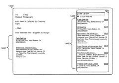
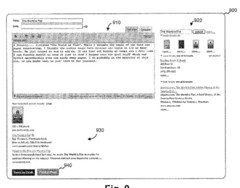

Imagine writing an email or blog post or forum post or IM message, and having a button that you can press that will perform queries based upon what you’ve written and found relevant lists of search results based upon your content, for you to include with what you have written.

Those can be maps and local search result lists for addresses or businesses that you’ve included, or search results for a name or product in your message or post, or other information. A couple of illustrations below (click on the images to see larger versions) show how these might look in email, or might be offered to someone writing a post in Blogger.

Local search results inserted into an email:

Auto generated search results offered to a blogger creating a post:

The way this might work is described in detail in a patent application published this past week:

[User Distributed Search Results](http://appft1.uspto.gov/netacgi/nph-Parser?Sect1=PTO2&Sect2=HITOFF&u=%2Fnetahtml%2FPTO%2Fsearch-adv.html&r=1&p=1&f=G&l=50&d=PG01&S1=20070130126.PGNR.&OS=dn/20070130126&RS=DN/20070130126)
Inventors: Mark Lucovsky, Derek L. Collison, and Carl P. Sjogreen
Assigned to Google
US Patent Application 20070130126
Published June 7, 2007
Filed: May 30, 2006

Abstract

> A universal distributed search system allows users to find and distribute search results (possibly including advertisements) to those with whom they communicate. The search results can be easily distributed by the user via a simple interface that allows the search results to be easily added to the user’s content. In one implementation, the search results may be automatically generated by the system based on user input to a content creation application.

**User Selected or Automatically Generated Results**

A search box would be available to the user, and they could pick something to query to include results about, or instead of the creator expressly choosing a query, the system could do it on its own, using some “entity recognition techniques” that would be performed using the content entered by the user or somehow otherwise associated with the content

These “entity recognition techniques” are ones that are designed to recognize entities such as products, places, organizations, or any other entities that tend to be subjects of searches.

They can be based on linguistic grammar models or statistical models. These might look for terms related to commercial products or terms that define a postal address, or could be biased to locate terms that are associated with a profile of the user, either explicitly created from a form that the user filled out, or an implicitly generated profile based on the user’s search history or documents created by the user.

If a USD is automatically generated, the user has the choice of whether or not to use it in their blog post, or email message or IM.

The USD may also take into account topic information from the message board, or the general topic of the blog – so if a blog tends to be about computer software, the USD generation may be biased in that direction if the blog generating software is connected to the USD generation software.

**Inserting Reputation into Ranking Web Results and Advertisements**

Can the use of these USDs in content created by a user be used to create a “reputation” network?

If someone incorporates search results into their content, and the readers of the content frequently select and use that content – the search results or other information provided, it may be an indication that the user is “an expert in the topic related to the content.” The use of those results may also be ranked higher by the search engine – user selection of search results when creating content may indicate that the selected search results are relevant to the search query.

A reputation score might be kept for authors on specific topics and could be increased. Having that person select certain results to include in what they right might have an impact on Web results, and advertisements shown by the search engine.

The act of selecting a result may be used as a feed back mechanism for the search engine, and could impact such things as:

- Raw result rankings,
- Raw value of an advertisement,
- Raw reputation of a user performing a selection, or;
- Raw reputation of an application using UDS.

The raw reputation results might be used to impact rankings for those documents.

**Advertisements and UDS**

For advertisements shown through UDS, they might be seen to have a higher likelihood of click-throughs. There may be a higher cost to the advertisers or be provided on different terms than other advertisements by the search engine.

Revenue could be shared by the content creator may be in some way shared with the content creator. I wonder if that would be explicitly disclosed – the patent application doesn’t discuss the concept of “paid links.” :)

Additional advertisements might also be shown to the people viewing the inserted search results, such as the ads that are shown in Gmail. Those might be related to the ads or results shown in the USD results, such as an offer of free shipping from a business listed.

**Conclusions**

When I first started reading about User Distributed Search, I questioned whether or not I would use something like this – I have no problems with cutting and pasting links into emails or blog posts. And I questioned whether or not I would appreciate the auto-generation of USD results based upon the content I’ve written or an explicit or implicit profile about me, or taken from the topics of the forum or blog.

But I can see how it would be potentially useful, and I would be interested in seeing what auto-generated results might show up. I imagine that some people might be interested in revenue sharing for ads displayed.

Will we see USD results show up as an option for people writing blog posts in Blogger? It would be a unique feature of the service, not available on other blogging platforms. Blogger seems to have been neglected in some ways by Google since its purchase. Will we see it in Gmail? Would it be a toolbar addition? That isn’t discussed in the patent application.

Would you use it?
