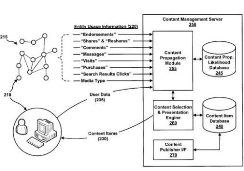
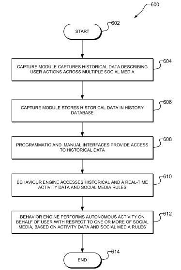
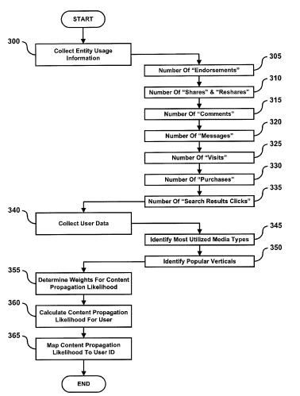
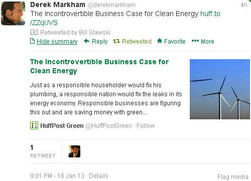

Will Google Plus show advertisements one day? If they do, how will they decide upon the ads to show different users of the social network? A 2010 paper, [AdHeat: An Influence-based Diffusion Model for Propagating Hints to Match Ads](https://static.googleusercontent.com/media/research.google.com/en//pubs/archive/36258.pdf) (PDF), described one method of advertising on a social network that was actually tested on Google’s world wide (except for the US) set of Q&A type sites with the code name of Confucius. It also incorporated the Confucius User Rank into displaying those ads. The user rank approach to reputation scoring for Confucius, and for choosing advertisements for users of the system appears to be an method that would work well in deciding upon [reputation scores for users](https://www.seobythesea.com/2011/07/how-google-might-rank-user-generated-web-content-in-google-and-other-social-networks/) at Google Plus.

A Google patent granted in early December, 2012, provides a different approach for showing advertisements and other content items to users of a social network like Google Plus. The patent makes it clear that while the approach described within it might be used for advertisements, it might also be used to show other content as well.

The content displayed to a user would be based upon a viral score, or “content propagation likelihood,” for users, which is the likelihood that content they share, (broadcast, reshare, comment on, endorse, like, recommend) might be spread throughout the user’s social network. Content in the patent is referred to as an entity (e.g., an item of content such as a video, audio clip, news article, photograph, etc.). In most patent filings and other writings I’ve seen from Google about [entities](https://www.seobythesea.com/2012/06/search-engines-and-entities/), the authors have been referring to specific people, places or things. So, it’s an interesting twist to see documents and other content types on the Web referred to as “entities” as well. Considering they are specific things though, with specific addresses (or URLS), and have their own sets of attributes and properties associated with them, I don’t find it odd to refer to them as entities.

I’m still trying to ferret out exactly how this patent might be applied to content other than ads, but the patent does tell us:

> While the following description includes many examples presented in the context of advertisements and makes reference to a user’s “ad propagation likelihood,” the scope of the present disclosure is not limited to advertisements.
>
> Instead, embodiments and features of the present disclosure are applicable to various content items in addition to or instead of advertisements, and thus reference may also be made to a user’s “content propagation likelihood” as well as similar terms or phrases.

The patent is:

[Method and system for selecting content based on a user’s viral score](http://patft.uspto.gov/netacgi/nph-Parser?Sect1=PTO1&Sect2=HITOFF&d=PALL&p=1&u=%2Fnetahtml%2FPTO%2Fsrchnum.htm&r=1&f=G&l=50&s1=8,332,512.PN.&OS=PN/8,332,512&RS=PN/8,332,512)
Invented by Ping Wu and Jennifer W. Lin
Assigned to Google
US Patent 8,332,512
Granted December 11, 2012
Filed: September 27, 2011

Abstract

> Methods and systems for selecting and presenting a content item, such as an advertisement, to a user of a social network are provided, where the content item is selected based on a calculated “content propagation likelihood” for the user.
>
> A user’s “content propagation likelihood” is a likelihood that an entity (e.g., video, audio clip, photograph, etc.) will spread throughout the user’s social network, and the social networks of the user’s friends, when the entity is shared (e.g., broadcast) by the user.
>
> A user’s content propagation likelihood is computed using weighted measures of various ways in which an entity can spread through a social network. A user’s content propagation likelihood may also be set for a given vertical (e.g., music, sports, etc.) and/or a given media type (e.g., images, videos, etc.) that pertains to the particular user.

**Share and Reshare Scores**

A user’s ad propagation likelihood may be calculated using a “share score” and a “reshare score” for the user.

***Share score*** is the probability that an entity (content item) will spread throughout a user’s social network, and the social networks of the user’s friends, when the entity is “shared” (e.g., broadcast) by the user.

***Reshare score*** is the probability an entity (content item) will likewise spread when the entity is “reshared” by either the user, a friend of the user, or another user in the user’s social network.

In a “reshare” situation, the person in question may be someone resharing information over a social network instead of being the one who originally created it or brought it to the social network.

Calculating a user’s “share score” could also involve how connected someone might be in a social network, such as looking at how many other people that person might be connected to, or have some kind of relationship with.

**Vertical Types**

A content propagation likelihood could also be set for specific verticals, such as music, technology gadgets, sports, etc., and/or for a given media type such as images, videos, audio clips, that pertain to a particular user.

Someone who frequently shares content related to music in a social network, and who has friends in the social network who often reshare such content initially shared by the user, may have a high content propagation likelihood for music and other related verticals. This high likelihood could be used to decide that user should be shown advertisements relating to music.

Someone who likes to share photographs might be shown image-based ads. Another person who shares a lot of videos might be served with ads (or other content items) in video format.

**Entity Usage and Advertisers**

Entity usage information about different content items might include information about:

- Whether or not a user has indicated he or she endorses (e.g., likes, recommends, suggests, etc.) the entity
- Has posted a comment about the entity
- Has sent a message (e.g., a text message, e-mail message, etc.) about the entity
- Has visited a web page associated with the entity
- Other information related to user-behavior regarding the entity.

If the content types in question are advertisements, an advertiser might limit the display of the ad based upon certain criteria as well. These might include whether or not the user is:

- Located in a certain geographic region or
- Only if the time of selection and presentation falls within a certain date range (e.g., between a start date and an end date indicated by the advertiser).
- Above a certain age (e.g., a child under the age of eighteen or a user who has not yet reached age twenty-one).

**Personal Information Collection Optional**

Under the patent, the collection of personal information about a user would be optional, and they might be given the option to not have his or her personal information collected or used in any way.

So a user would be given the change to opt out of information such as their geographic location, preferences, and similar information, or it might be hidden by removing personally- identifible information, or generalizing geographic information so that the location of a user can’t be determined.

**Entity Usage Information Collection**

An entity, or content item, might have information collected about its usage, that can include the number of:

- Endorsements (e.g., “Likes,” “Recommendations,” “Annotations,” etc.) it receives by users in the social network,
- Reshares of the entity by users,
- Comments made about the entity,
- Messages sent mentioning the entity,
- Visits to a web page or physical location (e.g., store) associated with the entity,
- Purchases of a product or service associated with the entity, and/or
- Search Results Clicks on the entity.

**Across Different Social Networks?**

The patent tells us that entity (content item) usage information collected isn’t limited to actions and behaviors of just friends of the user in the user’s social network, but also can include friends of friends who may be in other social networks as well. That would fit in with the Katango patent Google acquired from Katango, [Automated Agent for Social Media Systems](http://appft.uspto.gov/netacgi/nph-Parser?Sect1=PTO1&Sect2=HITOFF&d=PG01&p=1&u=%2Fnetahtml%2FPTO%2Fsrchnum.html&r=1&f=G&l=50&s1=%2220130013713%22.PGNR.&OS=DN/20130013713&RS=DN/20130013713) which was published (and filed again as a continuation patent) on January 10th.

The patent filing describes how a social media agent can log into a social network for a user, with permission to act as him or her, and collect information about the actions and activities of a user’s connections on those other networks. Might this viral score system collect information about activities on YouTube and other social networks as well?

**Calculating a User’s Content Propagation Likelihood**

The formula that the patent shows for computing a user’s content propagation likelihood is:

> Content Propagation Likelihood =
>
> w.sub.1(“Endorsements”) + w.sub.2(“Shares” & “Reshares”) + w.sub.3(“Comments”) + w.sub.4(“Messages”) + w.sub.5(“Visits”) + w.sub.6(“Purchases”) + w.sub.y (“Search Results Clicks”) where “y” is an arbitrary number, and where adaptive (or adaptable) weighting terms {w.sub.i} are used with each of the various components included in the computation.

Note that these are the same pieces of information that might be collected about the usage of an entity, but in this formula the data is collected for an individual user and people who may be connected to that user (and people who may be connected to them, etc.)

**Velocity of Propagation**

The speed at which an entity, or content item, might be shared and/reshared may also play a role, as an indication of the velocity of propagation of that entity, through the social network and the social networks of the user’s friends.

Different speed thresholds (how much weight the signals might carry) might also depend upon things such as they type of content item involved. For example, video content might be easier to share quickly, and might require higher speed thresholds during sharing and resharing than static images. With a video, one fast threshold might be 100 videos an hour, a medium threshold might be 50 an hour, a slowest third threshold might be 10 an hour. With static images, those thresholds might be 30 an hour, 10 an hour, and 5 an hour on the lowest end.

**Weighting Term Based on Social Network Used**

The value of sharing and resharing content, in terms of the adaptable weighting terms {w.sub.i} from the formula above may be adapted (e.g., updated) based on the particular social networks in question. For example, a “retweet” (if Twitter were to be included) might be considered an easier share than a status update on LinkedIn – 20 retweets on Twitter might be worth 5 shares on LinkedIn. Those comparative values might be calculated based upon differences in how entities (content items) spread throughout different social networks.

Also, the weight attached to the number of visits to a website or physical business location associated with an entity (w.sub.6), may be adapted accordingly in situations where the entity isn’t associated with any particular website or when the physical location of the business associated with an entity is in a different country than a user.

**Impact of User’s Taste and Expertise**

If someone is known for their taste in photography, and the entity or content item is related to photographs, it’s possible that more of the user’s friends will pay more attention to entities related to photography, and the user may have a higher content propagation likelihood because of their taste in that specific vertical.

**Take-aways**

The patent provides more details on how a viral score for a user may determine what kinds of ads or other content is shown to him or her, and how that score might be used to match up users with advertisements and other kinds of content.

It’s hard to tell if a system like this would be used with a system like the AdHeat one I mentioned above, or independently of it, or if we will even see ads on a social network such as Google Plus.

The patent doesn’t tell us this, but it is possible that information about the use of entities (content items) might lead to user viral scores that could determine the ads that users are shown while searching in Google itself, or on pages displaying Adsense, at least when they are logged in to Google.

Would Google use such a “content propagation likelihood” to show content other than ads to users as well?

What’s your Google viral score?

I’m guessing that if Google uses a viral score, it’s not going to share the score with us.
