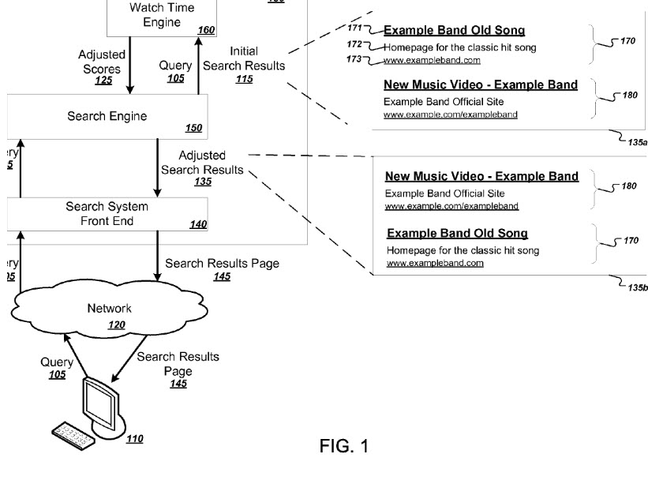

Google was granted a patent this week about how Google may rank some search results, by looking at watch times.

The patent appears to be aimed at video content, but it tells us that it might be applied to how long someone might watch a page after they’ve been delivered to the page, even if that page doesn’t contain video. The page may contain images or audio, and watch times for that content might be tracked as well.

Regarding videos, the patent tells us that a score might be adjusted for resources like videos based on how long people tend to watch that video content. That score might be boosted if people tend to watch the video for longer periods of time, and might be reduced if people historically tend to watch that video for shorter periods of time. This watch times score could be used to boost or demote a video in search rankings for a query.

The patent is:

[Watch time based ranking](http://patft.uspto.gov/netacgi/nph-Parser?Sect1=PTO1&Sect2=HITOFF&d=PALL&p=1&u=%2Fnetahtml%2FPTO%2Fsrchnum.htm&r=1&f=G&l=50&s1=9,098,511.PN.&OS=PN/9,098,511&RS=PN/9,098,511)
Inventors: James Lawry, Bryan M. Kressler, Stanislav Plamenov Angelov, David Elson, Christian Kaiserlian, David Agraz, Jeremy Hylton, and Phong Thanh Pham
Assigned to: Google
US Patent 9,098,511
Granted August 4, 2015
Filed: March 6, 2013

Abstract:

> Methods, systems, and apparatus, including computer programs encoded on computer storage media, for ranking search results. One of the methods includes identifying one or more sessions for a query and associating watch times of the respective resources watched in the sessions with the query. One or more watch time signals are calculated for a first resource and the query based on the watch times associated with the query. A first search result responsive to the query is obtained, wherein the first search result identifies the first resource and has an associated score S. A new score S’ is calculated based on a least S and a watch time function, the watch time function being a function of the one or more watch time signals. The new score S’ is provided to a process for ranking search results including the first search result.

## Take-Aways

I wanted to see if there was any discussion of watch times as a ranking signal at Google or YouTube and found one which says that at some point Video Views was replaced by Watch Times as a way to rank videos at YouTube. The article is [Watch Time: A Guide to YouTube’s TOP Search Ranking Factor](https://tubularinsights.com/youtube-watch-time/). The patent does mention user sessions, though it doesn’t seem very clear why. Visiting this article, I understand that the reason why they mention user sessions is to try to show that people spend more time on YouTube with some videos. Google seems to rank those higher.

A YouTube Help page titled [Watch Time optimization tips](https://support.google.com/youtube/answer/141805?hl=en) offers suggestions to keep people on your pages longer.
