One of the more interesting discussions about Google Glass I’ve seen recently was in a forum where one of the participants was describing [his own homemade version of Google Glass](https://forums.overclockers.com.au/threads/flass-my-google-glass.1074078/), which he named “Flass” (if someone at Google happens to be reading this, you should send him a pair of Google Glass, just because.) What was really interesting was that he was using a MyVu display in his clone.

I call it interesting because Google seems to have acquired a number of the patents from The MicroOptical Corporation, which was the predecessor to MyVu. MyVu no longer appears to be in business, and according to LinkedIn, the Founder and CEO and CTO of MyVue is now the Director of Operations at Google X. Here’s a view of one of the pairs of glasses created by MyVue (MicroOptical):

[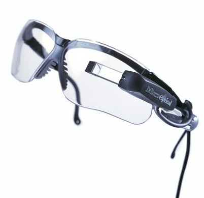](http://www.flickr.com/photos/caseorganic/4611801231/)

Image via [Caseorganic](http://www.flickr.com/photos/caseorganic/) at Flickr.

In his LinkedIn profile, Mark Spitzer is the Director of Operations at Google X. Before that, he was the Founder, CEO and CTO at MyVu Corporation. The Boston Globe article [Former MIT ‘borgs’ still back wearable technology](https://www.bostonglobe.com/business/2012/07/14/former-mit-borgs-still-back-wearable-technology/2EL5NgdbQ5VzjoBUGFZk4I/story.html) includes some quotes from him on some of the reasons why MyVu didn’t succeed. And then there’s this quote from the article:

> The company later shifted to a thin pair of RoboCop-style glasses that could plug into an iPod, so users could watch videos privately on a larger screen. But the company didn’t survive the last recession and its assets were sold off.

It looks like patent filings from MyVu/MicroOptical Corporation followed Mark Spitzer to Google, though it appears that they didn’t make the trip directly. The US Patent and Trademark Office assignment database added an assignment from Hon Hai Precision Industry Co., LTD. and Gold Charm Limited (a subsidiary of Hon Hai) to Google this past week, with an execution date of April 19th, 2013 and a recording date of April 20th, 2013. According to an article at TechCrunch, the management of [manufacturing of Google Glass](https://techcrunch.com/2013/03/27/google-glass-will-be-made-in-the-u-s-a-report-claims-at-an-assembly-facility-in-santa-clara/) may be done in a plant in Santa Clara by Hon Hai Precision, also known as Foxconn.

This review from 2006 shows what one version of wearable glasses from MyVu looked like at one point in time, in a [version created for the iPod](https://www.ilounge.com/index.php/reviews/entry/microoptical-myvu-made-for-ipod-edition).

The patents show some similarities to Google Glass both in form and in function, and there does seem to be an influence. But Google Glass is different, and Google will test to determine a final form.

Google’s “rapid” prototyping of Google Glass is worth watching as well (even though it is 28 minutes long):

[Tom Chi at Mind the Product 2012](https://vimeo.com/55741515) from [MindTheProduct](https://vimeo.com/mindtheproduct) on [Vimeo](https://vimeo.com/).

The patent filings involved follow.

There are some “continuation” patent filings (the claims are different) so some patents are listed twice or three times together since they share a common abstract. Most of these are granted patents, but there are a few that are still pending (referred to as “applications” below, including some that describe manufacturing of some of the parts for these display devices.

It’s interesting that one of the patent filings is a binocular, or two lens display device. Some of the Glass patents from Google itself also show a two lens Glass, including [one on calibrating a pair of binocular Glass](https://www.seobythesea.com/2013/02/2-lens-glass-google-robots-smartwatches/) (Google Glasses?), even though we’ve only seen a one lens Glass in public.

[Light Weight, Compact Remountable Electronic Display Device for Eyeglasses or Other Head-Borne Eyewear Frames](http://patft.uspto.gov/netacgi/nph-Parser?patentnumber=6023372) (US Patent No. 6023372)

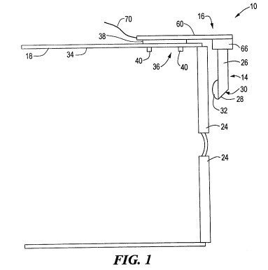

Abstract

> The present invention provides a compact, remountable display device for attachment to eyewear having a head-borne frame to provide an image from an image display superposed on the ambient image. The display device includes a housing assembly which removably mounts to the head-borne frame at a location outside of a user’s field of view.
>
> An electronic imaging assembly is supported by the housing assembly outside of the user’s field of view and in communication with circuitry within the housing assembly to produce an image. An optical element is provided comprising a transparent fixture supporting an eyepiece assembly in front of a user’s eye. The transparent fixture is located to receive the image from the electronic imaging assembly and relays the image to the eyepiece assembly, which directs the image to the user’s eye.
>
> The display device is a light weight, compact, ergonomic, remountable display system that combines an image relay system and mechanical support with a simple mounting system that can be applied to eyeglasses or other head gear. The display device does not significantly obscure the field of view of the user, does not hide the user’s face, and provides an undistorted image.

[Compact Display System](http://patft.uspto.gov/netacgi/nph-Parser?patentnumber=5715337) (US Patent No. 5,715,337)

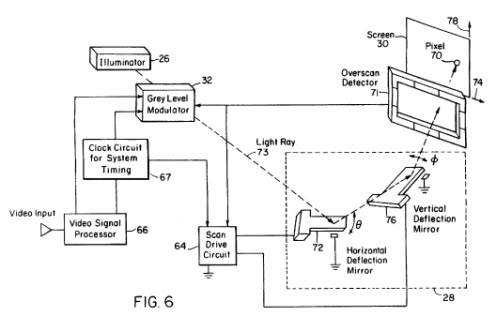

Abstract

> A compact display system including a viewing surface; a beam steering mechanism; a source of light remote from the viewing surface and the beam steering mechanism; and at least one waveguide connecting the source of light with the viewing surface for transmitting illumination from the source of light to the viewing surface.
>
> The beam steering mechanism is associated with the waveguide and the viewing surface for scanning illumination transmitted by the waveguide onto the viewing surface.
>
> There is a modulator for modulating the source of light; and a subsystem for synchronizing the modulator with the beam steering mechanism, but only the distal end of the waveguide and the beam steering mechanism are located near the viewing surface resulting in a more compact display which can be mounted on a pair of eyeglasses.

[Image Combining System for Eyeglasses and Face Masks](http://patft.uspto.gov/netacgi/nph-Parser?patentnumber=5886822) (US Patent No. 5,886,822)

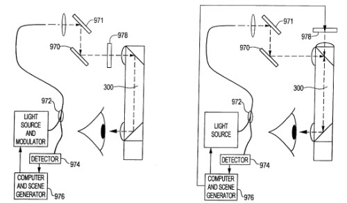

Abstract

> An optical system combines a first image formed by a main lens with a second image provided by an electronic display, slide, or other image source. The image combining system includes one or more inserts such as a set of reflecting image combiners to redirect light on an optical pathway within the main lens to the user’s eye.
>
> The image combining system is highly compact, allowing the integration of a display system with eyeglasses or a face mask, such as a diver’s mask. A number of implementations of the optical system make possible other types of image integration including uses in image acquisition systems such as cameras.

[Eyeglass Interface System](http://patft.uspto.gov/netacgi/nph-Parser?patentnumber=6091546) (US Patent No. 6,091,546)
[Eyeglass Interface System](http://patft.uspto.gov/netacgi/nph-Parser?patentnumber=6349001) (US Patent No. 6,349,001)

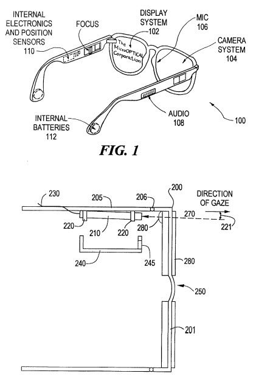

As we can see in the image below from this patent, this interface system may include image sensors that can capture video, Optical Character Recognition (OCR), and barcode information.

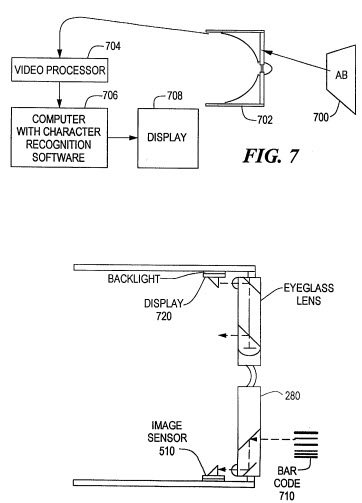

Abstract

> An eyeglass interface system is provided which integrates interface systems within eyewear. The system includes a display assembly and one or more audio and/or video assemblies mounted to an eyeglass frame. The display assembly is mounted to one temple and provides an image which can be viewed by the user. The audio or video assembly is mounted to the other temple and is in communication with the display assembly.
>
> The audio or video assembly may comprise a camera assembly and/or an audio input or output assembly, such as a microphone and/or speakers. The camera assembly is placed on the temple to record the visual field observed by the user. A head-tracking assembly may be provided to track the position of the user’s head.
>
> A number of applications can be provided with the present system, such as a telephone system, pager system, or surveillance system. The present eyeglass interface system is compact, offers the user hands-free operation, and provides an attractive appearance due to concealment of the assemblies within the eyeglass frame and lenses.

[Torsional Micro-Mechanical Mirror System](http://patft.uspto.gov/netacgi/nph-Parser?patentnumber=6201629) (US Patent No. 6,201,629)
[Magnetically Actuated Torsional Micro-Mechanical Mirror System](http://patft.uspto.gov/netacgi/nph-Parser?patentnumber=6538799) (US Patent No. 6,538,799)

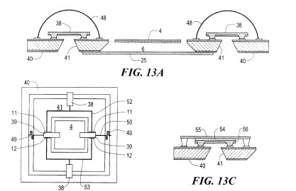

Abstract

> A torsional micro-mechanical mirror system includes a mirror assembly rotatably supported by a torsional mirror support assembly for rotational movement over and within a cavity in a base. The cavity is sized sufficiently to allow unimpeded rotation of the mirror assembly.
>
> The mirror assembly includes a support structure for supporting a reflective layer. The support structure is coplanar with and formed from the same wafer as the base. The torsional mirror support assembly includes at least one torsion spring formed of an electroplated metal. An actuator assembly is operative to apply a driving force to torsionally drive the torsional mirror support assembly, whereby torsional motion of the torsional mirror support assembly causes rotational motion of the mirror assembly.
>
> In another embodiment, a magnetic actuator assembly is provided to drive the mirror assembly. Other actuator assemblies are operative to push on the mirror assembly or provide electrodes spaced across the gap between the mirror assembly and the base. A process for fabricating the torsional micro-mirror is provided. The torsional micro-mirror is useful in various applications such as in biaxial scanner or video display systems

[Compact Image Display System for Eyeglasses or Other Head-Borne Frames](http://patft.uspto.gov/netacgi/nph-Parser?patentnumber=6204974) (US Patent No. 6,204,974)
[Compact Image Display System for Eyeglasses or Other Head-Borne Frames](http://patft.uspto.gov/netacgi/nph-Parser?patentnumber=6356392) (US Patent No. 6,356,392)
[Compact Image Display System for Eyeglasses or Other Head-Borne Frames](http://patft.uspto.gov/netacgi/nph-Parser?patentnumber=6384982) (US Patent No. 6,384,982)

This version of the display system discusses different shaped eye lenses and includes speakers and microphones.

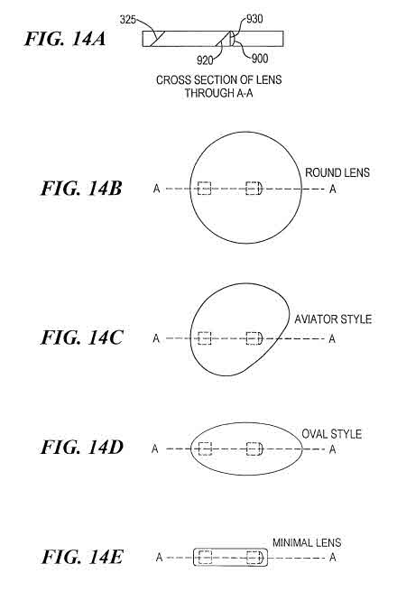

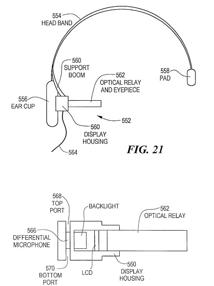

Abstract

> A head-mountable image display system provides an image to a user’s eye separate from ambient light. The system includes an optical relay having an optical pathway to receive light from a display element. The optical relay also permits passage of ambient light toward the user’s eye.
>
> An eyepiece assembly is disposed to redirect light on the optical pathway to the user’s eye. The system is highly compact, allowing the integration of the display system with eyeglasses, a face mask, such as a diver’s mask, a head set, or the like.

[Eyeglass Display Lens System Employing Off-Axis Optical Design](http://patft.uspto.gov/netacgi/nph-Parser?patentnumber=6353503) (US Patent No. 6,353,503)

Abstract

> An off-axis optical display system is provided. The system comprises an eyeglass lens assembly having a first lens section having a first surface, at least a portion of the first surface having a first curvature, and a second lens section having a second surface, at least a portion of the second surface having a second curvature.
>
> An interface is located between the first surface and the second surface. The interface comprises an optical layer and conforms to the first curvature of the first surface and the second curvature of the second surface.
>
> An image source is located off-axis with respect to the interface to transmit light along an optical path that reflects off the optical reflective surface of the interface toward an eye of a user. A portion of the optical path may be through air, and refraction is provided at the interface between air and the first lens. An aberration correction element is also provided.

[Display Device with Eyepiece Assembly and Display on Opto-Mechanical Support](http://patft.uspto.gov/netacgi/nph-Parser?patentnumber=6618099) (US Patent No. 6,618,099)

This “display device” looks somewhat similar to the display device that we see in pictures of Google Glass.

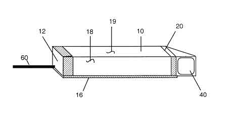

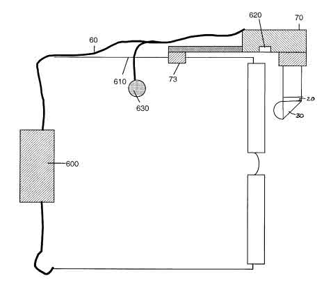

Abstract

> A compact, head-mountable display device for transmitting an image to a user’s eye is provided. The display device includes a support fixture comprising an elongated member configured to allow passage of ambient light across a direction of elongation of the elongated member to a user’s eye.
>
> A display, such as an LCD, is supported by the support and is operative to provide an image. An eyepiece assembly is supported by the support fixture in proximity to the display to receive the image from the display and to direct the image to the user’s eye.
>
> The support fixture also defines an illumination path along the elongated member, and the display is located to receive illumination light on the illumination path from a light source.

[Illumination Systems for Eyeglass and Facemask Display Systems](http://patft.uspto.gov/netacgi/nph-Parser?patentnumber=6724354) (US Patent No. 6,724,354)

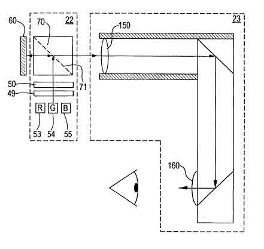

Abstract

> A display illumination and viewing system has an illumination optical path and a viewing optical path coinciding along a portion of their lengths. A display is located at one end of the coinciding path portion.
>
> A first lens system is located on the coinciding path portion and a second lens system is located on the viewing optical path. An illumination assembly is located on the illumination optical path and off the coinciding path portion. The illumination assembly is spaced from the first lens system by a distance corresponding to a focal length of the first lens system. A reflective and transmissive element is located at an opposite end of the coinciding path portion to reflect light from the illumination assembly onto the coinciding path portion toward the display and to transmit light from the display along the viewing optical path.
>
> In another aspect of the invention, the image display system is operable in a color mode and a monochrome mode. Illumination circuitry is in communication with an illumination source and includes a switch operative to switch the illumination source between the color mode to provide a color display and the monochrome mode to provide a monochrome display.

[Binocular Viewing System](http://patft.uspto.gov/netacgi/nph-Parser?patentnumber=6879443) (US Patent No. 6,879,443)
[Binocular viewing system](http://appft.uspto.gov/netacgi/nph-Parser?Sect1=PTO2&Sect2=HITOFF&u=%2Fnetahtml%2FPTO%2Fsearch-adv.html&r=1&f=G&l=50&d=PG01&p=1&S1=20050174651&OS=20050174651&RS=20050174651) (Patent Application No. US20050174651)

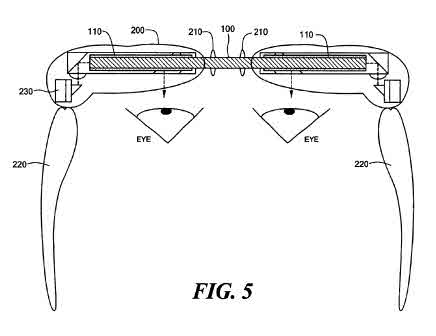

Another image from the patent showed a pair of glasses that looked a little more like the glasses shown in the review I linked to above for the MyVu glasses created for an iPod.

Abstract

> A binocular viewing system provides images from electronic display elements to the left and right eyes of a user transmitted via right eye and left eye display assemblies connected by a nose bridging element. The binocular viewing system includes an interpupillary distance adjustment mechanism to accommodate multiple users.
>
> Accommodation for vision correction and a focus mechanism may also be provided. Also, the binocular viewing system provides a virtual image at a distance less than infinity, in an arrangement that also accommodates a range of interpupillary distances.
>
> In other aspects, the binocular viewing system incorporates face curvature to more comfortably fit a user’s head, and places the electronic display elements close to the user’s eye, either in the line of sight, or within the nose bridging element.

[Compact, Head-Mountable Display Device with Suspended Eyepiece Assembly](http://patft.uspto.gov/netacgi/nph-Parser?patentnumber=7158096) (US Patent No. 7,158,096)
[Compact, Head-Mountable Display Device with Suspended Eyepiece Assembly](http://patft.uspto.gov/netacgi/nph-Parser?patentnumber=7843403) (US Patent No. 7,843,403)

Abstract

> A compact, lightweight, head-mountable display device is provided for transmitting an image to a user’s eye. The device includes a projection system including a display attached at one end to a head-mountable support fixture. An eyepiece assembly is attached to a second end of the support fixture.
>
> The support fixture maintains the projection system and the eyepiece assembly in alignment along an optical path through free space between the projection system and the eyepiece assembly, with the projection system disposed to transmit the image on the optical path and the eyepiece assembly disposed to receive the image from the projection system and to direct the image to the user’s eye.

[Optical System Using Total Internal Reflection Images](http://patft.uspto.gov/netacgi/nph-Parser?patentnumber=7242527) (US Patent No. 7,242,527)

Abstract

> An optical system for a head mounted display includes a light pipe having two parallel surfaces along which modes can travel by total internal reflection.
>
> An illumination element allows selection of modes so that the desired modes can be transmitted along the light pipe, either axially or by total internal reflection.

[Eyewear Display and Media Device Interconnection System](http://patft.uspto.gov/netacgi/nph-Parser?patentnumber=7663805) (US Patent No. 7,663,805)

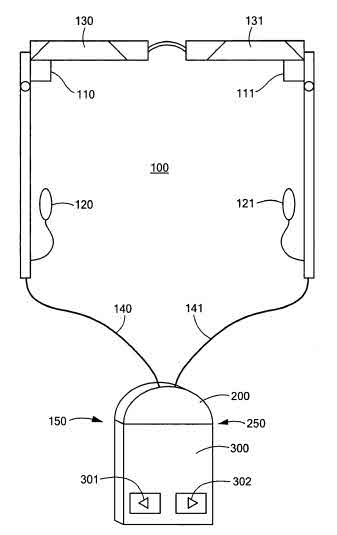

Abstract

> An eyewear display and media device interconnection system enables a user to connect various media devices and various eyewear or other displays to each other, by using a common interface.
>
> The integrated system offers improved ergonomics, lower size, lower power consumption and lower cost.

[Mobile Multi-Media Interface and Power Pack for Portable Entertainment Devices](http://patft.uspto.gov/netacgi/nph-Parser?patentnumber=7900068) (US Patent No. 7,900,068)

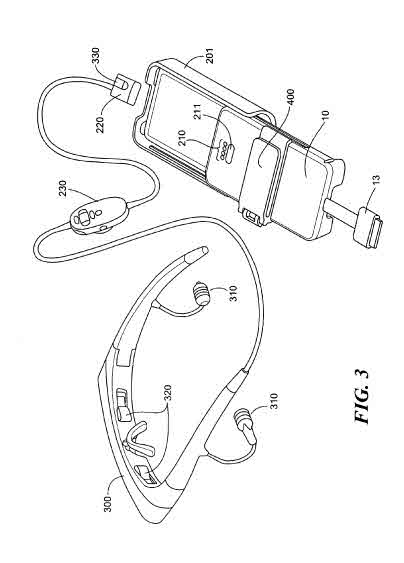

Abstract

> A power supply and interface circuit assembly is used with a portable media player (PMP) to relay signals between the PMP and a peripheral device(s), such as a head-mounted display. A power supply in or attached to the assembly provides power to the circuitry, the PMP, and the peripheral device.
>
> The assembly is able to manage the charging and discharging of power to the PMP and the peripheral device and to manage multi-media signals between the PMP and the peripheral device to provide a complete, mobile interface assembly.

[Light Weight, Compact, Remountable Face-Supported Electronic Display](http://appft.uspto.gov/netacgi/nph-Parser?Sect1=PTO1&Sect2=HITOFF&d=PG01&p=1&u=%2Fnetahtml%2FPTO%2Fsrchnum.html&r=1&f=G&l=50&s1=%2220030090439%22.PGNR.&OS=DN/20030090439&RS=DN/20030090439) (Patent Application No. US20030090439)

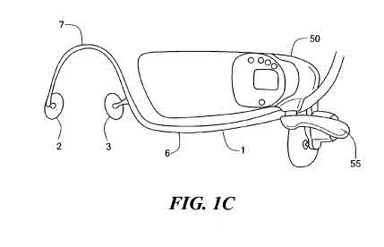

Abstract

> An electronic imaging system is mountable on a user’s head without eyewear. The system provides a computer monitor image or other electronic display, such as television or data display. The system provides many of the functions and advantages of known eyewear-mounted displays, but without requiring the user to wear spectacles. The system can be fit to a wide range of users without prescriptive correction or other customization.

[Manufacturing Methods for Embedded Optical System](http://appft.uspto.gov/netacgi/nph-Parser?Sect1=PTO2&Sect2=HITOFF&u=%2Fnetahtml%2FPTO%2Fsearch-adv.html&r=1&f=G&l=50&d=PG01&p=1&S1=20060192306&OS=20060192306&RS=20060192306) (Patent Application No. US20060192306)

Abstract

> A method for producing a solid optical system with embedded elements is provided. The embedded elements may include inorganic, polymer, or hybrid lenses, mirrors, beam splitters and polarizers, or other elements. The embedding material is a transparent high quality optical polymer.

[Method for Producing High Quality Optical Parts by Casting](http://appft.uspto.gov/netacgi/nph-Parser?Sect1=PTO2&Sect2=HITOFF&u=%2Fnetahtml%2FPTO%2Fsearch-adv.html&r=1&f=G&l=50&d=PG01&p=1&S1=20060192307&OS=20060192307&RS=20060192307) (Patent Application No. US2006192307)

Abstract

> A casting method, rather than injection molding, to produce polymer optical components and systems is provided. The casting process controls shrinkage and stress, thus providing both high bulk uniformity and high quality, accurate surfaces, by incorporating polymer films into the mold. The films may remain incorporated into the part or may optionally be removed from the part after removal from the mold. In addition, the incorporation of separately produced components within the cast part is also provided, eliminating post-casting assembly manufacturing steps

[Bi-Directional Backlight Assembly](http://appft.uspto.gov/netacgi/nph-Parser?Sect1=PTO2&Sect2=HITOFF&u=%2Fnetahtml%2FPTO%2Fsearch-adv.html&r=1&f=G&l=50&d=PG01&p=1&S1=20080219025&OS=20080219025&RS=20080219025) (Patent Application No. US2008219025)

Abstract

> A backlight assembly emits light out of two light emitting faces using a light source such as side-emitting LEDs that send light into an optical guide or body of optical material that diffuses the light uniformly and emits bi-facially. In this way, two displays, such as LCDs, can be illuminated at the same time and the efficiency is increased. The backlight assembly can be incorporated into an eyewear system such as a binocular display system.
