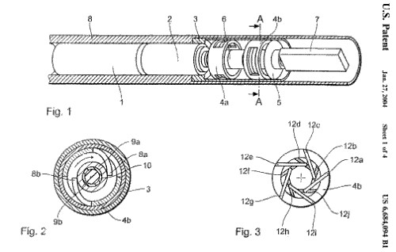
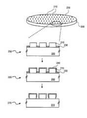
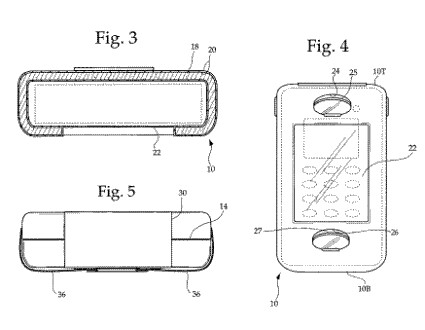

Google has many patents listed at the USPTO that have little to do with search.

I thought it might make a fun post to make a list of some of the ones that made me scratch my head a little, and wonder why Google might be interested in things like a waterproof cellular telephone case, or a medical instrument that can be “introduced into an animal or human body.”

A number of them appear to describe aspects of the way Google sets up their computer systems, which I also thought people might be interested in. Some others involve wireless communications networks. Here’s my list of the Oddest Patents from Google:

1. [Instrument for medical purposes](http://patft.uspto.gov/netacgi/nph-Parser?Sect1=PTO2&Sect2=HITOFF&u=%2Fnetahtml%2FPTO%2Fsearch-adv.htm&r=1&p=1&f=G&l=50&d=PTXT&S1=6684094.PN.&OS=pn/6684094&RS=PN/6684094)

This medical instrument uses ultrasonic sound to investigate the structural makeup of biological tissue in organs and vessels. An image from the patent:

2. [Methods to deposit metal alloy barrier layers](https://patents.google.com/patent/US7223695B2/en)

This one was originally assigned to Intel and was then assigned to Google in November of 2005.

Its focus is upon solving some of the engineering problems that copper presents during the semiconductor fabrication process. I don’t know if Google is in the business of making chips, but they have a patented process to handle issues around it.

3. [Application of a pseudo-randomly shuffled hadamard function in a wireless CDMA system](http://patft.uspto.gov/netacgi/nph-Parser?Sect1=PTO2&Sect2=HITOFF&u=%2Fnetahtml%2FPTO%2Fsearch-adv.htm&r=1&p=1&f=G&l=50&d=PTXT&S1=6829289.PN.&OS=pn/6829289&RS=PN/6829289)

One of the dominant wireless digital technologies around these days is Code Division Multiple Access, or CDMA. This patent tells us that this is a “unique, novel solution which improves the capacity of CDMA by a factor of four.” They also describe some of the other advantages of CDMA:

> Generally, CDMA offers greater signal quality, resulting in clearer calls. Also, CDMA utilizes a spread-spectrum approach, which makes it ideal for deployment in dense urban areas where multi-pathing is an issue. This results in fewer dropped calls. Furthermore, CDMA technology is more power-efficient, thereby prolonging the standby and active battery life. But one of the most attractive features of CDMA is that it offers greater capacity for carrying signals.
>
> The airwaves are divided into several different frequency bands per Federal Communications Commission (FCC) regulations. A limited segment of the airwaves has been allocated by the FCC for cellular usage. Due to the huge demand for cellular usage and the limited bandwidth that is available, getting a license from the FCC to transmit on a particular frequency band is extremely expensive. By increasing capacity, CDMA enables PCS providers to carry more users per channel. This increased capacity directly translates into greater revenue for cellular companies.

4. [Baseband direct sequence spread spectrum transceiver](https://patents.google.com/patent/US6982945B1/en)

The abstract from the patent is interesting:

> A baseband direct sequence spread spectrum CDMA transceiver. The data signal is modulated with a Hadamard function having pseudorandomly scrambled rows. This data signal is then broadcast baseband, absent a carrier, by a relatively short, mismatched antenna.
>
> The baseband signal is spread out across the DC to 30 MHz spectrum. A low noise, high gain-bandwidth product amplifier boosts the baseband RF signal. A correlator/servo system is used to actively cancel the transmit signal from the received signal. Consequently, the same antenna can be used to receive incoming baseband RF signals as well as transmit baseband RF signals, thereby providing full-duplex operation.

5. [Communications network quality of service system and method for real time information](https://patents.google.com/patent/US7142536B1/en)

This one talks about ways of managing the quality of service of network communications that need to be sent in real-time. Interestingly, it is referred to in the patent above it involving a broadband transceiver, and it discusses the sending and receiving of voice communications.

6. [Drive cooling baffle](https://patents.google.com/patent/US6906920B1/en)
7. [Cooling baffle and fan mount apparatus](http://patft.uspto.gov/netacgi/nph-Parser?Sect1=PTO2&Sect2=HITOFF&u=%2Fnetahtml%2FPTO%2Fsearch-adv.htm&r=1&p=1&f=G&l=50&d=PTXT&S1=6845009.PN.&OS=pn/6845009&RS=PN/6845009)
8. [Mounting structures for electronics components](http://patft.uspto.gov/netacgi/nph-Parser?Sect1=PTO2&Sect2=HITOFF&u=%2Fnetahtml%2FPTO%2Fsearch-adv.htm&r=1&p=1&f=G&l=50&d=PTXT&S1=7113409.PN.&OS=pn/7113409&RS=PN/7113409)
9. [Cable management for rack mounted computing system](http://patft.uspto.gov/netacgi/nph-Parser?Sect1=PTO2&Sect2=HITOFF&u=%2Fnetahtml%2FPTO%2Fsearch-adv.htm&r=1&p=1&f=G&l=50&d=PTXT&S1=6870095.PN.&OS=pn/6870095&RS=PN/6870095)

These all share the same inventor and may describe some of the methods that Google came up with in designing some of their internal systems.

10. [Cellular telephone case](http://patft.uspto.gov/netacgi/nph-Parser?Sect1=PTO2&Sect2=HITOFF&u=%2Fnetahtml%2FPTO%2Fsearch-adv.htm&r=1&p=1&f=G&l=50&d=PTXT&S1=6785566.PN.&OS=pn/6785566&RS=PN/6785566)

This patent for a waterproof cellular telephone case was filed in 2002. I wouldn’t say that it’s any indication that Google will be coming out with a telephone, but I’ve been finding it an odd piece in Google’s collection of intellectual property.

