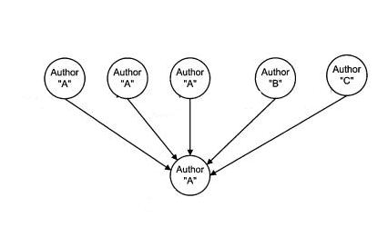
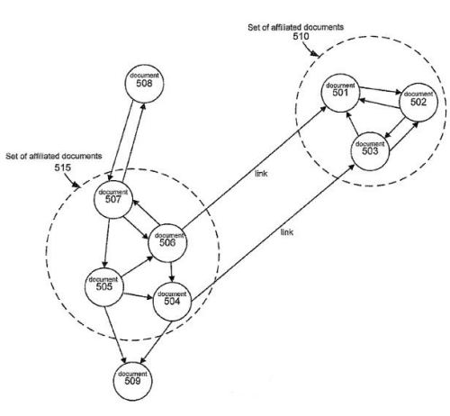

## An Affiliated Page Link is a Link between Pages From the Same Owners

Might Google rank links to pages differently based on a perception of how related or affiliated those pages might be to each other? For instance, if three pages authored by the same person link to a fourth page, and two other pages, each written by other people, also link to that fourth page, should the three links from the same author count as passing along three times as much link weight as the links from the independently written pages?

A patent granted to Google today shows how the search engine might analyze how “affiliated” pages or sites are to each other, and how their degree of affiliation might influence the amount of weight passed along by each link.

So, for instance, a page that has two links pointing to another page might not pass along twice as much link weight as a single link from that page. A site with 20 links from its pages to another page may not pass along 20 times as much link weight as a link from one page would.

There are a few different ways that Google might determine how affiliated pages might be to each other, and the patent provides many examples of how pages or sites might be considered to be affiliated with one another.

***Interlinking between pages and sites:*** For instance, Google might look at all the links between pages on the web, and pages or sites that are more closely interlinked to each other might be considered to be affiliated.

***Traffic patterns:*** Pages or sites that are visited by many users in the same search or browsing session might also be considered to be affiliated.

***Similarity of hostnames*** Pages that share a domain name or are on subdomains of the same domain can be considered affiliated.

***Similarity of IP addresses*** The Internet Protocol or [IP addresses](https://www.webopedia.com/DidYouKnow/Internet/IPaddressing.asp) of two web servers may be compared, and if the leading two or three components (octets) of the ID address are identical, affiliation may be inferred.

We don’t know if Google is using this method or not, but they may be. The patent was originally filed in 2004, and its inventors include Krishna Bharat, who amongst many other things invented Google News, Amit Singhal, who is Google’s present Head of Search Quality, and Paul Haahr, a co-inventor listed on several Google patents, including one on Information Retrieval based upon Historical Data, another on identifying meaningful stopwords in keywords, how multi-stage query processing might happen at Google, and how to query refinements might be identified.

The patent is:

[Determining quality of linked documents](http://patft.uspto.gov/netacgi/nph-Parser?Sect1=PTO2&Sect2=HITOFF&u=%2Fnetahtml%2FPTO%2Fsearch-adv.htm&r=1&p=1&f=G&l=50&d=PTXT&S1=7,783,639.PN.&OS=pn/7,783,639&RS=PN/7,783,639)
Invented by Krishna Bharat, Amit Singhal, and Paul Haahr
Assigned to Google
US Patent 7,783,639
Granted August 24, 2010
Filed June 30, 2004

Abstract

> A ranking component ranks documents, such as web pages or websites, to obtain a ranking score that defines a quality judgment of the document. The ranking score of a particular document is based on the ranking score of the documents which link to it and based on affiliation among the documents.

To sum up, the concept involved in this patent as succinctly as possible, a ranking score calculated for a page might be based upon a function that may (1) limit the value passed along through links from affiliated pages to some maximum value, while (2) adding independent values from non-affiliated pages.

So, for example, a sitewide link to a page might pass along more value than a single link from the same site. Still, the amount of link weight it would pass along may be capped off as some limited maximum amount because all the links are affiliated since they are on the same domain.

Interestingly, the patent doesn’t mention PageRank, which is the original ranking algorithm based upon looking at links between pages to come up with a query independent rank for those pages developed at Stanford by Google’s founders Larry Page and Sergey Brin, as described in the Stanford patent [Method for node ranking in a linked database](http://patft.uspto.gov/netacgi/nph-Parser?Sect1=PTO2&Sect2=HITOFF&u=%2Fnetahtml%2FPTO%2Fsearch-adv.htm&r=1&p=1&f=G&l=50&d=PTXT&S1=7,783,639.PN.&OS=pn/7,783,639&RS=PN/7,783,639).

But the process described in this patent does echo a number of the processes described in the PageRank patent, while also including a “set location component” that analyzes documents in a database (such as Google’s index of web pages). It groups those documents into sets of related documents. The patent shows a screenshot of a limited link graph of the Web, with some pages shown as affiliated sets:

Google’s patent does describe many alternative approaches to determine how much of a contribution value might be passed along to the final ranking score of a page being linked to by non-affiliated pages, and the maximum value that affiliated pages might pass along.

**Conclusion**

This *Affiliated Page Link* patent was filed the same month in 2004 as Google’s [Reasonable Surfer patent](https://www.seobythesea.com/2010/05/googles-reasonable-surfer-how-the-value-of-a-link-may-differ-based-upon-link-and-document-features-and-user-data/), which told us that the weight or contribution of a link on a page to the ranking score of a page being linked to might vary from link to link based upon a score involving features of the link, the page the link appears upon, and the page being linked to.

While there’s nothing within either patent that indicates they might be related to each other, it’s possible that both patents may be, or may have been used by Google.

Google uses many ranking signals, and some are query-dependent signals that depend upon the specific query used to rank pages in search results, such as whether or not the query terms appear upon the pages themselves.

Others are query-independent signals that try to weigh the quality or importance of a page, such as PageRank, which looks at the quality and quantity of links pointing to a page to determine how “important” that page might be.

The *Affiliated Page Link* approach tries to limit a calculation of the importance score of a page by links pointing to that page based upon whether or not the source of those links is perceived to be independent or not. The patent tells us, for instance, that “additional links by the same author…should not excessively raise the ranking score” of a document.

I’ve seen many people writing about sitewide links from the same domain surmise that those links don’t pass along as much link weight as they might if they were individual links from different domains. That would be likely under this affiliated page link approach. Is it the reason why they might not?

If you are a site owner, what sites might Google consider to be affiliated with your site or sites?

I’ve written a few posts about links. These were ones that I found interesting:

5/30/2006 – [Web Decay and Broken Links Can be Bad for Your Site](https://www.seobythesea.com/2006/05/web-decay-and-dead-links-can-be-bad-for-your-site/)
12/11/2007 – [Google Patent on Anchor Text Indexing and Crawl Rates](https://www.seobythesea.com/2007/12/google-patent-on-anchor-text-and-different-crawling-rates/)
1/10/2009 – [What is a Reciprocal Link?](https://www.seobythesea.com/2009/01/what-are-reciprocal-links-and-what-do-search-engines-think-of-them/)
5/11/2010 – [Google’s Reasonable Surfer: How the Value of a Link May Differ Based upon Link and Document Features and User Data](https://www.seobythesea.com/2010/05/googles-reasonable-surfer-how-the-value-of-a-link-may-differ-based-upon-link-and-document-features-and-user-data/)
8/24/2010 – [Google’s Affiliated Page Link Patent](https://www.seobythesea.com/2010/08/googles-affiliated-page-link-patent/)
7/13/2011 – [Google Patent Granted on PageRank Sculpting and Opinion Passing Links](https://www.seobythesea.com/2011/07/google-patent-granted-on-pagerank-sculpting-and-opinion-passing-links/)
11/12/2013 – [How Google Might Use the Context of Links to Identify Link Spam](https://www.seobythesea.com/2013/11/google-context-of-links-identify-link-spam/)
12-10-2014 – [A Replacement for PageRank?](https://www.seobythesea.com/2014/12/replacement-pagerank/)
4/24/2018 – [PageRank Update](https://www.seobythesea.com/2018/04/pagerank-updated/)

Last Updated July 1, 2019.
