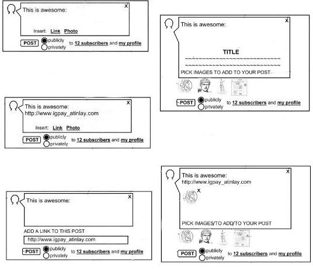

When you write a post at Google Plus, the social network allows you to link a web page and display an image from that page to the post, as well as defining who your post should be seen by. A patent filing published last week describes some of the processes behind adding those features, and provides us with screenshots of interfaces from an early version of Google Plus. It also shows off some of the thinking that might have led to the use of circles in defining the idea of an “asymmetric social network.”

The posting interface is shown in many screenshots in the patent filing:

I find it interesting about reading through patents is that they introduce us to the vocabulary used by the inventors and concepts that they might have considered that we might not even be conscious of. Chances are, you may have never thought of or referred to Facebook or LinkedIn, or Myspace as an asymmetrical or bidirectional social network, or Twitter or Google Plus as an asymmetrical social network. The patent’s description starts off with a detailed definition of what an asymmetric social network is.

> An asymmetric social network is a social network where a first member’s relationship to a second member is not necessarily the same as the second member’s relationship to the first member. Since the character of the social interaction between members in a member network can be defined by the nature of the relationship between those members, a first member in an asymmetric social network may interact with a second member in ways that differ from the social interaction provided for the second member to interact with the first member.

With the circles in Google Plus, the social network allows users to have several different social interactions, based upon whom they are attempting to interact with.

For instance, if you create a post and send it to one person, it’s a little like sending an email. If you create a post and send it to one or more of the Circles that you’ve created, it’s a little more like a newsletter, or a tweet that goes into the streams of people who have subscribed to you. (note: the patent doesn’t refer to “circles” anywhere though it describes a difference between sending something to subscribers or sending the post to your profile). If you create a post and post it to your profile, it’s more like a status update on a LinkedIn or Myspace.

The patent application focuses primarily upon authoring tools for posts where you might link to a page, choose an image from that page, or a thumbnail of the page to include with your post.

The patent application is:

[Assisting The Authoring Of Posts To An Asymmetric Social Network](http://appft.uspto.gov/netacgi/nph-Parser?Sect1=PTO1&Sect2=HITOFF&d=PG01&p=1&u=%2Fnetahtml%2FPTO%2Fsrchnum.html&r=1&f=G&l=50&s1=%2220110197146%22.PGNR.&OS=DN/20110197146&RS=DN/20110197146)
Invented by Samuel Shoji Fukujima Goto, Joseph Rideout, Braden F. Kowitz, and Todd Jackson
US Patent Application 20110197146
Published August 11, 2011
Filed: February 8, 2010

Abstract

> Methods, systems, and apparatus, including computer programs encoded on a computer storage medium, assist the authoring of posts to an asymmetric social network. In one aspect, a method performed by a system of one or more data processing devices includes receiving, at the system, an identification of an electronic document that is available on the Internet, the system identifying image content in the electronic document, the system filtering the identified image content, the system triggering presentation of the filtered image content to an author of a post to an asymmetric social network, the system receiving a selection of a first image from amongst the presented image content, and the system adding the first image to a post to the asymmetric social network.

Some of the features involved in the process of assisting authors of posts could include:

1) Filtering images, so that advertisement images aren’t shown.
2) Filtering image content not to include icons or decorative elements.
3) Possibly providing a screenshot of the page as an image to include with the post.

The patent goes into much more detail about the posting features and how the system might distinguish between images that are either advertisement or decorative images or neither, and is worth skimming through. For example, one of the ways that an advertisement image might be identified because it might be 3 times longer or taller than it is high or wide, indicating a banner advertisement of some type. An image that exists for decoration purposes or as an icon might be identified by being less than 30 pixels on any one side.

This patent doesn’t include the concept of Circles at this point, but it does include a posting selection feature that allows authors to decide whether a post is public or private. A private post would only go to the subscribers for an author and not be displayed on the author’s profile or subscribers’ profiles.

**Conclusion**

When I talk or write about creating titles for pages to be put in a title element on a page, one of the things I like to stress is that a page title is most commonly seen out of the context of the page. The words that you put in between an opening <title> and a closing </title> don’t appear upon the page itself, but rather at the top of the window that the web page is displayed in. If someone bookmarks that page, the title might be used as the name of the bookmark. A search engine usually (but not always) uses the title of the page as a title (and link) displayed in search results above the snippet for that page. It’s also not uncommon for people who might link to that page to choose to use the title for the page as the anchor text of that link.

When someone chooses to link to one of your pages at Google Plus, the process described in this patent filing allows them to include a choice of some images from your page, filtering out other images as described in this patent filing. I think that’s something to consider when you’re deciding upon an image or images to include with your article or post or products that might be linked to from the social network. Will thumbnails of one or more of those images make it more likely that someone may click through from Google plus to read your page? How well do those “out of context” thumbnails convey the ideas or meaning that might be found on your page? How effectively do they work out of context?

If you’re using Google Plus, have you experimented to see what images show up as choices for people to include when they post a link to your page? Facebook also provides a similar choice of images take from a page when you post a link to that page.

I’m not completely satisfied with the choices of images that show up in either Facebook or Google Plus with my pages because the books are shown in the left column of my page sometimes are shown as pictures to include with a link in a post, and I’m thinking of making some changes because of that.
