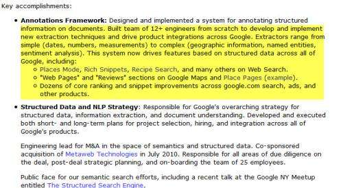
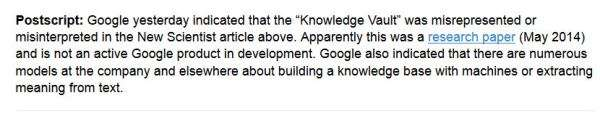

At Google, when you asked a question, you could sometimes get a response providing answers to questions such as:

“When was George W. Bush’s birth-date?”.

We knew that Google could answer some questions like that, even if it might [have been challenging](https://homes.cs.washington.edu/~weld/papers/mulder-www10.pdf), but we didn’t have much of a clue regarding the existence of something like [Google’s Knowledge Graph](https://www.google.com/search/about/) until 2011. So the answers we would see would sometimes be regular snippets where a word such as “**birth-date**” might be bolded.

Our set of 17 “related patents” that I first saw mentioned in a patent I wrote about this past Tuesday, and which was granted on August 19th, appear to have been created by a team under [Andrew Hogue](http://secondthought.org/resume.html) who was tasked to create “an annotation framework” to index more objects and facts associated with them on the web, which he would discuss more deeply during the presentation The Structured Search Engine, which is highly recommended.

He also oversaw the [acquisition of MetaWeb](https://www.seobythesea.com/2010/07/google-gets-smarter-with-named-entities-acquires-metaweb/) by Google and the introduction of 25 former Meta-Web staff members from the company into Google.

He left Google for Foursquare not long ago, and it’s hard to miss his [resume](http://secondthought.org/resume.html) online:

Some media and blog attention has been focused upon knowledge bases at Google, with a presentation at KDD ’14 on an introduction to The Google Vault, which is one of many projects going on at Google. It was pointed to last week by an [article](https://homes.cs.washington.edu/~weld/papers/mulder-www10.pdf) in New Scientist magazine. It covered several places on the Web since, including a post I wrote on the Go Fish Digital site titled [Good Bye Knowledge Graph, Hello Google Knowledge Vault?](https://gofishdigital.com/good-bye-knowledge-graph-hello-google-knowledge-vault/), and an article by Gregg Sterling at Search Engine Land named [Google “Knowledge Vault” To Power Future Of Search](https://searchengineland.com/google-builds-next-gen-knowledge-graph-future-201640).

Gregg got a response to his post from Google:

I mentioned that Andrew Hogue was in charge of a project, according to his resume, to annotate web pages and build a more structured web semantically. He is listed as the co-inventor of a patent on a ***Browseable fact repository*** which is the focus of this post. It’s not a Knowledge Vault or even a Knowledge Graph, but it describes a predecessor to those. Knowledge bases were known back then, and the patent starts by telling us of the history behind them and the problem this patent was intended to solve. As for history:

> Knowledge bases are collections of facts and data organized into a systematic arrangement of information. Online knowledge bases have become increasingly prevalent on the Internet, and examples include WordNet, Wikipedia, Webopedia, and similar online encyclopedias, dictionaries, and document collections.
>
> These knowledge bases are typically organized around individual documents (“articles”) that describe topics of interest, such as persons, places, events, fields of knowledge, and the like.
>
> Each article on a particular subject or topic is the primary unit of storage and manipulation. That is, articles as a whole are used to describe a topic, and articles themselves are stored as single documents typically containing a large block of unstructured (other than for formatting) text.
>
> More particularly, in a typical online knowledge base such as Wikipedia or Wordnet, search tools are provided to search for information. An underlying service engine or database management system receives a search query containing one or more keywords or phrases. The service engine then selects one or more articles that contain such keywords. Typically, the single article that best matches the keyword query, for example, the article having the query keywords in its title, will be retrieved and displayed to the user.

But, the answer someone might receive doesn’t indicate which “facts or details about the topic were most relevant to the user’s query.” A patent titled “Browseable Fact Repository” provides a look at a place where information about objects and facts associated with them could be extracted from the Web and placed in a data store that could be searched to return information. The importance of that information and confidence in it could be listed and presented based upon those factors. The patent is:

[Browseable fact repository](http://patft.uspto.gov/netacgi/nph-Parser?Sect1=PTO1&Sect2=HITOFF&d=PALL&p=1&u=%2Fnetahtml%2FPTO%2Fsrchnum.htm&r=1&f=G&l=50&s1=7,774,328.PN.&OS=PN/7,774,328&RS=PN/7,774,328)
Invented by Andrew W. Hogue and Jonathan T. Betz
Assigned to Google Inc.
US Patent 7,774,328
Granted August 10, 2010
Filed: February 17, 2006

Abstract

> A fact repository supports searches of facts relevant to search queries comprising keywords and phrases. A service engine retrieves the objects that are associated with facts relevant to the query. The objects are displayed on a search results page. Each object is displayed with a selection of the facts associated with the object. The selected facts are ordered according to their relevance to the query.

Here’s a summary of the invention, as listed in the patent:

> The present invention provides a methodology and system for automatically creating and maintaining facts and links between facts and objects in a fact repository. The fact repository includes a large collection of facts, each associated with an object, such as a person, place, book, movie, country, or any other entity of interest.
>
> Each fact comprises an attribute, which is descriptive of the type of fact (e.g., “name,” or “population”), and a value for that attribute (e.g., “George Washington,” or “1,397,264,580”). A value can also contain any text from a single term or phrase to many paragraphs or pages, such as appropriate to describe the attribute.
>
> Each object will have a name fact that is the name of the object. The value of an attribute can thus include one or more phrases that are themselves the names of other objects. Facts are preferably stored individually and separately, allowing them to be individually selected and configured in response to user queries.

> In one embodiment, there is provided a computer-implemented method for enabling browsing in the fact repository. A search query is received, which may contain keywords or phrases. The search query is used to search the fact repository for relevant objects to the search query. Each object is displayed with a plurality of facts that are associated with the object. The facts are displayed in a rank order based on a function of their relevance to the query. Associated with each displayed object is an object name link, which comprises a name fact for the object and a link to a page containing additional facts associated with the object.

In my post on how Google might use Wikipedia Titles and info boxes when extracting facts, I described part of the extraction process in a section of the post that might be used to feed information to this fact repository. I hadn’t mentioned things like how they might be ordered as described in this patent, and I cover that in the next section:

## Rankings of Facts for Objects

One ranking approach that could be used to rank a fact for an object could be:

- Whether the fact includes one or more query terms (a hit) in either the attribute or value portion of the fact. Each hit is scored based on the frequency of the term that is hit, with more common terms getting lower scores, and rarer terms getting higher scores (e.g., using a TF-IDF based term weighting model).
- The appearance of consecutive query terms in a fact
- The appearance of consecutive query terms in a fact in the order in which they appear in the query
- The appearance of an exact match for the entire query
- the appearance of the query terms in the name fact (or other designated fact, e.g., property or category)
- The percentage of facts of the object containing at least one query term
- The associated confidence measure for facts
- The associated importance measure for each fact

Since these facts are independently scored, the most relevant and important facts to any individual query can be determined and selected. A selected number (e.g., 5) of the top-scoring facts could be selected for display in response to a query.

## Browseable Fact Repository Takeaways

In the post [How Knowledge Base Entities can be Used in Searches](https://www.seobythesea.com/2014/07/knowledge-base-entities-used-in-searches/), I described how Google could respond to a query such as [In which movie did Robert Duvall profess his love for the smell of Napalm?] by searching through data store attributes or facts for the Actor=” Robert Duvall” and the Quote=”I love the smell of napalm in the morning” to identify the movie object of “Apocalypse Now.”

This Browseable Fact Repository evolved into something such as Google’s Knowledge Graph, which could be used to supply question answering Oneboxes, Knowledge Panels, [disambiguate entities](https://www.seobythesea.com/2014/08/google-finding-entities-tale-two-michael-jacksons/), and determine an [entity type](https://www.seobythesea.com/2014/08/identifying-entity-types-transfiguraton-search-google/) for an entity.

I’ll be continuing to look at those related entities from this knowledge team and possibly even some white papers they produced for other things that the fact repository was part of and was used for.
