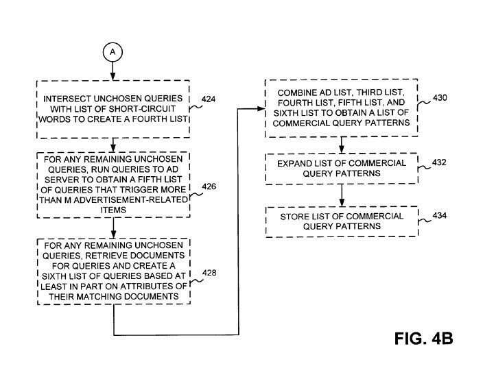
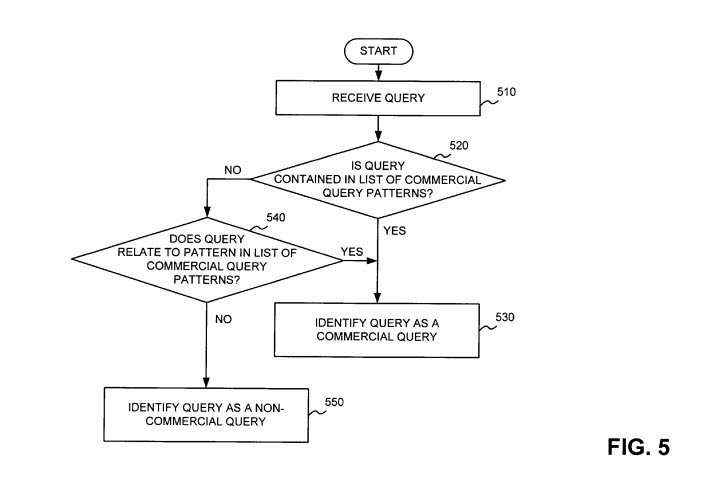

## Exact Match Domains an Unfair Ranking Signal?

One question I’m sometimes asked by people is about whether or not they should choose a domain name that includes the name of their business or brand, or if they should use keywords within a domain name to make it easier for them to rank for those keywords in Google and the other search engines. I often explain that while it may help them ranking for the phrase chosen if they use a keyword domain (often referred to as an exact match domains, or emd), that I usually prefer domain names using a brand, and that the best domain names tend to be somewhat short, memorable, and easy to spell, with emphasis on the “memorable.”

I have seen a lot of discussion on the Web about keywords in domain names, and a number of people discussing their experiments with exact match domains, and how those may help a site to rank for terms used in the domain name. The following video was uploaded at the [Google Webmaster Help Channel](https://www.youtube.com/user/GoogleWebmasterHelp) this past March, with the Head of Google’s Web Spam team, Matt Cutts answering the question, “How would you explain ‘The Power of Keyword Domains’ to someone looking to take a decision what kind of domain to go for?”

A Google patent, originally filed in 2003, and granted today (with Matt Cutts as one of the listed inventors) describes this problem in more detail and provides some ways that Google could potentially act to lessen the value of keywords included in domain names (an exact match domains) by recognizing when queries are commercial in nature and using a different ranking algorithm for those queries that might lessen the value of domains with keywords in them. As Matt noted in the video:

> We have looked at the rankings and weights that we give to keyword domains and some people have complained that we’re giving a little too much weight for keywords in domains. And so we have been thinking about adjusting that mix a little bit and sort of turning the knob down within the algorithm so that given two different domains, it wouldn’t necessarily help you as much to have a domain with a bunch of keywords in it.

The patent provides a little more context surrounding the issue, describing the use of keywords in a domain, or in exact match domains, as an effort to “trick” a search engine. From the video, it sounds like Matt empathizes a little more these days with site owners who are tempted to include keywords in domain names to help their sites become more visible in search results. Here’s the language from the patent on the problem that it attempts to solve:

> In other situations, a company may attempt to “trick” the search engine into listing the company’s web site more highly. For example, if the search engine gives greater weight in ranking results to words used in the domain name associated with web sites, a company may attempt to trick the search engine into ranking the company’s listing more highly by including desirable search terms in exact match domains names associated with the company’s listing.
>
> As an example, assume that company A sells laser printers. Company A may attempt to use a domain name that includes the words “laser printers” so that a search engine may rank the company’s listing more highly. As a result, a person searching for laser printers may not be presented with an unbiased set of results.

The patent is:

[Systems and methods for detecting commercial queries](http://patft.uspto.gov/netacgi/nph-Parser?Sect1=PTO2&Sect2=HITOFF&u=%2Fnetahtml%2FPTO%2Fsearch-adv.htm&r=1&p=1&f=G&l=50&d=PTXT&S1=8,046,350.PN.&OS=pn/8,046,350&RS=PN/8,046,350)
Invented by Amit Singhal, Matt Cutts, and Jun Wu
Assigned to Google
US Patent 8,046,350
Granted October 25, 2011
Filed: September 24, 2003

Abstract

> A system processes user queries. The system may generate a list of query patterns of a first type. The system may also receive a user query and determine whether the received query is a query of the first type based at least in part on the list of query patterns.

**More than Commercial Queries and More that Exact Match Domains**

The patent describes a number of approaches that could be used to identify commercial queries, and tells us that when a query is non-commercial, it might be processed in one way, and when it is commercial it might be processed in another manner that helps to “ensure that a person is provided with an unbiased set of results.”

The processes for determining whether queries are commercial or non-commercial may use an automated process, a manual process, or a combination of both, to find “query patterns” that can be used to match with queries typed into a search box to choose which algorithm is used.

Interestingly, in a paragraph near the end of the patent’s description, we also find this sentence which extends this process to include more than just commercial queries:

> Moreover, while the above description focused on detecting commercial queries, implementations consistent with the principles of the invention are equally applicable to detecting other types of queries, such as queries for geographic information, navigational queries (e.g., a uery of “ibm” is likely looking for IBM’s home page), time-based queries, news-related queries, natural language queries, queries involving proper names, etc.

It’s also quite possible that in addition to giving less weight to exact match domains, the ranking algorithm used when a commercial query is identified may also look at other possible signals as well.

**Identifying Commercial Queries**

The patent describes a number of possible steps that it might take to identify commercial queries.

The first step may be to obtain a list of user queries, and it might limit that list to keep it manageable. An example from the patent tells us that it might “retrieve those stored search queries that occur at least once per 100 million queries.” That could potentially limit the list to a few million or billion queries.

The next step might be to collect a list of phrases or keywords of interest to advertisers or webmasters or both. That can include phrases and keywords used in advertising or phrases/keywords used in meta tags.

A list of domain names that contain 2 or more hyphens might be gathered as well. We’re told in the patent that:

> It is very common to see domain names that include a single hyphen, but when two, three, or more hyphens are present, this is often an indication that these domain names are associated with companies that are attempting to trick search engines into ranking their web pages more highly.

Similarly, Google might create a list of hostnames (subdomains) that it finds that contain more than a certain number of hyphens. The Microsoft paper, [Spam, Damn Spam, and Statistics](https://www.microsoft.com/en-us/research/publication/spam-damn-spam-and-statistics-using-statistical-analysis-to-locate-spam-web-pages/) (pdf), describes its authors’ observations concerning the use of heavily hyphenated hostnames in web spam. Google might collect a list of hyphenated hostnames during a crawl of the Web.

Google might watch manual and automated rank checking from companies to identify terms and phrases that those companies may be competing for against other sites to identify competitive queries.

A list of “short-circuit words” or words and phrases likely to be targeted by advertisers might be put together by monitoring queries received at the search engine, through experience with commercial queries, or by manual evaluation.

**Processing Exact Match domains or Commercial Query Candidates**

The lists of user queries, domain names, and host names might be processed in a number of ways, such as:

Removing stop words, digits, punctuation, etc. “For example, for the domain name “buy-credit-cards-online.com,” server may remove the hyphens and “.com” portion to leave the following phrase ‘buy credit cards online.'” In a query such as, “where can I find low apr credit cards,” the “where can I find,” might be removed to leave the phrase “low apr credit cards.”

An n-gram analysis of the list of domain names and host names might be performed to find combinations of words found in that list that tend to show up frequently.

> For example, assume that the domain name list includes the domain name “buy-cheap-credit-cards-online.com.” Server may form the following exemplary n-grams for this domain name: “credit cards,” “buy cards,” “cheap cards,” “buy credit cards,” “cheap credit cards,” “buy cheap cards,” “buy card online,” “cheap cards online,” “credit cards online,” “buy credit cards online,” “buy cheap credit cards,” “buy cheap credit cards online.” Other n-grams may also be formed.

In addition to performing that kind of analysis on hyphenated domain names and hostnames, this process might also be performed on user queries and identified competitive queries, and terms or phrases that appear both within those lists and the domain/host lists might be identified (as “intersecting terms.”)

A set of heuristics or rules might be applied to those terms or phrases in lists where the queries and domains/subdomains intersect. For example, these rules could pull out any terms that might include two or more words, and a query occurs 5 or more times in the intersecting lists. Or three words long if the query occurs 2 or more times.

Other queries that aren’t identified through an intersection analysis, or through one of those heuristics might be identified as commercial if they include words identified as a short-circuit term. Assume for example that “hotel” is in the list of short-circuit words and the phrase “book hotel” wasn’t on one of the other lists. It may be identified as a commercial query since it includes the word “hotel.”

Other queries that weren’t identified as commercial through one of those processes might be sent to an ad server to see if it triggers a certain number of advertising related items such as ads or sponsor links or featured links, etc.

For queries that weren’t identified as commercial through any of those processes, the search engine may return a number of documents on a search for that query and examine those documents to see how commercial the documents might be. We are told, for example, that pages that target commercial terms might be more likely to include many keywords in their meta tags. (It’s possible that may have been more true back in 2003 when this patent was originally filed, but there are probably a good number of other signals that could be used to determine how commercial a page or site might be.)

We are also told in the patent that the search engine might also look at synonyms of the query terms and stems (or versions of the words included that go down to their roots – for example, “walk” is the stem of “walking.) The types of analysis described above might be performed with those synonyms or stems.

**Conclusion**

The patent notes that the processes above are illustrative examples, and provides more details for a number of them as well as a few alternatives and possible ways to score how “commercial” a query might be.

We don’t know if Google is using this approach to keywords in domains, or exact match domains, but if not, it seems like they potentially might use it or something like it from Matt Cutts’ statements in the video I included at the start of this post.

The process in this exact match domains patent focuses upon queries that Google might consider to be “commercial,” so it’s possible that keywords in domains might work better with non-commercial queries than commercial ones if Google follows this patent.

The patent was originally filed in 2003, and it’s possible that Google might look at other signals as well that aren’t described in this exact match domains patent, but I think it provides an interesting look into some of the assumptions from Google about keywords within domain names.

Lat Updated May 22, 2019
