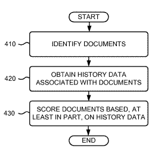

In March 2005, Google published [Information retrieval based on historical data](https://patents.google.com/patent/US7346839B2/en) and provided us with an incredible list of factors that might be used to rerank pages in search results.

It stirred a lot of discussions, and “time” became something people started thinking about in how Web pages are ranked by search engines.

A few domain hosting companies started recommending people register domain names for longer than one year since Google might see single year registrations as possible indications of a spammer’s site.

A “sandbox” effect, which appears to make new sites not rank well during an extended period of months, for competitive keywords rankings, was considered by some to be a result.

**Two new patent applications were published today which return to that topic and freshen it up a little.**

Many of the original Historical Data Patent Application factors re-emerge, and some new factors – such as advertising traffic, are raised to a more prominent role. The claims section of the second patent application that I list below expands upon what is found in the March 2005 document.

The purchasing or trading of links to improve the rankings of pages is mentioned in a section on ranking, and detection involves tracking spikes in traffic to a page over time.

Rand Fishkin created a nice overview of the original historical data patent application, and going through that first might be helpful. The description sections of the patent filings haven’t changed much at all.

Many of the authors who appeared upon the 2005 historical data patent filing are also listed upon the first of the newer filings.

**Overview**

A search engine may gather history data associated with web pages, such as:

- Document inception dates,
- Document content updates/changes,
- Query analysis,
- Link-based criteria,
- Anchor text,
- Traffic,
- User behavior,
- Domain-related information,
- Ranking history,
- User maintained/generated data (e.g., bookmarks and/or favorites),
- Unique words, bigrams, and phrases in anchor text,
- Linkage of independent peers, and/or,
- Page topics.

The search engine may then score pages based in part on that historical data. When those pages are associated with a search query, relevancy scores may be created for those pages based upon the relevance to the query. History scores could be combined with the relevancy scores to obtain overall scores for the pages.

Or, the relevancy scores might be altered based on the history data, so that some pages’ rankings are raised, others are lowered, and others stay the same. It’s also possible for pages to be given scores just based upon historical data without consideration of relevancy scores.

In response to a query, the scores of those results may determine the order that pages are listed in on search results pages from the search engine.

**Traffic and Advertising**

The original document included advertising, but I didn’t hear much discussion about it. It asked what role might advertising plays in providing historical data scores to pages.

A search engine might track some time-varying characteristics involving “advertising traffic” for a page, to provide a score for that page.

These are factors that could be looked at:

1. The extent to and rate at which advertisements are presented or updated by a given page over time,
2. The quality of the advertisers (e.g., a page whose advertisements refer/link to pages known to a search engine over time to have relatively high traffic and trust, such as amazon.com, may be given relatively more weight than those pages whose advertisements refer to low traffic/untrustworthy pages, such as pornographic sites, and;
3. The extent to which the advertisements generate user traffic to the pages to which they relate (e.g., their click-through rate).

**The patent applications**

[Document Scoring Based on Query Analysis](http://appft1.uspto.gov/netacgi/nph-Parser?Sect1=PTO2&Sect2=HITOFF&u=%2Fnetahtml%2FPTO%2Fsearch-adv.html&r=1&p=1&f=G&l=50&d=PG01&S1=20070088692.PGNR.&OS=dn/20070088692&RS=DN/20070088692)
Invented by Jeffrey Dean, Paul Haahr, Monika Henzinger, Steve Lawrence, Karl Pfleger, Olcan Sercinoglu, and Simon Tong
Assigned to Google
US Patent Application 20070088692
Published April 19, 2007
Filed: November 22, 2006

Abstract

> A system may determine an extent to which a page is selected when the page is included in a set of search results, generate a score for the page based, at least in part, on the extent to which the page is selected when the page is included in a set of search results; and rank the page concerning at least one other page-based, at least in part, on the score.

[Document Scoring Based on Traffic Associated with a Document](http://appft1.uspto.gov/netacgi/nph-Parser?Sect1=PTO2&Sect2=HITOFF&u=%2Fnetahtml%2FPTO%2Fsearch-adv.html&r=1&p=1&f=G&l=50&d=PG01&S1=20070088693.PGNR.&OS=dn/20070088693&RS=DN/20070088693)
Invented by Steve Lawrence
Assigned to Google
US Patent Application 20070088693
Published April 19, 2007
Filed: November 30, 2006

Abstract

> A system determines an extent to which advertisements are presented or updated within a page, a quality of an advertiser associated with an advertisement provided within the page, whether an advertisement in the page relates to an advertising page that has more than a threshold amount of traffic, and/or an extent to which an advertisement provided within the page generates user traffic to an advertising page related to the advertisement.
>
> The system generates a score for the page based, at least in part, on the extent to which advertisements are presented or updated within the page, the quality of the advertiser associated with the advertisement provided within the page, whether the advertisement relates to an advertising page that has more than the threshold amount of traffic, and/or the extent to which the advertisement generates user traffic to the advertising page.
>
> The system ranks the page concerning at least one other page-based, at least in part, on the score.

If you didn’t pay much attention to the potential impact that advertising traffic might have on rankings of a page, you may want to spend a little time with the claims section of the second patent application. I found it worth going back over the description section in detail, with some hindsight from the last two years since the original patent application on historical data was filed.
