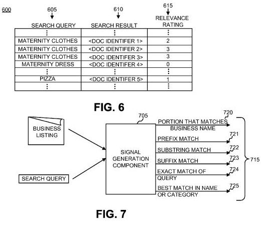
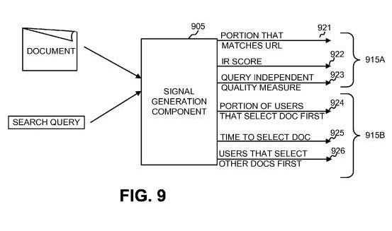

Google employs human evaluators to judge the relevance of web pages in search results, but according to Google’s Matt Cutts, usually only when engineers from the search engine are testing a new algorithm, and want to compare the results with the ranking algorithms that they might be replacing. (We’ve also seen that Google likely uses human evaluators to [uncover web spam](https://www.seobythesea.com/2012/05/how-google-might-disassociate-webspam-from-content/) as well.) Matt Cutts answered a question on how Google uses human evaluators in a video filmed last month:

Google was granted a patent today originally filed in July of 2005, that describes how human evaluators might be used to test algorithms, as well as in actual live ranking systems for local search and for web search. Those evaluations of search results pages for specific queries could be used in a statistical model that might influence search results. Google may only be using human evaluators for purposes of testing search results (and finding web spam), but it’s interesting to see both the testing and ranking approaches described within a patent from Google.

One of the things that I enjoyed about the patent was how it describes some of the possible ranking signals that might be used in ranking Google Maps type results, and how important the relevance of a business name to a query might be in the process of ranking that result. A couple of months ago, Google was granted another patent that looked at [business names as local ranking signals](https://www.seobythesea.com/2012/02/business-names-local-search-ranking/).

This newly granted human evaluators patent is:

[Prediction of human ratings or rankings of information retrieval quality](http://patft.uspto.gov/netacgi/nph-Parser?Sect1=PTO2&Sect2=HITOFF&p=1&u=%2Fnetahtml%2FPTO%2Fsearch-adv.htm&r=1&f=G&l=50&d=PALL&S1=08195654&OS=PN/08195654&RS=PN/08195654)
Invented by Michael Dennis Riley and Corinna Cortes
Assigned to Google
US Patent 8,195,654
Granted June 5, 2012
Filed: July 13, 2005

Abstract

> A statistical model may be created that relates human ratings of documents to objective signals generated from the documents, search queries, and/or other information (e.g., query logs). The model can then be used to predict human ratings/rankings for new documents/search query pairs. These predicted ratings can be used to, for example, refine rankings from a search engine or assist in evaluating or monitoring the efficacy of a search engine system.

We’re given some examples of how a human evaluator might work. In the first, someone might be shown a page corresponding to the home page of the store “Home Depot,” and may be asked to rate how relevant it is to the search query “home improvement store.” They might provide a rating between a certain range of numbers such as 1-5. Multiple evaluators might be asked the same question, and those might be collected, along with ratings for other pairs of queries and pages.

The results of those ratings might be used to automatically generate a number of statistical signals.

In another example, we’re told that someone might be shown a query of “maternity clothes.” and shown 4 pages associated with web pages. Two of those might be for stores that actually sell maternity clothes, and they might be given the highest number (5). The next might be a business that “caters to pregnant women, but does not specialize in selling maternity clothes.” It might be given a lower score (1). A fourth page might be that of a law office. Since it’s likely not going to be relevant to a searcher looking for maternity clothes, it might be given a relevance rating of 0.

In a slightly different approach, the human evaluators might be given a specific query term and a list of pages. Instead of giving those pages scores, they might be asked to list them in order from most relevant to least relevant.

## Examples of Possible Local Search Signals from Human Evaluators Scores and Rankings

In a local search arena, the following are some examples of rules that might be generated from evaluators:

*Number of Words Matching a Business Name*

The number of words in a search query matching the business name from a search result might be ranked from zero to one. A one would indicate that all the words in the search query match the business name. A zero would indicate that none of the words in the search query match the business name. If the query is two words long, and one of the words match, that pair would be given a value of 0.5.

*Number of Words matching a relevant category*

Instead of looking at the business name, the category and/or subcategories that a business might be listed in might be paired up with a query to see how many words match. A search for [pizza restaurant] might find a partial match with the category “Italian restaurant,” and be given a 0.5 score, for example.

*Prefixes, Suffixes, and Substrings*

I’m bundling three possible signals here. A prefix might be the first word in a business name. A suffix might be the last word. A substring might be any word within a business name.

Imagine that someone searches for [lowe’s], and one of the choices is “lowe’s home improvement.” The match of The query term with the prefix portion of the business name is a positive match, with a score of one. It’s also a substring of the business name, so it also might have a value of one. Since it’s not a suffix, it gets a value of zero. If the query was [home improvement] instead, it would have a prefix value of zero, a suffix value of one, and a substring value of one.

*Exactly Matching a Business Name*

Someone searches for [home depot] and the business name is “home depot,” the score for an exact match would be a one. But, if the query was [home depot garden] and the business name is “Home Depot,” the relevance score for the exact business name might be a zero.

*Best Match of Query to Business Name rather than Category Name*

When the best match of a query is to a business name, it might be given a relevance score of one. If instead, it’s a better match for the category name, it might be give a relevance score of zero.

*Dynamic Signals*

In addition to a statistical model of signals like those above, created from human evaluation scores on a test set of local search results and queries, the search engine might also look at a set of “dynamic” signals. These signals might be taken from query log files from prior local search sessions. For example, if someone quickly clicks upon “a business listing or clicking on a phone number link, directions link, or other link associated with the business listing may indicate that the business listing is ‘good.'”

We are also told that when there’s a decision as to which signals to include in the statistical model, this system might err on the side of over-including many signals rather than under-including signals. Signals that might not be statistically relevant may end up being de-emphasized by the model.

## Web Search Results

Like the local search signals that might be generated as relevance signals, it’s possible that other signals might be identified from human evaluators. One might be whether or not the query term appears within the URL of the page. While that might not be one of the actual signals that might be part of a statistical model created from human evaluator rankings, it is a possibility under the approach in this patent.

In addition to the human evaluators-based statistical model, web search results would also likely be ranked based upon “query-dependent signals,” as an information retrieval relevance score, and “query independent signals, which don’t change based upon what the query might be, such as PageRank.

Again, another aspect of a final ranking score may also involve “dynamic features,” such as clicks and time variations between clicks. The patent tells us:

> Signal 925 may define how long it takes (i.e., the duration between when a user first views the result document set and selects the document) an average user to select the document when it is returned to the user at a particular location in a list of search results or how long a user spends viewing the document based on the sequence of user click times. Signal 926 may define the fraction of users that first selected another document before selecting this document.

The patent does tell us that instead of being used as a ranking signal for web search results shown to searchers, that instead it might be used in a manner as described by Matt Cutts in the video I started this post with, as a way to compare the results from one algorithm with different results from a newer ranking signal.

## Human Evaluators Takeaways

We know, based upon the video from Matt Cutts and this patent, that Google likely uses human evaluators to help them test the relevance of search results. We don’t know if the kind of statistical model described in this patent is part of that process.

The signals that are described within the patent seem reasonable, but somewhat simple. They are examples for purposes of helping describe how the process described within this patent might work, but the patent does tell us that other signals might be created using this approach as well.

I’m not sure how well an approach like this would work based upon how many documents there are on the Web, and how many queries are performed on a regular basis on both web searches and local searches. Actual query log information and user behavior data such as clicks seems to potentially provide a much wider and more scalable range of information that could be useful in making relevancy determinations

A Google Lat Long post from December of 2010, [How Local Search Ranking Works](https://maps.googleblog.com/2010/12/how-local-search-ranking-works.html) tells us that key elements involving how local search results are ranked include [location prominence](https://www.seobythesea.com/2006/12/google-local-search-patent-application-on-ranking-businesses-at-a-location/), distance from some geographic centerpoint, and relevance.

We don’t know if that “relevance” is determined in a method like that described within the patent, or by using an approach as I wrote about recently involving [business names](https://www.seobythesea.com/2012/02/business-names-local-search-ranking/), or in another manner.
