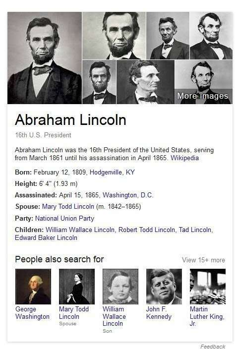
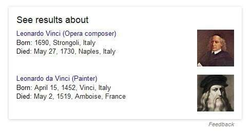
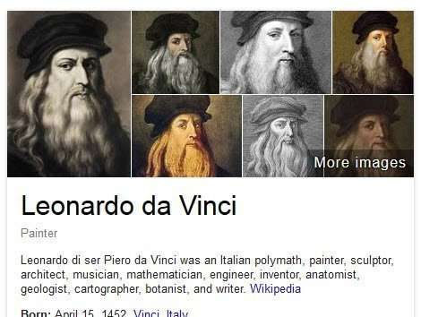
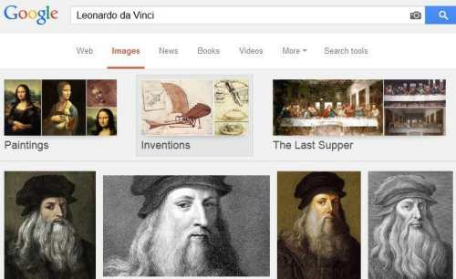

## Google Knowledge Cards Show What Entity a Search Result is About

The Google patent “Providing Knowledge Panels With Search Results” refers to an earlier Google patent describing Knowledge Cards in depth. The patent provision is titled “Apparatus and Method for Supplying Search Results with a knowledge Card,” It is identified as being Patent Application No. 61/515,305, filed on Aug. 4, 2011.

This provisional patent about knowledge cards is not linked on the Web; otherwise, I would link to it.

It is “incorporated fully” into that later patent filing, but many details about what knowledge cards are have been left out of the later patent filing. I wrote about that patent in a post titled, [How Google Decides What to Know in Knowledge Graph Results](https://www.seobythesea.com/2013/05/google-knowledge-graph-results/), but the patent specifically about Google knowledge cards contains information not in the later patent, which is why I created this post.

Knowledge Panel results are part of Google’s Semantic Web search results, including a mix of result types such as Direct Answers, Structured Snippets, Rich Snippets, and are part of an evolution of search results happening at Google and Bing/Microsoft that go much beyond yesterday’s 10-Blue links. I’ll be following this post with one about the rich search results that show up in response to queries at Bing.

The Google Knowledge Cards patent tells us that, “This invention generally relates to user interfaces for presenting search results.”

Search results tend to require a searcher to review several snippets of information “for different links and/or clicking through to several websites.”

Google Knowledge Cards are about the entities in sets of search results; the purpose behind this patent involving knowledge cards is to provide a factual response to a query showing different aspects related to a “single conceptual entity.” Interestingly, Google uses a Card type interface that seems to be more geared toward mobile search results than desktop results like Google Now Cards are.

Query Answers that provide knowledge cards are different than a [Direct Answers to a natural language question](https://www.seobythesea.com/2014/12/direct-answers-natural-language-search-results-intent-queries/) because They focus upon providing information about a specific entity. Rather than an answer to a particular question.

## What is contained in knowledge cards?

The provisional patent tells us that it is comprised of “condensed factual information that is frequently sought by a user in association with a given query.” The factual information in knowledge cards relates to different aspects of that single conceptual entity associated with a query. Knowledge cards may contain the following components:

- name
- description
- image
- facts and
- related searches

For example, a knowledge card for Abraham Lincoln contains his height because he was the tallest US President, and many people query his height.

_A knowledge Carld that appears on a query for Abraham Lincoln’s name._

The Knowledge Cards provisional patent tells us that:

“The name is the most canonical descriptor of an entity. The name will usually be an alias for the entity that is mentioned most often as a title.” And it says that the name of an entity might be different than the name in a query. So the name will often be different than the name in a query and provides an example of the query “Leonardo vinic,” producing a knowledge card for “Leonardo da Vinci.” In response to that query, what is shown is the choice of two different entities: one for “Leonardo da Vinci” and one for “Leonardo vinic.”

_Disambiguation Knowledge Cards allow a searcher to choose which entity they are querying about._

The patent tells us that Knowledge cards shouldn’t be distracting to searchers:

“The description should provide an adequate explanation of what the entity is without going into so much detail as to distract from the search results page.” For example, sources of Candidate descriptions might be chosen from “a variety of places, such as prefixes of text from trusted encyclopedia articles or top-ranking web pages.”

Images shown for a knowledge panel might be taken from a “top ranking image for that entity from the search engine.”

_The images at the top of a knowledge Card on a query for Leonardo Da Vinci_

_The images at the top of a knowledge Card on a query for Leonardo Da Vinci_

Facts about the entity may also be displayed in the knowledge panel. For example, for an individual, those facts may be specified as the date of birth, place of birth, date of death, place of death, and nationality. In addition, related searches may be shown looking at query log information.

## How Knowledge Cards Improve search engine experiences?

There are many ways knowledge cards are intended to help searchers.

1. Knowledge cards help searchers with queries directed toward learning, browsing or discovery,
2. Knowledge cards supply users with basic factual information about a query
3. They can help a user navigate to related content seamlessly and naturally
4. Knowledge cards supply new content that may not otherwise be encountered
5. Knowledge cards help users find information faster than they would by clicking through search results
6. Knowledge cards provide social proof that a site has a brand around it
7. Knowledge cards provide sentiment-based snippets of reviews

## Identifying Entities

There are a couple of different ways that a knowledge card might be used. One of those is identifying a single conceptual entity, such as a “person, place, country, landmark, animal, historical event, organization, business or sports team.” It may also be used to “distinguish between distinct meanings associated with a query term.” For example, a query of “Phoenix” may produce a knowledge card with disambiguation information about the mythical bird and other disambiguation information about the capital city of Arizona. It may contain content that enables a searcher to choose between 2 different meanings.

## Sources of Content for Knowledge Cards

The kind of content shown may depend upon the type of entity. For example, a query involving a person could include a first set of standard information such as:

- birth place
- birth date
- career highlights
- awards
- etc

A query related to a place may include a second set of standard information, such as:

- population
- languages
- currency
- etc

In both instances, we are often told that “Preferably, the knowledge card includes information from multiple sources. In this way, the knowledge card summarizes information from disparate sources.”

## Factual Entities in Knowledge Cards

When knowledge cards may contain information about factual entities, such as a person, place, country, landmark, animal, historical event, organization, business, or sports team. a User interface processor might show off the content from those Knowledge Cards in a standard manner, using pre-existing content in a templated form. This is true for different types of entities. The patent provides examples of templates for:

Place Queries
Landmark Queries
Actor Queries
Movie Queries
Company Information Queries
Software Application Queries (games)
Disambiguated Queries
Highly Disambiguated Queries

For that last one, the example of “California universities” is provided, where there might be many possible results. When the patent was published, its authors mention listing several choices of universities, which Google was doing a few weeks ago but is no longer doing now.
