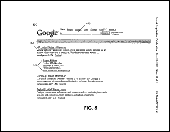

## How Are Sitelinks Chosen to be Shown in Search Results?

*Added 9/1/2019* I decided that it would be a good idea to add a link to a newer patent about Google sitelinks where they talk more about how they might decide upon the different links that they might choose to show for a page on a site: [How Google May Choose Sitelinks in Search Results Based upon Visual or Functional Significance (Updated)](https://www.seobythesea.com/2015/06/how-google-may-choose-sitelinks-in-search-results-based-upon-visual-or-functional-significance/)

Sometimes when you see the top search result in Google, under it is a list of links to other pages on the same site. Ever wondered how and why those sitelinks appear?

For example, a search for “WordPress” shows the wordpress.org page at the top of the search engine results page, with a link to the site, and a snippet of text from the WordPress home page. Then under that are links to other pages on that site, including; Download, Hosting, Extend, Blog, and “More results from wordpress.org.”

Here’s an image, from the US Patent and Trademark Office, of a result for the search “hp” which shows a link to the HP web site at the top of the results, and additional links to pages from that site:

I’ve had a few people ask me how Google does that, and while I could provide some ideas, I couldn’t provide more than that. Google published a patent application this week which gives a little more insight into the process.

[Systems and methods for providing search results](http://appft1.uspto.gov/netacgi/nph-Parser?Sect1=PTO1&Sect2=HITOFF&d=PG01&p=1&u=%2Fnetahtml%2FPTO%2Fsrchnum.html&r=1&f=G&l=50&s1=%2220060287985%22.PGNR.&OS=DN/20060287985&RS=DN/20060287985)
Invented by Luis Castro, Walt Lin, and Benedict Gomes
US Patent Application 20060287985
Published December 21, 2006
Filed June 20, 2005

Abstract

> A method includes generating search results in response to a user query, where at least one of the search results includes a group of links. The group of links may represent links to web pages within the same web site and may be identified based on at least one factor associated with the links. The method may also include providing the search results to the user.

The questions that I had as I first started looking at this document were:

1. How are the pages included in the list chosen?
2. Why show lists of links for some web sites, and not others?
3. Is it always only the first search result that will show additional links?
4. What can I do, if anything, that might make it easier for the search engine to add a list of links for a site?

## Which Pages are Listed in Sitelinks?

How does the search engine choose which pages to show in these sitelinks? The patent application tells us that those pages are the *ones that searchers might most likely want to access*.

This could be based upon a log file analysis which tells the search engine:

- How many times the page has been accessed.
- How long visitors stayed upon the page.
- If a visitor scrolled down the page, or clicked on a link without scrolling down.
- Information retrieval scores for the page, along with an indication of how good a match the page maybe for the query that was used in the search.
- The likelihood that someone might purchase on that page.
- Other information that might indicate that someone would be interested in the page.

## How are Pages Chosen to Have Sitelinks?

One possibility is that the pages have enough traffic so that Google can make some meaningful choices regarding which additional pages to show for a site from a log file analysis.

That log file information would be used to create a map of the pages of a site, and maintain some quality score information about the pages like I’ve listed above. Other information could also be used, such as the number of links pointing to those pages from other web pages (the patent application doesn’t explicitly make a distinction here between internal sitelinks or external ones).

## What Determines the Ordering of Those Sitelinks?

A map, or list, of pages from the site would be created which includes a *quality measure* associated with those pages. The quality measure may represent:

- Popularity associated with a web page,
- Likelihood that the information on a web page will be accessed by a user,
- Likelihood that the information will be useful to a user submitting a search query, or;
- Other factors associated with the quality of a web page.

The order of those pages in the sitelinks would be determined by the quality scores for the pages.

## Where would the Search Engine Get the Log File Information?

The patent application describes how this mapping of pages, and assignment of quality scores works, and for this example uses information gathered from search engine and toolbar usage.

In the conclusion area of the patent application it notes that an alternative approach might be to allow the site owner to identify what they believe might be the most important pages of the site:

It also notes that it might be possible, based upon different users’ past search histories, to provide different sitelinks to different searchers.

## Sitelinks Conclusion

It’s interesting, but not surprising, that so much of the generation of these additional sitelinks are based upon user-behavior based information. The patent does note that it is only the top result they are showing these additional links for, so to have lists like this appear, it’s helpful to rank pretty well.

Beyond being number one, the first step in getting Google to show additional sitelinks may be to get lots of traffic to your pages. It’s hard to tell how much is enough, but it has to be enough for them to think that this will be a good user experience for searchers to list those pages.

The second may be to have a core group of pages that tend to get visited more than other pages of the site – the only reason to list pages like this is if you are helping make it easier for searchers to find what they may be looking for.

When someone visits the WordPress site, there is a small identifiable core group of things that they may want to do once there, which may make those pages ideal sitelinks. When they visit the front page of Wikipedia or Digg, they may be interested in any number of pages. When you search for WordPress, you’ll see a list of links to additional pages under the WordPress site. When you search for Digg or Wikipedia, you don’t. (Both do have second indented results, which are relevant for the search term, with a link for “more results from” those sites – but that’s not the same thing.)
