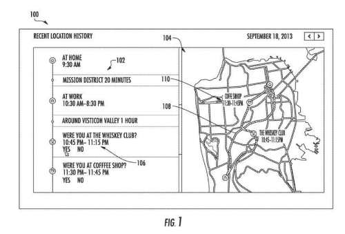

## Mobile Location History Connects to the Use of Google Maps for Navigation Purposes

Google does track your mobile location history if you use Google Maps to navigate to places.

You may use Google Maps to navigate from place to place. You can be a local guide for Google Maps. Either way, there is a chance that you have seen [Google Mobile Location history](https://www.google.com/maps/timeline?authuser=0&pb) information. A Google Account Help page covers how to [Manage or delete your Location History](https://support.google.com/accounts/answer/3118687?visit_id=1-636527891442351404-2489432911&p=location_history&hl=en&rd=1). The mobile location history page starts by telling us:

> Your Location History helps you get better results and recommendations on Google products. For example, you can see recommendations based on places you’ve visited with signed-in devices or traffic predictions for your daily commute.

You may see this history as your timeline, and a Google Help page to [View or edit your timeline](https://support.google.com/maps/answer/6258979?co=GENIE.Platform%3DDesktop&hl=en). This page starts by telling us:

> Your timeline in Google Maps helps you find the places you’ve been and the routes you’ve traveled. Your timeline is private, so only you can see it.

This timeline information can show you the local number’s mobile location history with the places you may have visited in the past. In addition, Google will sometimes ask you to update your timeline information by asking you about the accuracy of information about your timeline.

## Mobile Location History in Other Google Patents

Mobile Location history has been around for a while. It is in a few Google patents. It may get referred to as a “mobile location history” because it appears to contain information collected by your mobile device. Here are four posts I’ve written about patents that describe processes that depend upon Mobile Location history:

- [Google to Use Distance from Mobile Location History for Ranking in Local Search](https://gofishdigital.com/mobile-location-history/)
- [Google Giving Less Weight to Reviews of Places You Stop Visiting?](https://www.seobythesea.com/2017/12/google-reviews/)
- [Google Tracking How Busy Places are by Looking at Location Histories](https://www.seobythesea.com/2016/12/google-tracking-how-busy/)
- [Quality Visit Scores to Businesses May Influence Rankings in Google Local Search](https://gofishdigital.com/quality-visit-scores/)

An interesting article that hints at some possible aspects of mobile location history just came out on January 24th. It was in the post, [If you’re using an Android phone, Google may be tracking every move you make](https://qz.com/1183559/if-youre-using-an-android-phone-google-may-be-tracking-every-move-you-make/).

The article’s timing about mobile location history is interesting, given that Google earned a patent on user location histories the day before that article got published. It focuses on telling us how location history works:

> The present disclosure generally relates to systems and methods for generating a user location history. In particular, the present disclosure gets directed to systems and methods for analyzing raw location reports received from one or more devices associated with a user to identify one or more real-world location entities visited by the user.

## Technology Used to Determine Mobile Location History

Techniques that could get used to determine locations associated with a device can use GPS, IP Addresses, Cell-phone triangulation, Proximity to Wifi Access points, and maybe even [power line mapping using device magnetometers](https://gofishdigital.com/google-may-identify-device-locations-using-magnetic-fields-ac-powerlines/).

The patent has an interesting way of looking at location history, which sounds reasonable. I don’t know the latitudes and longitudes of places I visit:

> Thus, human perceptions of location history are generally based on time spent at particular locations associated with human experiences and a sense of place, rather than a stream of latitudes and longitudes collected periodically. Thus, one challenge in creating and maintaining a user location history accessible for enhancing one or more services (e.g., search, social, or an API) is to correctly identify particular location entities visited by a user based on raw location reports.

The mobile location history process looks like it involves collecting data from mobile devices in a way that allows it to gather information about places visited. It creates scores for each of those locations. I have had Google Maps ask me to verify some of the places that I have visited, as if the score it had for those places may not have been enough (not high enough of a level of confidence) for it to believe that I had been at those places.

The mobile location history patent is:

[Systems and methods for generating a user location history](http://patft.uspto.gov/netacgi/nph-Parser?Sect1=PTO1&Sect2=HITOFF&d=PALL&p=1&u=%2Fnetahtml%2FPTO%2Fsrchnum.htm&r=1&f=G&l=50&s1=9,877,162.PN.&OS=PN/9,877,162&RS=PN/9,877,162)
Inventors: Daniel Mark Wyatt, Renaud Bourassa-Denis, Alexander Fabrikant, Tanmay Sanjay Khirwadkar, Prathab Murugesan, Galen Pickard, Jesse Rosenstock, Rob Schonberger, and Anna Teytelman
Assignee: Google LLC
US Patent: 9,877,162
Granted: January 23, 2018
Filed: October 11, 2016

Abstract

> Systems and methods for generating a user location history can get provided. One example method includes obtaining a plurality of location reports from one or more devices associated with the user. In addition, the method includes clustering the plurality of location reports to form a plurality of segments.
>
> The method includes identifying a plurality of location entities for each of the plurality of segments. In addition, the method includes determining, for each of the plurality of segments, one or more feature values associated with each of the location entities identified for such segment.
>
> The method includes determining, for each of the plurality of segments, a score for each of the plurality of location entities based at least in part on a scoring formula. The method includes selecting one of many location entities for each of the plurality of segments.

## Why generate a mobile location history?

A couple of reasons stand out in the patent’s description.

1) The generated mobile location history can get stored and then later accessed to provide personalized location-influenced search results.

2) As another example, a system implementing the present disclosure can provide the location history to the user via an interactive user interface that allows the user to view, edit, and otherwise interact with a graphical representation of her mobile location history.

I like the interactive user Interface in the timeline that shows times and distances traveled.

This statement from the patent was interesting, too:

> According to another aspect of the present disclosure, a plurality of location entities can become identified for each of the plurality of segments.
>
> For example, map data can get analyzed to identify all location entities within a threshold distance from a segment location associated with the segment. Thus, all businesses or other points of interest within 1000 feet of the mean location of all location reports are included in a segment identified.

Google may track information about locations appearing in that history, such as popularity features, which may include “several social media mentions associated with the location entity valued. It can also look at several check-ins associated with the location entity valued; many requests for directions to the location entity getting valued; and/or and a global popularity rank associated with the location entity getting valued.”

Personalization features may also get collected about previous interactions between searchers and the location entity, such as a number of times in which the searcher:

1. Clicked a map on the location entity getting valued
2. Requested directions to the place becoming valued
3. Checked-in to the place getting valued
4. Transacted with the place as showed by data obtained from a mobile payment system or virtual wallet
5. Performed a web search query about the location entity getting valued

## Other benefits of mobile location history

This next potential feature was one that I tested to see if it was working, querying location history. It didn’t seem to be active at this point:

> For example, a user may enter a search query that references the user’s historical location (e.g., “Thai restaurant I ate at last Thursday”). When it recognizes that the search query references the user’s location history, then the user’s location history can be analyzed in light of the search query. Thus, the user location history can be analyzed to identify any Thai restaurants visited on a certain date and then provide such restaurants as results in response to the search query.

The patent refers to a graphical representation of mobile location history, which is available:

> For example, in some implementations, a user reviewing a graphical representation of her location history can indicate that one of the location entities included in her location history is erroneous (e.g., that she did not visit such a location). In response, the user can get presented with one or more of the location entities identified for the segment. The incorrect location entity got selected and can become allowed to select a replacement location.

> In other implementations, opportunities to perform other edits, such as deleting, annotating, uploading photographs, providing reviews, etc., can get provided in the interactive user interface. In such a fashion, the user can become provided with an interactive tool to explore, control, share, and contribute to her location history.

The patent tells us that it tracks activities that you may have engaged in at specific locations:

> In further embodiments of the present disclosure, a location entity can get associated with a user action within the context of location history. For example, the user action can be making a purchase (e.g., with a digital wallet) or taking a photograph. In particular, in some embodiments, the user action or an item of the content generated by the user action (e.g., the photograph or receipt) can become analyzed to identify the location entity associated with such user action. For example, the user action or item of content can contribute to the score determined for each location entity identified for a segment.

I have had the Google Maps application ask me if I would like to contribute photos that I have taken at specific locations, such as at sunset at Solana Beach. However, I haven’t used a digital wallet, so I don’t know if that is potentially part of my location history.

The patent describes the timeline feature and the Map feature that I included screenshots from above.

## Location Entities as Semantic Identifiers

The patent tells us those location entities may get referred to by the common names of the places they get called and refers to those as “Semantic Identifiers.”

> Each location entity can get designated by a semantic identifier (e.g., the common “name” of the restaurant, store, monument, etc.), as distinguished from a coordinate-based or location-based identifier. However, besides a name, the data associated with a particular location entity can further include the location entity’s location, such as longitude, latitude, and altitude coordinates associated with the location entity.

It’s looking like Google mobile location history could get smarter:

> As an example, an interaction evidenced by search data can include a search query inputted by a user that references a particular location entity. As another example, an interaction showed by map data 218 can include a request for directions to a particular location entity or selecting an icon representing the particular location entity within a mapping application. Yet another example, an interaction showed by email data 220 can include flight or hotel reservations to a particular city or lodging or reservations for dinner at a particular restaurant. As another example, an interaction showed by social media data 222 can include a check-in, a like, a comment, a follow, a review, or other social media action performed by the user about a particular location entity.

Tracking these interactions is being done under the name “user/location entity interaction extraction,” and it may calculate statistics about such interactions:

> Thus, user/location entity interaction extraction module 212 can analyze available data to extract interactions between a user and a location entity. Further, the interaction extraction module 212 can maintain statistics about aggregate interactions for a location entity about all users for which data is available.

It appears that to get the benefit of being able to access information such as this, you would need to give Google the ability to collect such data.

The patent provides more details about mobile location history, and popularity, and other features. It even shows a little more about personalization. Many aspects of mobile location history have gotten implemented. Some look like they might have yet to become developed. Location history may also have gotten used in other processes used by Google.

What might Google do with Location history? I wrote about some other patents that use Google mobile location history. These are about patents from Google that use location history:

- [Google Tracking How Busy Places are by Looking at Location History](https://www.seobythesea.com/2016/12/google-tracking-how-busy/)
- [Google Lifestreaming?](https://www.seobythesea.com/2013/02/google-searchable-life-experiences/)
- [Google Patents Identifying User Location Spam](https://www.seobythesea.com/2013/02/google-patents-identifying-user-location-spam/)
- [Google Patent Granted on Mobile Location Detection](https://www.seobythesea.com/2013/02/google-mobile-location-detection/)
- [Location Extensions Augmented Advertisements](https://www.seobythesea.com/2019/06/location-extensions-augmented-advertisements/)

How do you feel about mobile location history from Google?
