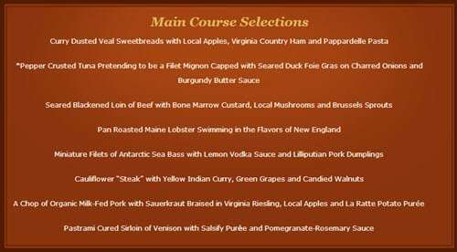

Will Google be transforming the way that we order from restaurants and other merchants such as pharmacists? A patent application published by Google this past week points to the possibility.

Google has been experimenting with showing menus from restaurants in its search results recently, and added them as reported in Search Engine Land on Friday – [Now Official: Google Adds Restaurant Menus To Search Results](https://searchengineland.com/now-official-google-adds-restaurant-menus-search-results-185708).

The article seems more filled with questions than answers, such as where Google is getting the menu information, and even why they are publishing menu information. I suspect that a lot of restaurants will be be begging Google for ways to submit their latest menus in the near future.

Knowing what the menu might look like at a restaurant might make the difference between whether you will dine there, or drive past. For example, if I didn’t know better based on word of mouth, I wouldn’t begin to suspect that the [Inn at Little Washington](https://theinnatlittlewashington.com/), in the middle of nowhere rural Virginia, might be one of the best restaurants in the United States. Here’s part of their menu:

The patent application is:

[Ordering Ahead with a Mobile Device](http://appft.uspto.gov/netacgi/nph-Parser?Sect1=PTO1&Sect2=HITOFF&d=PG01&p=1&u=%2Fnetahtml%2FPTO%2Fsrchnum.html&r=1&f=G&l=50&s1=%2220140058901%22.PGNR.&OS=DN/20140058901&RS=DN/20140058901)
Invented by Robert Kim, and Ray Reddy
US Patent Application 20140058901
Published February 27, 2014
Filed August 24, 2012

Abstract

> The present invention provides a computer-implemented method to order ahead with a mobile device.
>
> A user network device:
>
> - Receives an input of an order from a user;
> - Communicates the order to a merchant network device;
> - Receives a preparation time for one or more components of the order;
> - Determines a location of the user device;
> - Monitors a projected time of arrival at the merchant based on the location of the user device;
> - Compares the projected time of arrival with the component preparation time; and
> - Notifies the merchant to begin preparation of at least one of the components in response to a determination that the projected time of arrival equals the preparation time of one or more components.

There are others in this space, including some that have recently made announcements about how their mobile payment system might work. Square [announced a beta program](https://mashable.com/2014/02/27/hands-on-square-pickup/#aDXzv9Dsmiqi) on February 27th where people could order online ahead of arrival at a restaurant and pay beforehand, which they are testing at a number of restaurants in San Francisco.

On Friday, a company named Dash [announced a new IOS 7 app update](https://techcrunch.com/2014/02/27/964641/) to a mobile app that allows for mobile payments to restaurants before ordering and location-based sensing of the location of orderers, including when they enter a restaurant they ordered at.

The Google patent application covers ordering online before you make a pickup, a way to time the preparation of an order (whether for food, or for places such as a pharmacy), and a way for a merchant to find and track the location of someone who ordered and adjust preparation times based upon estimated arrival times of the person who ordered.

The patent doesn’t tell us that the first step Google might use to introduce a service such as this one would be by making menus available to searchers. But it’s definitely a way to have people think of Google when they want to see menus and are considering where to dine.
