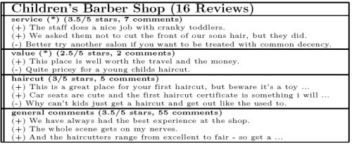

*Sentiment- a general feeling, opinion, personal judgment, feeling, or sense about something.*

At Google’s recent [Searchology](https://googleblog.blogspot.com/2009/05/more-search-options-and-other-updates.html) presentation, one of the new features described as being used by Google was sentiment analysis.

In the [recap](https://www.mattcutts.com/blog/google-searchology-2009-search-options-google-squared-rich-snippets/) of the event from Google’s Matt Cutts, he tells us that:

> If you sort by reviews, Google will perform sentiment analysis and highlight interesting comments.

I’ve seen many papers from Google on sentiment analysis and a recent patent filing, so I decided to look closer at some of those review search results.

**Google Review Examples**

For some search results, when you choose the “show options” link after your search and then the “reviews” link, you may see quotes from reviews in the snippet area for search results, surrounded by quotation marks. Testing this, I did see some results where the snippets were in quotation marks, and when I visited those pages, that quoted text tended to be mostly from actual reviews. I looked at some reviews for restaurants, music, and products.

Here’s an example from one result on a search that I did for [new york seafood restaurants]:

> “Aquavit, which is located in one of the famous family’s former townhomes, maybe your best bet.” … “Save room for one of the tantalizing desserts.” … “With a menu almost exclusively devoted to seafood, Aquagrill is an excellent pick for diners who want great choice and unparalleled options.”

On a search for the band [Led Zeppelin], the following quotes were culled from two different reviews on Amazon.com where there were several reviews:

> “This was Led Zeppelin’s finest hour, and therefore rightly holds the claim to #1 album of all time.” … “I own it and have listened through it over a hundred times, so I am more than familiar with it, along with the rest of Zeppelin’s music.” … “Four Sticks is heavier, but nothing exceptional.”

On a search for [green cleaners], these quotes were pulled from a couple of different reviews on one page:

> “Overall, I feel good about using these products.” … “The other seemed to work ok, but overall I really recommend Clorox brand GreenWorks instead.” … “I am hoping with continued use, it will also assist in eliminating the mold stains in the grout lines.”

Exactly why did Google choose the particular quotes that it shows?

**Sentiments by Different Aspects**

One recent paper from Google describes some of the thought processes that might explain why certain statements may be included. In [Building a Sentiment Summarizer for Local Service Reviews](https://ryanmcd.github.io/papers/local_service_summ.pdf) (pdf), we’re shown the following example of quotes from reviews broken out by different aspects, such as “service,” “value,” and “general comments.” Aspects are defined in one of Google’s papers on sentiment analysis as “properties of an object that can be rated by a user.”

The abstract for the paper tells us that:

> In this paper, we present a system that summarizes the sentiment of reviews for a local service such as a restaurant or hotel. In particular, we focus on aspect-based summarization models. A summary is built by extracting relevant aspects of a service, such as service or value, aggregating the sentiment per aspect, and selecting aspect-relevant text.

So, when we are shown multiple quotes, one goal that Google may try to reach is to provide sentiment information about different aspects of an item or service.

Other Google papers on sentiment analysis also worth looking over include:

- [Comparative Experiments on Sentiment Classification for Online Product Reviews](https://static.googleusercontent.com/media/research.google.com/en//pubs/archive/4.pdf) (pdf)
- [Sentiment Summarization: Evaluating and Learning User Preferences](http://www1.cs.columbia.edu/~klerman/sentiment-summarization-09.pdf) (pdf)
- [A Joint Model of Text and Aspect Ratings for Sentiment Summarization](http://web.archive.org/web/20160116072001/http://ryanmcd.com/papers/MAS.pdf) (pdf)

**Google’s Patent Filing on Sentiment Analysis**

The patent application is interesting because it provides some information about how Google might choose text from reviews to present. The patent filing appears at:

[Domain-Specific Sentiment Classification](http://appft.uspto.gov/netacgi/nph-Parser?Sect1=PTO2&Sect2=HITOFF&u=%2Fnetahtml%2FPTO%2Fsearch-adv.html&r=1&p=1&f=G&l=50&d=PG01&S1=20090125371.PGNR.&OS=dn/20090125371&RS=DN/20090125371)
Invented by Tyler J. Neylon, Kerry L. Hannan, Ryan T. McDonald, Michael Wells, Jeffrey C. Reynar
Assigned to Google
US Patent Application 20090125371
Published May 14, 2009
Filed August 23, 2007

One of the document’s primary focuses is describing how different words or terms that may appear in reviews may have completely different meanings when applied to different products or services. A couple of early examples illustrate this very well:

> The word “small” usually indicates positive sentiment when describing a portable electronic device. Still, it can indicate negative sentiment when describing the size of a portion served by a restaurant.
>
> Thus, words that are positive in one domain can be negative in another.
>
> Moreover, words which are relevant in one domain may not be relevant in another domain. For example, “battery life” may be a key concept in the domain of portable music players but be irrelevant in the domain of restaurants.

The abstract from the patent filing provides a pretty high-level overview of what the document contains:

> A domain-specific sentiment classifier that can be used to score the polarity and magnitude of sentiment expressed by domain-specific documents is created. A domain-independent sentiment lexicon is established, and a classifier uses the lexicon to score the sentiment of domain-specific documents.
>
> Sets of high-sentiment documents having positive and negative polarities are identified. The n-grams within the high-sentiment documents are filtered to remove extremely common n-grams. The filtered n-grams are saved as a domain-specific sentiment lexicon and are used as features in a model.
>
> The model is trained using a set of training documents which may be manually or automatically labeled as to their overall sentiment to produce sentiment scores for the n-grams in the domain-specific sentiment lexicon. This lexicon is used by the domain-specific sentiment classifier.

If you want to dive deeper into the actual processes behind how different sentiments are identified for different kinds of products or services, you may want to spend some time with this patent filing and the papers I linked to above. I’d also recommend looking at many reviews for products and services in different areas to get an idea of how Google uses sentiment analysis in actual practice.
