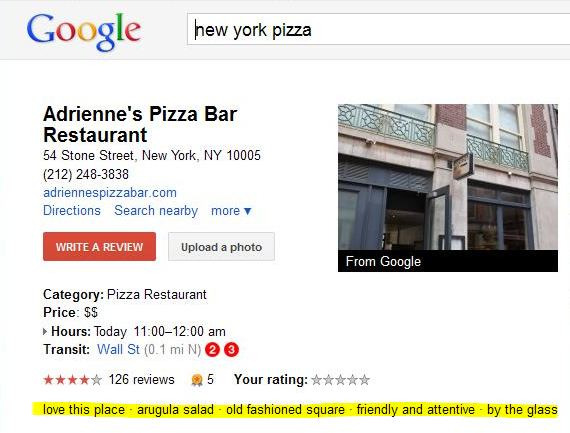

## New Sentiment Phrase Snippets

When you look at web page search results for a Web search, there are usually three important elements displayed for each page. One is the page title, which also acts as a link to the page. Another is the URL of the page, which sometimes gives you a hint of what you might find at the page if the URL shows a meaningful directory category or two for the page.

The third element is a **snippet** of text for the page, which describes some type for what you might find on the page. This is sometimes taken from the meta description for the page if it contains the keywords you searched for or possibly a synonym for one or more keywords, or often some text from the page itself if that snippet of text contains the keywords or synonyms for those. Snippets aren’t limited solely to Web search results, and recently a new type of snippet has been showing on Google Place Pages, as highlighted in the image below:

A Google patent granted this week provides a detailed look at short snippets like these related to businesses and products and gives us some insights into what the people at Google may be thinking about when they come up with the snippets. These types of Sentiment Phrase Snippets were the topic of a blog post from [Mike Blumenthal](http://blumenthals.com/blog/) titled [Google Places Descriptor Snippets](http://blumenthals.com/blog/2011/08/30/google-places-descriptor-snippets/). I’m not sure that I like the name “Descriptor” from Mike’s name to describe them – it reminds me of [Transformers](https://en.wikipedia.org/wiki/Transformers_%28film%29) for some reason (or would that be “descripticon” snippets)?

Mike mentions in his post contacting me to ask about a Google patent I wrote about recently on how Google might [categorize queries and websites](https://www.seobythesea.com/2011/08/google-boost-search-rankings-category/), and boost web search rankings for those pages which shared categories with the queries. While I responded to Mike, telling him that I wasn’t sure about the relationship between that patent and new Google Places snippets, Google published this new patent after our correspondence, and it seems like a good fit for the new Google Places snippets that appear upon Place Pages. I sent Mike an email this morning, and I’m looking forward to his thoughts.

Using sentiment analysis in snippets to describe a business or product does seem like a good idea, and this patent discusses why Google thinks doing that would be both useful and important:

> A snippet is a segment of a document used to summarize an entity or document associated with search results. Snippets allow the users of a search engine to quickly assess the content of the search results to identify the search results that are of greatest interest to them. Snippet text is usually selected based on keywords, word frequencies, and words or phrases that signify summarization such as “in sum” or “overall”. Snippet text is also selected based on many other factors including the length of the snippet as defined by the size of the display.
>
> Users of search engines often perform searches for entities such as hotels, restaurants, and consumer products. These entities are considered “reviewable” as public opinion or sentiment is often expressed about them in websites such as review websites and personal web pages. For reviewable entities, sentiment forms a special type of summarization. Consequently, the sentiment expressed in one or more reviews provides valuable information for inclusion in snippets generated for reviewable entities.
>
> Sentiment information included in snippets should be representative of the opinion expressed about the reviewable entity over several reviews while including non-redundant sentiment information. Further, sentiment information should be readable and easily understandable. Lastly, each piece of sentiment information should be as concise as possible to allow for the inclusion of the maximum amount of sentiment information for each snippet.

The patent tells us that the focus upon these sentiment phrase snippets is to provide several sentiments about specific entities extracted from documents such as reviews, in as concise language as possible. The example that Mike displays in his post for Google’s headquarters doesn’t seem to do that very successfully, but my pizza example above does tell me a lot about the Pizzeria in very few phrases.

[Phrase based snippet generation](http://patft.uspto.gov/netacgi/nph-Parser?Sect1=PTO2&Sect2=HITOFF&p=1&u=%2Fnetahtml%2FPTO%2Fsearch-adv.htm&r=1&f=G&l=50&d=PALL&S1=08010539&OS=PN/08010539&RS=PN/08010539)
Invented by Sasha Blair-Goldensohn, Kerry Hannan, Ryan McDonald, Tyler Neylon, and Jeffrey C. Reynar
Assigned to Google
US Patent 8,010,539
Granted August 30, 2011
Filed January 25, 2008

Abstract

> Disclosed herein is a method, a system, and a computer product for generating a snippet for an entity, wherein each snippet comprises a plurality of sentiments about the entity. One or more textual reviews associated with the entity is selected. A plurality of sentiment phrases is identified based on the one or more textual reviews, wherein each sentiment phrase comprises a sentiment about the entity. One or more sentiment phrases from the plurality of sentiment phrases are selected to generate a snippet.

If you’re interested in how these sentiment phrase snippets might be selected, it’s worth working through the patent, but I do want to also point to a paper that two of the co-inventors of this patent were co-authors of involving snippet selection for reviews for businesses. The paper is [Sentiment Summarization: Evaluating and Learning User Preferences](http://www1.cs.columbia.edu/~klerman/sentiment-summarization-09.pdf) (pdf) by Kevin Lerman, Sasha Blair-Goldensohn, and Ryan McDonald.

A previous post I wrote about reviews and sentiment analysis links to some other Google papers and patent filings about sentiment reviews as well: [Google’s New Review Search Option and Sentiment Analysis](https://www.seobythesea.com/2009/06/googles-new-review-search-option-and-sentiment-analysis/). It’s interesting seeing how Google is experimenting with expressing sentiment in snippets from reviews for products and businesses, and how their display of that information is evolving or transforming over time.

One of the areas that the patent spends some time with is in distinguishing between structured and unstructured reviews.

A structured review is one that follows a specific format, including a defined rating and/or textual review of a specific business or product:

> A structured review will typically have a format such as:, “F-; The pizza was horrible. Never going there again.” In this instance, F- corresponds to the rating, and “The pizza was horrible. Never going there again” corresponds to the Textual Review. Structured reviews are collected through the Network from known reviews web sites such as TripAdvisor, Citysearch, or Yelp. Structured reviews can also be collected from other types of textual documents such as the text of books, newspapers and magazines.

On the other hand, unstructured reviews are text-based pages that include a reference to the product or business being “reviewed”, and also have a high likelihood of including an opinion about those entities. Those aren’t structured like the reviews that might be found at Yelp or Citysearch and might be from webpages, blogs, newsgroup postings, and other sources.

The process behind this patent attempts to find reviews, either structured or unstructured that can be associated with specific people, places, and things about which an opinion is being expressed to extract sentiment phrases about those. In other words, words or text about things like restaurants, hotels, consumer products, books, films and so on, that express some kind of attitude about them such as an opinion.

The patent tells us that these sentiment phrases are “short, easily-readable phrases which provide a synopsis of a Textual Review,” and provide examples such as: “great setting”, “clean rooms”, “fantastic debut”, “an interesting book”.

These phrases are identified through many natural language processing (NLP) techniques, and it’s worth drilling down into the descriptions of those in the patent if you want to get an idea of how they might be selected from different reviews. I will probably be spending some time over the weeks to come exploring different place pages and the rest of this patent to get a sense of how Google is collecting snippet phrases to display with some real-life examples.

If you decide to do the same, please let me know if you come up with something interesting, like the odd examples that Mike found with the place listing for Google’s headquarters.
