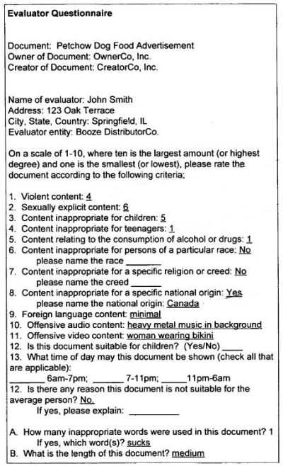

*A newly granted patent from Google provides details on how human evaluators may evaluate advertising from Google…*

Last September, Scott Huffman, leader of Google’s Search Evaluation Team, told us about efforts behind the scenes to measure and improve the quality of Google’s search results in a post at the Official Google Blog titled [Search evaluation at Google](https://googleblog.blogspot.com/2008/09/search-evaluation-at-google.html). As one part of the review process that they perform, the search engine may use human reviewers:

> Human evaluators. Google makes use of evaluators in many countries and languages. These evaluators are carefully trained and are asked to evaluate the quality of search results in several different ways. We sometimes show evaluators whole result sets by themselves or “side by side” with alternatives; in other cases, we show evaluators a single result at a time for a query and ask them to rate its quality along various dimensions.

Google also uses human evaluators to look at the quality of paid advertising shown through Google’s advertising programs. Here’s a snippet from a classified that Google is running for a temporary Ads Quality Rater:

> As an Ads Quality Rater, you will be responsible for reporting and tracking the visual quality and content accuracy of Google advertisements. Ads Quality Raters use an online tool to examine advertising-related data of different kinds and provide feedback and analysis to Google. Projects may involve examining and analyzing text, web pages, images, and other kinds of information.
>
> You will need an in-depth and up-to-date familiarity with English- speaking web culture and media. Additionally, you will apply this knowledge to a broad range of interests and topics. Ads Quality Raters possess excellent written communication skills and web analytics capabilities. You will be required to work 10-20 hours a week on a self-directed schedule.

Google was granted a patent today, providing details on the things it may have been looking at in its evaluation of sponsored search results. The patent was first filed in 2004. It may only provide a summary of an actual process that was taking place back then. The evaluation process from Google has probably evolved since this patent was filed. It is interesting for the types of questions that it asks and the concerns that it addresses in advertisements. Here’s a screenshot of a partially filled out evaluation form from the patent:

The patent is:

[System and method for rating electronic documents](https://patents.google.com/patent/US7533090B2/en)
Invented by Sumit Agarwal, Gokul Rajaram, and Leora Ruth Wiseman
Assigned to Google
US Patent 7,533,090
Granted May 12, 2009
Filed March 30, 2004

Abstract

> A system and method for rating an electronic document such as an advertisement. Rating information is received from one or more evaluators. A signal relevant to a criterion is received. A determination is made to deliver the document in response to the signal based on the criteria and the rating information from one or more evaluators.

The patent goes into a great amount of detail on how advertisements might be reviewed prior to being considered for use with advertisements, by a large number of evaluators, who create a trust score for ads as well as ranking and classifying the ads on a number of criteria. Classification may take place by looking at information such as:

- Subject matter,
- Content rating,
- Aggregate content rating,
- Sensitivity score,
- Content type,
- Language,
- Geographic origin (e.g., country or city of origin),
- Geographic area of target audience,
- Document source,
- Owner of content,
- Creator of content,
- Target demographic, or;
- Other criteria.

Ranking aspects of ads to determine whether they should be run at all, or to match them to content for appropriate audiences may also look at such things as:

- Offensiveness content,
- Pornographic or other prurient content,
- Adult content,
- Violence content,
- Children’s content,
- Target age,
- Gender,
- Race,
- National origin,
- Religion, or;
- Other factors

The patent provides more details on how this evaluation process may work and offers many examples of the processes involved. If you use paid search, you may find some value in spending time reading through the patent more deeply.
