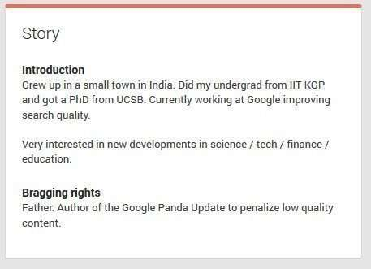

## Changes to the Panda Patent, Behind Google’s Panda Update

*Added 3/4/2022 – A lot of information has come out about this patent, and it is worth sharing because it has had a huge impact on SEO. The changes are worth sharing, and I am going to post many of them at the start of this post.*

Google does not rank sites because of Brand Mentions from this Patent (What Brand?)

Google does not rank pages from this patent because of Implied links.

**The patent calculates a Ratio from the independent links and the reference queries and uses that to modify the quality of pages, and low-quality pages move down penalized, and high-quality pages move up and rank higher because of it.**

I’ve broken it down into more parts. Stop thinking that a patent with the Name “Ranking Search Results” is talking about a ranking factor every time it talks about implied links or reference queries because it is all about the Ratio, and only about the ratio.

1. **“Brand”** does not appear even once in this patent, so it is quite likely that this patent has nothing to do with Brands. That appears to confuse the arguments of at least two other SEOs who wrote posts about this patent where they were insisting that “Brand Mentions” were the new link building, and they wrote posts at Moz and Forbes backing that assertion. I wrote a post in response to their post detailing what they wrote about. : [Entity Mentions are Good: Brand Mentions are not the New Link Building](https://www.seobythesea.com/2014/08/brand-mentions-not-new-link-building/)
2. **“Ranking search results”** – This patent has the name “Ranking Search Results” because the author has since written about at least one algorithm that increases the ranks of some pages by scoring and lowering the ranks of low-quality pages that should not rank as highly as they were (this is also the point behind what looks like the first patent behind the Panda Update.That other patent tells us that its influence is to lower the rankings of some pages, like in the title to this patent:
  > The positive aspect of this result is that results that have a high threshold of results from low-quality sites disappear and are replaced with results that include higher-quality sites. Google’s search results end up looking better.
3. **Implied Links** – Implied links do not count as actual Links. They are part of the ratio that is used to determine site quality that decides how the site or parts of the site rank compared to other relevant pages. The patent describes Implied Links:
  > “The system determines a count of independent links for the group.
  >
  > A link for a group of resources is an incoming link to a resource in the group, i.e., a link having a resource in the group as its target.
  >
  > Links for the group can include express links, implied links, or both. Together express links and implied links are added together to be counted at independent links.
  >
  > An express link, e.g., a hyperlink, is a link that is included in a source resource that a user can follow to navigate to a target resource.
  >
  > **An implied link is a reference to a target resource, e.g., a citation to the target resource, which is included in a source resource but is not an express link to the target resource.**
  >
  > Thus, a resource in the group can be the target of an implied link without a user being able to navigate to the resource by following the implied link.”
  Another SEO was sent a note within the last 6 months about these implied links (he know who he is.) He was investigating whether or not they passed PageRank or any ranking even without being actual links. He was pushing the idea that they were capable of helping something rank, even like citations do for local search. He may not have remembered that someone posted about this patent on the Moz blog back in 2012 and referenced Brand Mentions (even though the patent doesn’t use the world brand at all.
  Nope. these implied links are part of the ratio of independent links to referring queries, and if the ratio is too high, the -pages they point to are considered low quality and get penalized. In this paten, the implied links do not pass along ranking weight. They might pass along the penalty though.
4. **Ratio Of A Number Of Independent Links Counted For The Particular Group To The Number Of Reference Queries** – this is the ration that determines the quality of pages p0or parts of sites, and the independent links and reference queries are only used to calculate they ratio.
   To quote the patent exactly:
  > 45. The computer storage medium of claim 35, wherein determining a respective group-specific modification factor for a particular group of resources comprises: determining an initial modification factor for the particular group of resources, wherein **the initial modification factor is a ratio of a number of independent links counted for the particular group to the number of reference queries counted for the particular group.**

Said about the ratio in a slightly different way in the patent:

> In general, one innovative aspect of the subject matter described in this specification can be embodied in methods that include the actions of determining, for each of a plurality of groups of resources, a respective count of independent incoming links to resources in the group; determining, for each of the plurality of groups of resources, a respective count of reference queries; determining, for each of the plurality of groups of resources, a respective group-specific modification factor, wherein the group-specific modification factor for each group is based on the count of independent links and the count of reference queries for the group; and associating, with each of the plurality of groups of resources, the respective group-specific modification factor for the group, wherein the respective group-specific modification for the group modifies initial scores generated for resources in the group in response to received search queries.

- **Who is Panda?**, when the Wired Interview came out, we were told that Google had decided to use the name “Big Panda” to refer to this upgrade and not the “Farmer” name (taken from his SEL article: [Google Forecloses On Content Farms With “Panda” Algorithm Update](https://searchengineland.com/google-forecloses-on-content-farms-with-farmer-algorithm-update-66071))The interviewed mentioned that one employee at Google had come up with several questions to improve the quality of sites (making some drop in rankings as penalized low-quality sites. I searched through LinkedIn to find a person named “Panda” at Google and found around five of them, including custodial workers. Two Pandas were search engineers, and I looked at their work and chose one, but I was wrong. It wasn’t until I found a Google+ Profile with “bragging rights for Navneet Panda, where he claimed to be the Panda behind the Panda Update.

This is the first patent that I have found that Navneet Panda has authored for Google.

A Google Blog post written by Amit Singhal about Panda came out with 23 questions for site owners to ask themselves about the quality of their websites and is often seen as a way of overcoming the penalty behind the Panda Update. That Google paper can be found here: [https://developers.google.com/search/blog/2011/05/more-guidance-on-building-high-quality](https://developers.google.com/search/blog/2011/05/more-guidance-on-building-high-quality)[More Guidance On Building High Quality Sites](https://developers.google.com/search/blog/2011/05/more-guidance-on-building-high-quality)

## Ranking Search Results

One of the most impactful updates at Google was the Panda Update, released into the world in February of 2011 and affecting almost “12%” of all search results. In a Wired interview of Google’s Amit Singhal and Matt Cutts, [TED 2011: The Panda That Hates Farms: A Q&A With Google’s Top Search Engineers](https://www.wired.com/2011/03/the-panda-that-hates-farms/), the name of the update was revealed to be taken from a Google Engineer that played a significant role in its development:

> **Wired.com:** What’s the code name of this update? Danny Sullivan of Search Engine Land has been calling it Farmer’s because content farms’ apparent target.
>
> **Amit Singhal:** Well, we named it internally after an engineer, and his name is Panda. So internally, we called a big Panda. He was one of the key guys. He came up with the breakthrough a few months back that made it possible.

There were at least a couple of search engineers at Google with the last name of Panda, and a review of what either had written led to some interesting information but not much about the Panda Update itself. At some point in time, Google’s Navneet Panda included the following statement on his Google Plus About Page:

_Navneet Panda includes the Panda Update in his “bragging rights.”*_

I’ve been looking for any patents from Google that have his name on them, and one was granted today.

[Ranking search results](http://patft.uspto.gov/netacgi/nph-Parser?Sect1=PTO2&Sect2=HITOFF&p=1&u=%2Fnetahtml%2FPTO%2Fsearch-adv.htm&r=1&f=G&l=50&d=PALL&S1=08682892&OS=PN/08682892&RS=PN/08682892)
Invented by Navneet Panda and Vladimir Ofitserov
Assigned to Google
US Patent 8,682,892
Granted March 25, 2014
Filed: September 28, 2012

Abstract

> Methods, systems, and apparatus for ranking search results, including computer programs encoded on computer storage media. One of the methods includes:
>
> - Determining, for each of a plurality of groups of resources, a respective count of independent incoming links to help in the group;
> - Determining, for each of the plurality of groups of resources, a respective count of reference queries;
> - Determining, for each of the plurality of groups of resources, a respective group-specific modification factor, wherein the group-specific modification factor for each group is based on the count of independent links and the count of reference queries for the group; and
> - Associating, with each of the plurality of groups of resources, the respective group-specific modification factor for the group, wherein the respective group-specific modification for the group modifies initial scores generated for resources in the group in response to received search queries.

It will take a while to drill down into the process described in this Ranking Search Results patent and make sense of how it might work, but I’ll tackle that. A quick run through the claims and the description section of the Ranking Search Results patent reveals some exciting details. While this is the first published or granted patent we’ve seen from Navneet Panda, that doesn’t mean that he doesn’t have others that are presently being prosecuted by the patent office, either.

The Ranking Search Results patent appears to describe some ranking of pages based upon classifying them by looking at the links pointing to them, the queries that refer to the pages, and how well the pages fit as navigational queries for those queries.

*It appears that Navneet Panda removed his “bragging rights” section on his Google Plus profile after this post was published, which claimed that he was the “Father. Author of the Google Panda Update.” I had made a copy, so I included that here.

I also followed up this post with another one that I called: [Is Ranking Search Results in the Panda Patent?](https://www.seobythesea.com/2014/04/the-panda-patent/) I will likely update that post to provide more details about referring queries and Independent Links and the ratio between the two used as one of the first quality tests to improve the rankings of sea5rch results at Google.

Last Updated March 4, 2022.
