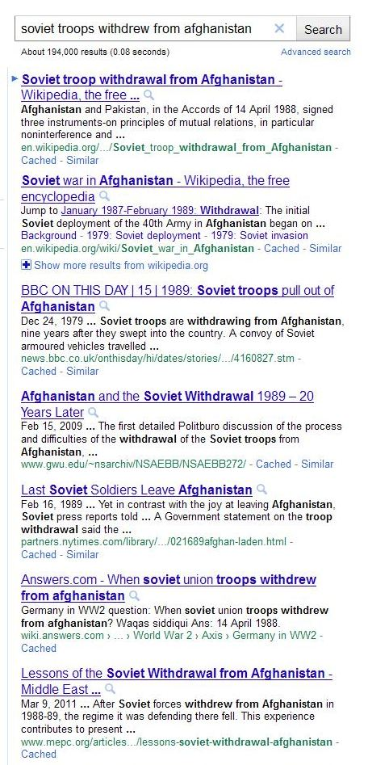

Imagine if Google could identify similar snippets of text when it comes across them in its index and recognize that they might be related in a meaningful way. For example, the search engine might see a headline on a news article that says, “Soviet troops pulled out of Afghanistan,” and another noted that “Soviet troops withdrew from Afghanistan.” Is Google capable of understanding paraphrases like that?

Is paraphrase-based indexing influencing the search results below?

I’ve written about Phrase-Based Indexing in the past, with my latest post on the subject being [Phrasification and Revisiting Google’s Phrase-Based Indexing](https://www.seobythesea.com/2010/04/phrasification-and-revisiting-googles-phrase-based-indexing/). While phrase-based indexing involves a search engine going through web pages, and associating “good phrases” with specific pages, and finding out how frequently those phrases tend to co-occur in a certain top number of search results for a specific query, the impetus behind finding paraphrases is somewhat different.

A couple of patents originally filed in 2005 and granted to Google this week provide details on how it might recognize paraphrases, index them, and use them. There are also some white papers from Google that explore the topic in more detail. I will write about the first of the patents and one of the papers in this first post on paraphrase identification to introduce the topic.

In a search for the two headlines, I listed above, ideally, Google would return the same or a very similar set of search results in response to both. However, instead of just matching keywords to return documents, the search engine would have to recognize that “Soviet troops pulled out of Afghanistan” and “Soviet troops withdrew from Afghanistan” are somewhat equivalent to each other. While a search engine could rely upon people compiling potential paraphrases and mining text from documents to identify when those are actual paraphrases, that would be very time-consuming and require a lot of effort by many people to work well.

A better approach would be an automated one that does a reasonable job of identifying paraphrases. A Google Whitepaper, written by the inventors listed on the two granted patents that I referred to above, describes how this might work and many reasons why identifying paraphrases may be helpful. The paper is [Aligning Needles in a Haystack: Paraphrase Acquisition Across the Web](https://www.aclweb.org/anthology/I05-1011/) (pdf).

In the paper by Marius Pasca and Peter Dienes, we are told that the method they have come up with for using an automated approach to identifying paraphrases is unique because it can use just about any document that it finds on the web regardless of the quality of that document. It doesn’t need some preprocessing that identified which documents are likely to contain paraphrases:

> The method differs from previous approaches to paraphrase acquisition in that
>
> 1. it removes the assumptions on the quality of the input data by using inherently noisy, unreliable Web documents rather than clean, trustworthy, properly formatted documents; and
> 2. it does not require any explicit clue indicating which documents are likely to encode parallel paraphrases, as they report on the same events or describe the same stories.

While researching the process involved, Pasca and Dienes conducted an experiment in which they extracted paraphrases from roughly 972 million web pages.

Some reasons why Google might want to learn about paraphrases in the documents they index can include:

- Giving better answers to Q&A (Question answering) type results
- Making sure that relevant documents aren’t missed by expanding queries to include words from possible paraphrases
- Possibly identifying documents that have duplicated the majority of the content of another document but used paraphrases to hide the source

The first patent goes into a description of how some paraphrases might be identified on the Web.

[Methods and systems for identifying paraphrases from an index of information items and associated sentence fragments](http://patft.uspto.gov/netacgi/nph-Parser?Sect1=PTO2&Sect2=HITOFF&u=%2Fnetahtml%2FPTO%2Fsearch-adv.htm&r=1&p=1&f=G&l=50&d=PTXT&S1=7,937,396.PN.&OS=pn/7,937,396&RS=PN/7,937,396)
Invented by Alexandru Marius Pasca and Peter Szabolcs Dienes
Assigned to Google
US Patent 7,937,396
Granted May 3, 2011
Filed: March 23, 2005

Abstract

> Methods and systems for identifying paraphrases from an index of information items and associated sentence fragments are described. One method described comprises identifying a pair of sentence fragments, each having the same associated information item from an index. The index comprises a plurality of information items and associated sentence fragments, and identifies a paraphrase pair from the pair of sentence fragments.

One method involves looking for specific information while analyzing the content of a web page to see if there are dates, entity names, or concepts on that page and sentence fragments associated with those.

For example, the search engine finds many references to “1989” on a good number of web pages. Each has associated sentence fragments, and it compares the sentence fragments against each other to see if there are any similarities. For example, it might see the following two fragments associated with that date from several documents and consider them to be paraphrases of each other based upon patterns found in the sentence fragments:

“1989–Soviet troops pulled out of Afghanistan.”
“1989–Soviet troops withdrew from Afghanistan.”

Once the paraphrases have been identified, they may be associated with one another (along with their sources) in a paraphrase index.

When looking for paraphrases like this, there may be some rules that would be followed. For example, the search engine might require some similar alignment between the paraphrases. In this case, “soviet troops” appear in both fragments at the start, and “Afghanistan” appears in both at the end. There may also be a certain required threshold of types of words required to align like that. For instance, the aligning words may be required to be non [stop words](https://www.seobythesea.com/2008/08/google-stopword-patent/).

In deciding whether a paraphrase is valid, the search engine might see how frequently each sentence fragment appears in other documents on the Web. If they don’t appear very frequently, it might not include them in its index paraphrases.

> For example, if the paraphrase pair “pulled out of-withdrew from” has a frequency value of ten, meaning that it appeared in the list of potential paraphrase pairs ten times, a single entry for the paraphrase pair “pulled out of-withdrew from” may be included in the paraphrase index with the associated frequency value of ten.

This frequency value of paraphrases may be used to rank paraphrases to indicate how useful they may be in things like question answering results from the search engine or expand a query to paraphrase results.

As the patent tells us:

> In information retrieval, the paraphrase index may be used to associate a paraphrase in the search request with matching paraphrases in the text of documents sought for retrieval. So, for example, if a web search query includes the phrase “withdrew from,” a search engine can access the paraphrase index and determine that “withdrew from” has an associated paraphrase “pulled out of.”
>
> The search engine can use this information to search for documents that match both “withdrew from” and “pulled out of” and the rest of the search terms. In question answering, a question may be a natural language search query. It is helpful to identify any paraphrases of words or phrases in the question to identify the answer more fully.

The paraphrasing process may also potentially be used to filter some pages out of search results when it sees paraphrases in the snippets intended to describe documents within those search results:

> In summarizing a document or text, key sentences can be identified as useful in summarizing the document’s content or text. By identifying paraphrases, duplicative sentences that say the same thing but differently can be eliminated.

I’ll dig more into [paraphrase-based indexing in my next post](https://www.seobythesea.com/2011/05/googles-paraphrase-based-indexing-part-2/). For now, it’s a good start to recognize that Google may be identifying paraphrases to use to expand queries and possibly avoid presenting somewhat duplicate content.
