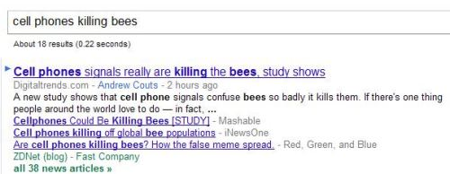

Paraphrases happen.

People write news exploring a particular event and use slightly different words to convey the same or a similar meaning based upon their own personal style, different levels of expertise or background knowledge, or a desire to try to be somewhat unique.

Bloggers may cover a particular concept or story and add their own unique touch to a headline or post about a topic.

Ecommerce site publishers may craft their own description of a product that shares some words and ideas with others.

Informational sources such as wiki’s may share facts about particular persons, places, and things that answer *who*, *what*, *why*, *when*, and *how* type questions that address commonly asked questions, such as when someone was born, who was involved in some event, how a particular process works, and so on.

Two different web pages may share many text fragments that may vary slightly but have the same meaning or are relevant to each other.

**Search Engines and Paraphrases**

Search engines perform several functions where some knowledge of when paraphrases convey similar ideas can help them.

These include answering searchers’ queries when a paraphrase in a document doesn’t quite use the same keywords as in the query but is very relevant to that query.

Or when the search engine attempts to create document summaries for pages to show in search results, and the summaries from different pages contain paraphrases that address the same topic.

Or when gathering information to use in a question answering or definitions type response that might appear at the top of search results in response to a query.

My last post, [Google’s Paraphrase-Based Indexing, Part 1](https://www.seobythesea.com/2011/05/googles-paraphrase-based-indexing-part-1/), introduced the idea that Google might be using paraphrases to expand queries, to answer Q&A type questions, and to possibly identify when content might be duplicated on more than one page through the use of paraphrases.

Google was granted a couple of patents this week to identify paraphrases in documents and use that identification of those paraphrases in meaningful ways.

I cited one of the patents and a paper by the authors of both patents and wanted to follow up with some details about how the search engine might identify paraphrases.

**Using Ngrams to Identify Paraphrases**

If you’ve come across the [Google Books Ngram Viewer](https://books.google.com/ngrams/info), then you’ve been given something of an introduction to one technology that can be used to identify paraphrases on the Web.

Google has taken the text from the books they have scanned in their scanning program and broken that text into ngrams. An “ngram” is a fragment of text “n” words long. So, for instance, Google might take the opening of Charles Dickens *A Tale of Two Cities* and break it down into a set of ngrams of different lengths.

*It was the best of times, it was the worst of times; it was the age of wisdom, it was the age of foolishness; it was the epoch of belief, it was the epoch of incredulity; it was the season of Light, it was the season of Darkness; it was the spring of hope, it was the winter of despair; we had everything before us, we had nothing before us; we were all going directly to Heaven, we were all going the other way.*

Here are some ngrams 6 words long from that text:

- It was the best of times
- was the best of times, it
- the best of times, it was
- best of times, it was the
- of times, it was the worst
- times, it was the worst of
- it was the worst of times

Text can be broken into longer and shorter ngrams as well.

**Breaking Ngrams into Portions**

In my first post on paraphrase-based indexing, I listed an example of a couple of sentence fragments that might be considered paraphrases. They were

- Soviet troops pulled out of Afghanistan
- Soviet troops withdrew from Afghanistan

Both phrases were pulled out of a body of web documents by extracting ngrams from those documents. After ngrams are identified, they may be broken down into three portions.

The first of those is a beginning constant portion containing many words that are similar at the beginning of the ngram.

The second portion might be an ending number of similar words and a middle portion containing the words between the other two.

The first and second portions (the beginning and end) are considered an anchor for the ngram. So, in the paraphrase above, “soviet troops” are the beginning constant portion, and “Afganistan” is the ending constant portion, and together they make up the anchors for those ngrams. Note that they are different lengthed ngrams.

If the anchor for more than one ngram is the same, then the ngrams may be considered a potential paraphrase pair.

This process may follow several additional rules in deciding whether a pair of ngrams are possibly paraphrased.

For example, one possible rule described in the patent is that:

> …all possible ngrams between 7 and 10 words in length in a set of documents might be evaluated, where the beginning and ending constant portions of the ngrams are each three words in length and a middle portion in between the beginning and ending constant portions is therefore between one and four words in length.

**Ngrams as sentences**

If the ngrams are sentences, then some other restrictions on deciding whether those sentences might be paraphrase pairs might include:

1. All words in a sentence must contain fewer than 30 letters
2. A sentence must contain at least one verb that is neither a gerund nor a modal verb
3. A sentence must contain at least one word that is not a verb and is not capitalized; or
4. Fewer than half of the words in a sentence may be numbers

The other Google patent granted on paraphrases this week is:

[Paraphrase acquisition](http://patft.uspto.gov/netacgi/nph-Parser?Sect1=PTO2&Sect2=HITOFF&u=%2Fnetahtml%2FPTO%2Fsearch-adv.htm&r=1&p=1&f=G&l=50&d=PTXT&S1=7,937,265.PN.&OS=pn/7,937,265&RS=PN/7,937,265)
Invented by Alexandru Marius Pasca and Peter Szabolcs Dienes
Assigned to Google
US Patent 7,937,265
Granted May 3, 2011
Filed: September 27, 2005

Abstract

> Methods and apparatus, including systems and computer program products, acquire potential paraphrases from textual input.
>
> In one aspect, textual input is received, a first map is generated, where the key of the first map is an ngram identified in the textual input and the value associated with the key of the first map is a unique identifier, a second map is generated, where the key of the second map is an anchor identified from the ngram and the value associated with the key of the second map is one or more middle portions associated with the anchor. A third map is generated, where the key of the third map is a potential paraphrase pair identified from the middle portions. The value associated with the key of the third map is the one or more unique anchors associated with the potential paraphrase pair.

I’ve provided a fairly simple description of one process that could be used to identify paraphrases. Still, the patent includes more details on how paraphrases might be identified, including the use of Dates and Named Entities preceding sentences or sentence fragments that might be identified as paraphrases.

For instance, the soviet troop withdrawal mentioned above happened in 1989, and it’s not uncommon to see something like the following on a web page:

- 1989 – Soviet troops pulled out of Afghanistan
- 1989 – Soviet troops withdrew from Afghanistan

The use of a date on a page in presenting a particular occurrence might reinforce the possibility that the fragments following the date are paraphrases.

Similarly, the use of [named entities](https://www.seobythesea.com/2009/11/search-taxonomies-and-search-engines-answering-questions-vs-indexing-webpages/) and [adverbial relative clauses](https://www.ego4u.com/en/cram-up/grammar/relative-clauses) on a page, naming specific people or places or things may also help in identifying ngrams that might have paraphrases on the web. Here’s how that might work, from the patent:

> For example, the sentence “Together they form the Platte River, which eventually flows into the Gulf of Mexico at the southernmost tip of Louisiana” has three named elements: “Platte River,” “Mexico,” and “Louisiana.” One of the ngrams that can be extracted from this sentence is “River which eventually flows into the Gulf.”
>
> If the beginning constant portion is three words long and the ending constant portion is three words long, the anchor for this ngram, without considering any of the named entities, is “River which eventually into the Gulf”; “River which eventually” is the beginning constant portion and “into the Gulf” is the ending constant portion.
>
> If the named entity following the ending constant portion is added to this ngram, the anchor for this ngram is “River which eventually into the Gulf of Mexico.” If the remainder of an adverbial relative clause modifying the named entity is also added to the anchor of this ngram, the anchor is “River which eventually into the Gulf of Mexico at the southernmost tip of Louisiana,” as the adverbial relative clause modifying the named entity is “at the southernmost tip of Louisiana.”

The patent also presents an alternative method of using ngrams to identify paraphrases which is worth digging into more deeply.

**More Paraphrase Approaches from Google**

While the patents I’ve written about in this two-part post on paraphrases were originally filed in 2005, Google has continued to look into how paraphrases might be identified.

A 2008 Google whitepaper, [Large Scale Acquisition of Paraphrases for Learning Surface Patterns](https://www.aclweb.org/anthology/P08-1077/) (pdf) focuses upon identifying paraphrases with the use of seed patterns. For example:

> For a “birthplace” relation, we start with two seed patterns:
>
> 1. “(PERSON) was born in (LOCATION)”
> 2. “(PERSON) was born at (LOCATION)”

In Google’s patent application, [Machine Translation for Query Expansion](http://appft.uspto.gov/netacgi/nph-Parser?Sect1=PTO2&Sect2=HITOFF&u=%2Fnetahtml%2FPTO%2Fsearch-adv.html&r=1&p=1&f=G&l=50&d=PG01&S1=20080319962.PGNR.&OS=dn/20080319962&RS=DN/20080319962), statistical language models (based upon the use of ngrams) might help identify paraphrases as well.

A 2008 blog post at Google’s Public Policy Blog, [Making search better in Catalonia, Estonia, and everywhere else](https://publicpolicy.googleblog.com/2008/03/making-search-better-in-catalonia.html), tells us how language models might be used to identify synonyms and expand queries. The *Machine Translation* patent notes in one claim that this kind of approach could be used for paraphrases as well:

> 5. The method of claim 1, further comprising:
>
> - Identifying a first phrase in a first natural language;
> - Generating a second phrase in a second natural language by translating the first phrase into a second natural language;
> - Identifying a paraphrase of the first phrase by translating the second phrase back into the first natural language; and
> - Building a translation model for the statistical machine translation using the first phrase as a source language and the paraphrase as a corresponding target language.

In other words, a sentence fragment like “Soviet troops pulled out of Afghanistan” might be translated from English into French and then back into English.

And there might be more than one reasonable version of that translation back into English, such as “Soviet troops withdrew from Afghanistan,” or “Soviet Troops withdrawn from Afghanistan,” or “Soviet troops withdrawal from Afghanistan,” or “soviet Troops leave Afghanistan.”

Just as Google started including [Synonyms](https://www.seobythesea.com/2010/01/google-synonyms-update/) in search results, paraphrases may get a similar treatment from the search engine.

Paraphrases happen if search engines can identify when and where. It can improve the experience of searching by providing a wider range of relevant search results, a broader set of answers, and possibly less duplicated content in search results.
