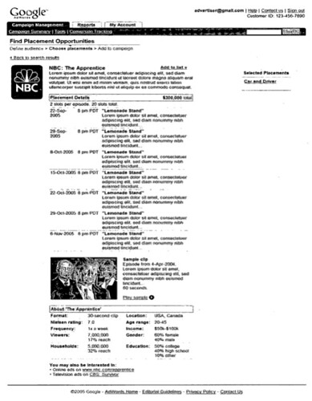
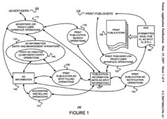
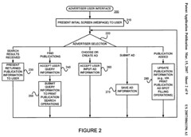
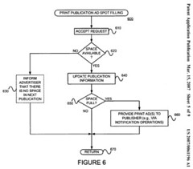
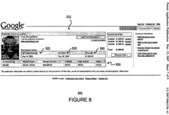
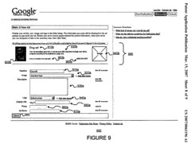
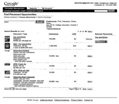
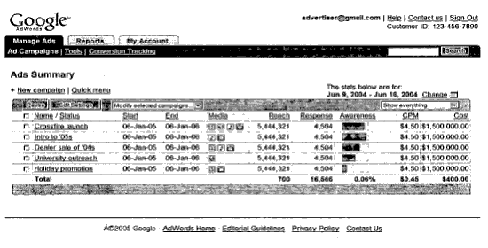

It’s hard to know the future of Google’s print ads program. Or on television or other media. Here’s a quick peek from an expired provisional patent from Google that may give us a hint of one possible future:

(Click through the image, and then on “all sizes” to see the largest version on Flickr.)

The Google Print Ads team home page tells us that the conducted an experiment with ads in premium magazine titles in 2006, and that they are “exploring ways to add value to newspaper advertising.” They ask advertisers who might be interested in participating in such tests to contact them.

Google’s patent application on advertising through print publications adds some interesting twists on the topic of offline advertising. It includes much more than just magazines the description within the document focuses upon how it would be applied to print publications. The actual patent claim goes beyond magazines:

> 19. The computer-implemented method of claim 18 wherein the offline property is selected from a group of offline properties consisting of (A) a billboard, (B) signage, (C) a placard, (D) a poster, (E) a banner, and (F) a sandwich board.

It also mentions another patent application that Google had filed back in September of 2005 – “Platform for Buying, Selling, and Placing Traditional Advertising Such as TV, Radio, Newspaper, and Magazine, Instead of, or in Addition to, Online Advertising.” (U.S. provisional application Ser. No. 60/718,767). That provisional patent application had expired, but the new application states that it is incorporating it by reference.

[Entering advertisement creatives and buying ad space in offline properties, such as print publications for example, online](http://appft1.uspto.gov/netacgi/nph-Parser?Sect1=PTO2&Sect2=HITOFF&u=%2Fnetahtml%2FPTO%2Fsearch-adv.html&r=1&p=1&f=G&l=50&d=PG01&S1=20070061196.PGNR.&OS=dn/20070061196&RS=DN/20070061196)
Invented by Brian Axe, Steve Miller, Gokul Rajaram, and Susan Wojcicki
US Patent Application 20070061196
Published March 15, 2007
Filed: September 30, 2005

Abstract:

> Processes for advertising on offline properties, such as print publications, may be improved by
>
> (a) accepting ad creative information and associating it with an ad identifier,
>
> (b) accepting offline property information and associating it with a property identifier,
>
> (c) determining at least one ad, each having an associated ad identifier, to be placed in or on an ad spot of an offline property,
>
> (d) generating a final ad using the ad creative information associated with the at least one ad identifier associated with the determined at least one ad, and
>
> (e) providing the final ad to an entity for placement on or in the offline property.

Rather than going through the patent application, and summarizing it, I decided to post some images from the document. I also grabbed some images from the provisional patent application, which shows interfaces for television, radio, and print advertising.

Click on the images below to see larger sizes.

**Offline Print Images**

An overview of how Google’s offline advertising might work:

A flowchart describing the advertiser user interface:

A flowchart showing how ad spot filling might happen:

A publisher statement for print advertisements:

The Ad Creation Interface for Magazines:

**Media Advertising Images**

Finding placement opportunities for television, radio, and magazines:

An ads summary page for multiple media:

