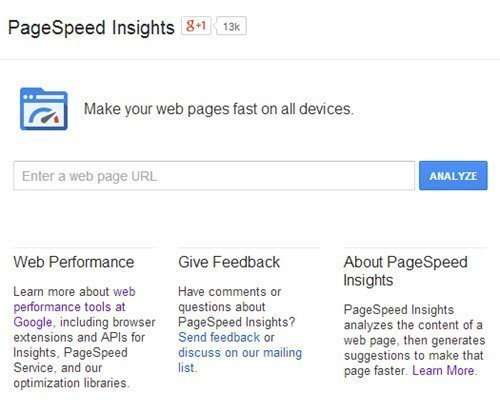

## How Might Google Use Site Speed as a Ranking Signal?

On April 9th, 2009, many people developed an interest in speeding up their websites, after reading a post on the Google Webmaster Central Blog – [Using site speed in web search ranking](https://webmasters.googleblog.com/2010/04/using-site-speed-in-web-search-ranking.html).

On the same day, Google’s Matt Cutts published [Google incorporating site speed in search rankings](https://www.mattcutts.com/blog/site-speed/) on his blog. These posts introduced site speed as a ranking signal that Google would be using.

Matt Cutts told us that site speed wouldn’t be an earth-shattering signal. And that it might not have an impact within a large set of rankings. But he did stress that site speed has benefits other than just ranking, including improved user experience.

The blog posts didn’t give us a full-scale breakdown of the kinds of things that Google might be looking for when it comes to site speed. Or how Google might use site speed when ranking pages.
A Google patent granted on February 4th gives us more details.

So why did Google decide to use the site speed that a page loads as a ranking signal?

Putting it simply, the site speed patent tells us:

> Given two resources that are of similar relevance to a search query, a typical user may prefer to visit the resource having the shorter load time.

Google has worked to help site owners with tools that can help them explore issues related to their site, such as their online [PageSpeed Insights](https://developers.google.com/speed/pagespeed/insights/) tool:

The PageSpeed Insights tool gives sites a score base upon how well they meet many [rules](https://developers.google.com/speed/docs/insights/rules) (or heuristics) involving how quickly a page loads into a browser. These aren’t the factors cited in the patent, but the tool is very helpful to people attempting to improve their site speed.

There’s also a lot of [information about those rules](https://developers.google.com/speed/docs/insights/rules), why they are used, and how they can be implemented. Many of these are technical and you may need the help of a developer or someone who has experience optimizing the speed of sites.

## Load Time Comparisons

The Google Site Speed patent is at:

[Using resource load times in ranking search results](http://patft.uspto.gov/netacgi/nph-Parser?Sect1=PTO2&Sect2=HITOFF&p=1&u=%2Fnetahtml%2FPTO%2Fsearch-adv.htm&r=1&f=G&l=50&d=PALL&S1=08645362&OS=PN/08645362&RS=PN/08645362)
Invented by Arvind Jain and Sreeram Ramachandran
Assigned to Google
US Patent 8,645,362
Granted February 4, 2014
Filed: November 12, 2010

Abstract

> Methods, systems, and apparatus, including computer programs encoded on a computer storage medium, for using resource load times in ranking search results.
>
> In one aspect, a method includes receiving a search query from a particular user device; receiving, for each of a plurality of resources responsive to the search query, a respective first score; accessing load time data that specifies, for each of the plurality of resources, a load time measure for the resource; and adjusting the first score for each of the plurality of resources based on the load time measure for the resource to generate a second score for each of the plurality of resources.
>
> The load time of an online resource can be based on a statistical measure of a sample of load times for several different types of devices that the page or resource might be viewed upon.

The site speed patent points to these as factors that impact load time in a browser:

- The size of the resource
- The number of images the resource includes or references
- The web server that serves the resource
- The impact of the network connection on the loading of the resource

When Google measures load time to compare two different pages or resources, it might limit itself to devices that (1) are in the same country, and (2) use the same user-agent (such as the same browser).

Load time data might be collected from a web browser, a web browser add-on, or monitoring software associated with a particular user device.

## Site Speed Take Aways

The site speed patent tells us that when there are two different pages or results for a query, and one load **relatively** quickly, while the other loads **relatively** slowly in comparison, the quicker result might be promoted in display order and the slower result might be demoted, so that the quicker page will appear higher in search results.

There are more details in the site speed patent, such as how it might “predict” load times for some pages. We’re also told that load time data for mobile devices might not be included, “because of the high latency of all requests for resources on such devices.”

This kind of load time information also might not be used in all cases, because “some resources may not have enough traffic from particular locations or types of devices for load time measures derived from devices sharing a particular attribute to be meaningful.” The patent gives us these examples involving site speed:

> A resource in Chinese may not have enough visits from user devices located in France to generate a meaningful load time measure using solely devices from France, or a newly launched website may not have sufficient load time data associated with its resources.

If you can improve the speed of your site, it’s not a bad thing to do. It may not be as strong a factor as something like relevance or an important signal such as PageRank, but it could make a difference when two different pages are very close in both of those areas, and one loads much faster than another.

*Added: 2014/02/14* – Devin Holmes, whom I work with at [Go Fish Digital](https://gofishdigital.com/) (he brings some great designs to our work), pointed me towards this article this afternoon – [Google speeds up Chrome by compiling JavaScript in the background](https://thenextweb.com/google/2014/02/13/google-speeds-chrome-compiling-javascript-background/#!vNtKg), which shows how serious Google is about trying to speed up the Web. Where this patent talks about comparing sites while considering things like different user agents, this is one of the reasons why it looks at user agents. If Google compared load times for two different resources they might do that while considering times to load websites on the same version of the Chrome Browser, for example, where Google’s newest tweak to the browser could help pages load faster.
