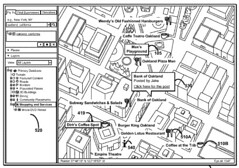

In a digital map system, like Google Earth or Google Maps, it is possible for users to annotate placemarks using brief descriptions relevant to those locations.

The [Google Earth Community](https://productforums.google.com/forum/#!forum/gec) is filled with examples of such placemarks. It’s also possible to come up with your own custom Google Maps using the [Google Map API](https://cloud.google.com/maps-platform/), or using the [Google My Maps](https://patentscope.wipo.int/search/en/detail.jsf?docId=PCTUS2006061922) feature.

Google has come up with a way of ranking these custom placemarks in different placemark layers, which they’ve referred to as **Place Rank**. Click on the image for a larger view of placemarks shown in Google Earth.

They’ve also come up with a way of personalizing some aspects of rankings of different locations based upon an **interestingness** measure, for different users – this kind of personalized information is stored locally on someone’s computer.

Place Rank and Interestingness are described in a patent application from Google:

[Entity Display Priority in a Distributed Geographic Information System](http://appft1.uspto.gov/netacgi/nph-Parser?Sect1=PTO2&Sect2=HITOFF&u=%2Fnetahtml%2FPTO%2Fsearch-adv.html&r=1&p=1&f=G&l=50&d=PG01&S1=20070143345.PGNR.&OS=dn/20070143345&RS=DN/20070143345)
Invented by Michael T. Jones, Brian McClendon, Amin P. Charaniya, and Michael Ashbridge
US Patent Application 20070143345
Published June 21, 2007
Filed October 11, 2006

Abstract

> A system for ranking geospatial entities is described. In one embodiment, the system comprises an interface for receiving ranking data about a plurality of geospatial entities and an entity ranking module. The module uses a ranking mechanism to generate place ranks for the geospatial entities based on the ranking data. Ranked entity data generated by the entity ranking module is stored in a database. The entity ranking module may be configured to evaluate a plurality of diverse attributes to determine a total score for a geospatial entity. The entity ranking module may be configured to organize ranked entity data into placemark layers.

This patent application describes a geographic information system (GIS), which could also be configured as a distributed geographic information system (DGIS) because some of the information that is displayed on the maps may be stored on client computers.

One of the features of the system is the use of techniques that prioritizing which placemarks (as well as other map entities) to display on a IS (information system) based map.

**The Entity Ranking Process**

Entity Ranking could be done client side or server-side. An Entity Ranking Module would receive or collect data from various sources about geospatial entities, and rank the data.

The data includes:

*Entity data* – identifying and defining geospatial entities, which may be placemark-level data.

*Ranking data* – by which geospatial entities can be evaluated. A ranking engine applies ranking algorithms or rank mechanisms to the ranking data to determine scores for geospatial entities defined in the entity data.

That ranked entity data can then be sent to an application such as a mapping application, or formed into placemark layers.

**Sources of Entity Data and Ranking Data**

Entity data and ranking data can come from a lot of different places, such as:

- Satellite data,
- Aerial photographs,
- Street-level photographs,
- Digital map data,
- Tabular data (e.g., digital yellow and white pages),
- Targeted database data (e.g., databases of diners, restaurants, museums, and/or schools; databases of seismic activity; database of national monuments; etc),
- Government census and population data,
- Building plan data,
- Demographic data including socio-economic attributes associated with a geospatial entity such as a zip code or town,
- Alternative name data.

Some of this data might be proprietary content, and the placemarks created from that data may only be accessed by subscribers ([Google Maps for Work](https://cloud.google.com/maps-platform/), for example).

While the information is made up of structured data about geospatial entities, definitions of geospatial entities and ranking data in the form of information about attributes of geospatial entities may also be provided in unstructured form.

This data could be harvested from websites on the internet, and/or taken from other sources such as community forums like the Google Earth Community, online bulletin boards, or other virtual spaces in which geospatial entities are being defined and described by users in a public, private, or semi-public setting.

I’ve created a few local maps myself which show local area restaurants, shops, schools, and nonprofit organizations. The pinpoints (placemarks) in those have little user annotations that I’ve added. The many different projects at the Google Earth Community are worth exploring – some of them are pretty significantly involved creations.

Examples of the kinds of geospatial entities that might be ranked include:

- A city name and location,
- A user defined entity,
- A commercial entity,
- A geospatial item found in a web search, or;
- Any item (e.g., physical thing, event, or quality) having a geographic association.

A geospatial entity is defined as:

> geometry associated with a physical place (such as a set of geographic coordinates on Earth or the moon) and a description.

A geospatial entity can also be non-geographical in nature, such as the War of 1812, in which case, the geometry may correspond to locations associated with the event. (There are some great examples at the Google Earth Community pages.)

A geospatial entity can also correspond to single place or multiple physical places and descriptions. The patent notes as an example, an “entity” like “Oakland gas stations,” which may include several different physical locations, each of which is represented by a separate placemark.

**Interestingness for Geospatial Entities – Personalization in Maps**

Some of this geographic information may only be shown to a searcher/user on their own computer, and there are some personalization features that individuals will be shown which could be influenced by how they use Google Earth and Google Maps.

The ranking data in this system can be used to describe attributes of placemarks evaluated by the ranking engine to determine the entity’s rank.

Those attributes can define the “interestingness” of an entity to a particular user.

Such interestingness can be used to rank the various geospatial entities in the area of a user’s visual search.

**Determining Interestingness**

In determining “interestingness” for placemarks for individuals, there are a few features that are looked at. Places (and their annotations) that are higher ranked may be given priority for display over lower ranked (less interesting) entities.

This is the kind of ranking data that might focus a user’s interest in certain placemarks:

- Placemarks that have been *saved or annotated* by the user.
- A user’s *search terms or patterns of web page access* or use may also be correlated to certain placemarks.
- Placemarks that a user has *defined for his or her own use* may be assumed to be of high personal interest.

These geospatial entities may include points of interest or personal relevance to the user, such as home, work, their child’s daycare or favorite playground. These kinds of things might be identified and marked on any map regardless of their relative rank as calculated by a geographic information system.

These points of interest might be gauged from the user’s behavior, or taken from expressed preferences or instructions regarding entities expressly provided by the user, for instance instructing the inclusion or exclusion of specific entities or groups of entities in maps provided by a map server system.

A ranking premium may be assigned to placemarks based on the user’s interest or preferences. This user data collected at a client computer may be stored in the memory of the client computer and used by the ranking engine to create rankings that are personal to the user.

**Place Ranking Mechanisms**

There are a few mechanisms used to create relative rankings of geospatial entities such as city name and location, user defined entities, commercial entities, or geospatial items found in a web search.

It’s not possible to display all entities on a map, so this method of ranking helps determine which placemarks should be shown.

This ranking can be referred to as **place rank**, and is computed based on the weighted contributions of various non-cartographic meta attributes about a geospatial entity.

These aren’t physical characteristics of places, such as population. Instead, they reflect traits of abstractions or representations associated with the geospatial entity.

Examples include:

a) The amount of detail in the description of an entity or the number of times a description has been viewed,

b) The context or downloads of a definition of an entity, or attributes about the creation of an entity in a public forum,

c) An indicator of the popularity of a geospatial entity (such as the number of views, downloads, or clicks on the entity or a placemark associated with the entity or an attribute based on a ranking or score assigned to an entity), or;

d) The relationship of an entity to its context, such as the category to which an entity belongs.

**Conclusion**

The patent application provides a lot more detail on the ranking factors, and how interestingness works for personalization. If you’ve wondered why some placeholders show in a system like Google Earth, and why others don’t, this patent filing may hold some answers.
