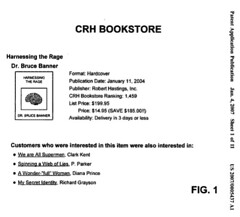
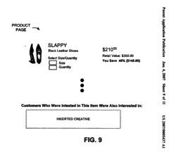

If Google were to get into the shopping comparison and recommendation business, how would they do it?

The answer might involve incorporating measures of user behavior to perform collaborative filtering based upon data collected from more than one web retailer, and could be done with the use of shopping recommendation widgets displayed on many web retailers’ pages.

A patent application from Google shows how they might do that.

User behavior data, such as information about user purchases (conversions) and information about accesses of, and time spent on product pages and product information pages, may be collected for a good number of users and from many web retailers and possibly even non-web retailers. This kind of information might be collected through toolbar software or retailer supplied information or both.

In addition to looking at purchases of possibly related products during single online sessions, this system would also consider amount of time spent by people looking at reviews, product descriptions, and prices.

So if a lot of people who buy Crest toothpaste also spend some time looking at a page for a Reach toothbrush in the same online session, people looking at a product page for the toothpaste may see a recommendation for that toothbrush.

[Product recommendations based on collaborative filtering of user data](http://appft1.uspto.gov/netacgi/nph-Parser?Sect1=PTO1&Sect2=HITOFF&d=PG01&p=1&u=%2Fnetahtml%2FPTO%2Fsrchnum.html&r=1&f=G&l=50&s1=%2220070005437%22.PGNR.&OS=DN/20070005437&RS=DN/20070005437)
Invented by Michael Stoppelman
US Patent Application 20070005437
Published January 4, 2007
Filed: June 29, 2005

Abstract

> A system gathers user behavior data from a group of web retailers and/or non-web retailers, analyzes the user behavior data to identify product recommendations for products offered by the web retailers, and provides one of the identified product recommendations in connection with a product page associated with one of the web retailers.

**Google Recommendation Widgets**

Product recommendations may be provided to web retailers, enabling them to insert a piece of code, called a “creative,” on their product pages.

It could be implemented using JavaScript or in some other manner, and would display recommended products from the product recommendation system to people browsing the page. In effect, it would be a recommendation widget.

The products displayed would be relevant to the product page shown, and to the web retailer selling the product. It wouldn’t recommend products that the online retailer doesn’t sell.

A web retailer using the widget might be charged based upon the clicking of links to recommended products, or when visitors place recommended products in a shopping car, or upon purchasing those, or it could involve fees using a flat rate basis.
