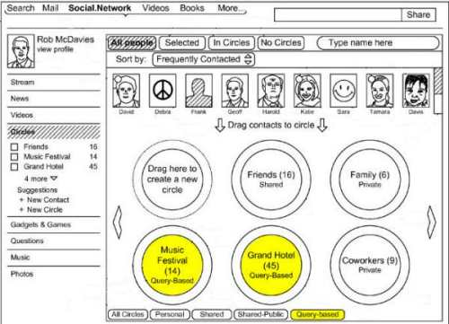

*Are Google’s query-based social circles the answer to Facebook’s Graph Search?*

Not too long ago, Facebook launched its [Graph Search](https://www.facebook.com/help/821153694683665), which enables people to search for things like “My Friends who live in San Francisco,” and My Friends who like Surfing,’ and “Places my Friends like.”

Imagine if Google Plus allowed you to perform searches such as, “People who take the same bus as me into the city,” or “People who like to eat at the Red Truck Bakery,” or “People attending the Dave Matthews Band Concert next Friday,” and creates in response a social network circle that other people might be invited to join, even temporarily, or who could join anonymously. Or Google Plus may dynamically create such a query-based social circle which it may recommend that you share through as you create a post about a music festival you’re going to or a meal you’re reviewing from a local hotel.

The image above from the patent filing shows a query-based circle for a “Music Festival” and a query-based circle for a “Grand Hotel,” as well as a button to only display query-based circles in the interface.

This dynamic circle creation would enable you to identify and talk to people who share a common interest with you. Such a circle could be set up so that it would be open to anyone to join, or it would be a moderated circle that people would have to apply to join. It wouldn’t be limited to your “friends.” Considering most of the people I’m “connected” to through Google Plus or even Facebook are more likely from outside of my local area, this could be a good way for me to be social on a more local scale.

A patent application published by Google in late December describes the use of queries to create social circles. The [announcement of Facebook’s Graph search beta](https://www.facebook.com/notes/facebook-engineering/under-the-hood-building-graph-search-beta/10151240856103920) wasn’t announced until 3 weeks later in Mid-January, 2013.

The pending Google patent application is:

[Query-Based User Groups in Social Networks](http://appft.uspto.gov/netacgi/nph-Parser?Sect1=PTO1&Sect2=HITOFF&d=PG01&p=1&u=%2Fnetahtml%2FPTO%2Fsrchnum.html&r=1&f=G&l=50&s1=%2220120323909%22.PGNR.&OS=DN/20120323909&RS=DN/20120323909)
Invented by Reza Behforooz, George Baggott, Ana Maria Ulin Vazquez, and Charles Mendis
Assigned to Google
US Patent Application 20120323909
Published December 20, 2012
Filed: June 20, 2011

Abstract

> Implementations of the present disclosure include obtaining one or more queries, processing data stored in a data store based on at least one query of the one or more queries to identify a plurality of users,
>
> - The plurality of users sharing a commonality that is a subject of the at least one query,
> - Generating one or more query-based social circles,
> - The plurality of users populating a query-based social circle of the one or more query-based social circles,
> - The query-based social circle being directed to the commonality and defining a distribution list for distributing digital content provided by one or more users of the plurality of users, and
> - Transmitting social circle data corresponding to the query-based social circle to display a representation of the query-based social circle to at least one user of the plurality of users.

People who might be added to such a query-based social circle would be determined by a relevance score for each of them that might be above a “threshold relevance score.” So unlike Facebook’s Graph search, a query-based social circle might be available to someone based upon *whether or not the circle might be relevant to them*, rather than whether they are a “friend” of the person searching.

A query-based social circle could be temporary, or it could be longer term. It would enable people selected as members to be able to distribute information to each other.

## Examples of Topics for Query-Based Circles

The patent filing provides many options about how such a query/topic-based social circle could be set up, and how information could be shared through it, but what’s most interesting are the kinds of information that might be shared. People who would be notified of such a social circle would require that those users either explicitly and/or implicitly are associated with a particular subject that they have in common. According to the patent filing, some examples include:

- A location (e.g., restaurant, coffee shop, park, museum, school)
- An event (e.g., concert, sporting event)
- A locale (e.g., a town, a city, a neighborhood)
- A route (e.g., a bus route, a hiking route, a biking route) and the like

The location might be determined based on signals such as GPS location information, WiFi location information, or cell tower location information, or explicit locations indicated in a Profile or some similar manner.

For example, you go to a coffee shop or a concert hall, and you check in to the social network, which can broadcast your location to your connections. Or that information might be collected from a status update or photos of a sign or a landmark.

For events, contacts who are attending might be sent electronic invitations, or other sources of information could be used to determine who might be attending.

Locales that are shared might also form the basis for such a circle, such as people who regularly visit the same coffee house, or, within the same time-frame:

- A crowd of spectators at golf tournament
- A crowd of protesters outside city hall
- Tourists on a cruise ship at sea
- A flash mob at a particular location

## Automatically Generated Social Circles Based on Google Plus Posts

A query can be dynamically generated based on real-time user input, such as a post to a social networking service. That writing of that post might lead to the creation of a query-based circle.

For example, someone makes a post to Google Plus, and they include the name of a local biking route that’s closing That might trigger the creation of a query-based social circle. The person making the post might be given a recommendation for the distribution of their post to the social circle, and the people it’s distributed to might be anonymous to the person making the post.

Someone regularly checks in to the social network, and writes and rates businesses of a particular type in a locale. A query-based social circle might be generated, and the person posting the reviews might be recommended to share them with others in the area who write reviews of local businesses of the same category.

## Membership in a query-based social circle

A query-based social circle might be offered to someone based upon a prediction that he or she would find it of interest.

A person might not need to explicitly join a query-based social circle as a member and could use it to distribute information to others.

Someone could use one of these social circles to anonymously distribute content or could share information about themselves such as username, profile picture, and other profile information. They could also explicitly join the circle and share information about themselves with others.

## Take Aways

A query-based social circle approach could potentially connect a lot of people who might otherwise not communicate, and there seems to be a lot of potential in enabling people to connect through circles like this.

Imagine, for instance, a group that likes to go to the same park connecting through a dynamically created circle about the park, and using it to organize park cleanups, and celebrations of holidays at the park.

These query-based social circles seem to have a potential advantage over Facebook’s Graph search in that they could connect people who don’t know each other but have common interests. For instance, you could join a circle of people who like to dine in the small town nearby and learn about restaurants in the area, whereas with Facebook’s Graph Search, you would have to rely on other people you know from the area to get a response.

This could potentially have a big impact on the distribution of reviews for local businesses by people interested in your local community (identified explicitly from their profile, or explicitly if they write about the area).

We don’t know if query-based circles will be a feature added to Google Plus, but they could be.

I could see query-based circles making Google Plus a much more useful and active place.
