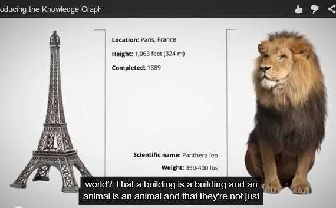
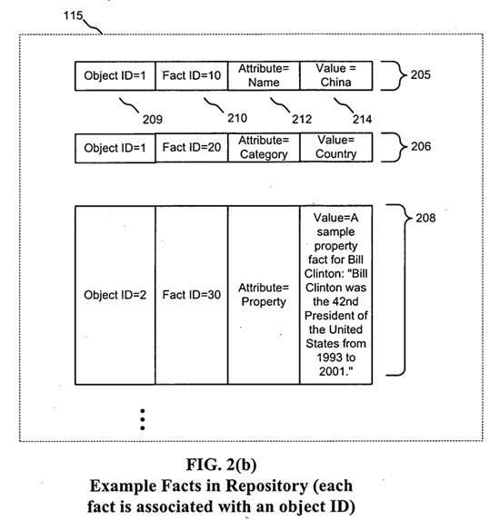
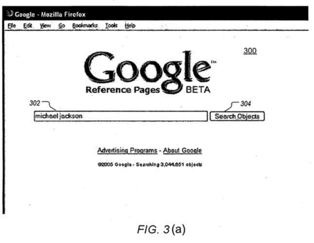
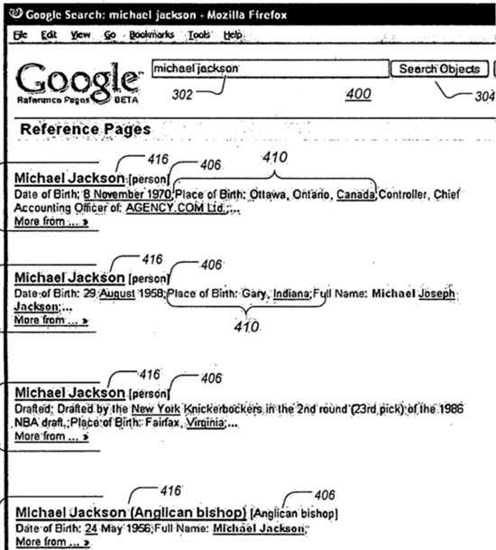
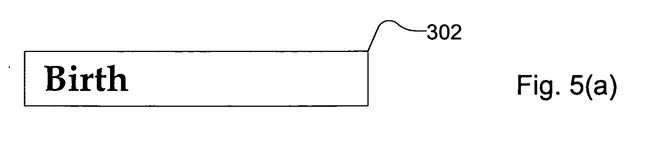
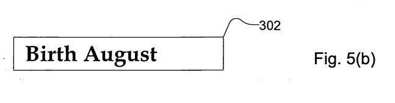
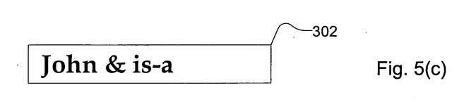
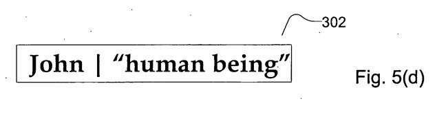
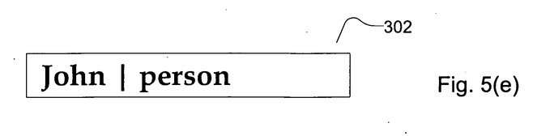
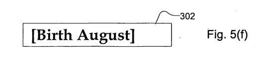

There’s a “Greenway park” near me, built where a train had previously roamed for over 100 years. The park is narrow and not much wider than the width of railroad cars. It cuts a nice path for residents to walk across town, and it’s a relaxing trail to parks and schools and walking a dog. This is good since the rail mode of transportation has been replaced mostly by the automobile.

_Sometimes the signs we see have meaning, and sometimes there’s no train to be found nearby at all._

Former Google search engineer Andrew Hogue, now the head of the search at Foursquare, was in charge of a Google called the Annotation Framework project.

He put together a team in the mid-2000s who pursued patents on a range of related topics involving something called a [browseable fact repository](https://www.seobythesea.com/2014/09/googles-browseable-fact-repository-early-knowledge-graph/), which would later grow into Google’s Knowledge Graph.

## Specialized Queries for Google’s Semantic Web?

One of those Annotation Framework patent filings describes different ways that searchers might search at Google to uncover facts that might be contained in that browseable fact repository. It is about a query language that may have seen its time slip by, like the train in my town.

As far as I know, there hasn’t been much of a discussion on the web about this “query language” patent or the idea of specialized queries solely for Google’s Knowledge Graph.

Google seems to be moving towards a united search interface that is filled more with knowledge panels, and carousels and [delivering more direct answers](https://searchengineland.com/semantic-search-what-is-it-how-are-major-search-and-social-engines-use-it-part-1-133160) to searchers and is less about a query language for their fact repository or knowledge graph.

This query language may have been too complicated for most searchers to use. So Google introduced [Structured Snippets](https://ai.googleblog.com/2014/09/introducing-structured-snippets-now.html) in September that gives us a look at facts in our search query results but doesn’t have most of us trying to figure out a query language.

Many of us could learn a query language like [SPARQL](https://www.cambridgesemantics.com/blog/semantic-university/learn-sparql/sparql-by-example/) to search through something such as Google’s knowledge graph, but it would probably be lost on many people who don’t have the time to take to learn something new. So a query language built to make it easier to find answers through a knowledge graph makes sense. But Google’s fact repository is like the local train – it’s likely been replaced with something else.

_Google’s knowledge graph shares the world’s data with us._

I decided to share some of the query languages since it shows off a Google that most of us have never seen and likely never will. You might take it as a piece of history that never happened or a business lesson about choosing products carefully.

## Ease of finding information at Google

This query language patent tells us about how easy it is to find web-based information:

> Many search engines exist to search the World Wide Web. The Google search engine, for example, employs a user-friendly syntax that lets users type in a search query for items of interest (e.g., typing “Britney Spears” to find out information about the singer Britney Spears).
>
> The Google search engine also allows users to construct more complex search queries. For example, advanced Google search allows users to search for web pages by specifying that the web page:
>
> 1. Must contain an exact phrase (by placing the query terms in quotes);
> 2. Must contain one or more of the query terms, or
> 3. Must not contain one or more of the query terms.
>
> This advanced search capability allows a user to tailor his search for web pages that contain specific information. Google search permits the search of web pages, which are an example of unstructured data.

A couple of years ago, the paper [Enhanced Results for Web Search](https://www.dc.fi.udc.es/~roi/publications/sigir2011a.pdf) (pdf) was published by Kevin Haas of Microsoft, Peter Mika and Roi Blanco of Yahoo!, and Paul Targan of Facebook. It describes the tremendous impact that enriched search results have given to search engines that display them, and that may also be a compelling reason to merge Knowledge Web results into search over web page results.

Not only are the results richer and more interesting than 10 blue links pointing to web pages, but they provide a much better user experience. If you haven’t, take the time to read the “Enhanced Results” paper. I think it’s a clear roadmap for the direction that today’s search engines are headed towards.

The patent, which I think was a push in the opposite direction, is:

[Query language](https://patents.google.com/patent/US20070198480)
Invented by Andrew W. Hogue, and Douglas L. T. Rohde
US Patent Application 20070198480
Published August 23, 2007
Filed: February 17, 2006

Abstract

> A fact repository supports searches of facts relevant to search queries comprising keywords and phrases. A service engine retrieves the objects that are associated with facts relevant to a query. The query language described is designed for use with such a repository of facts and searches both the attributes of facts and the values of the attributes.

## Searching a Fact Repository

The fact repository was intended to be searchable. It provides access to documents and facts, a mix of text and graphics and multimedia, and content presented in HTML markup codes and languages such as javascript.

This document can be located by a Uniform Resource Locator (URL) or a Web address.

The fact repository has several moving parts, such as one or more importers, one or more janitors (to analyze and massage and shape data), a build engine, a service engine, and a fact repository.

The patent provides more details on how a fact repository might work and how importers and janitors would play a role in its operation. If you want more details, the patent has some.

## The Index in a Fact Repository

The fact repository contains objects and collects facts about them. Each object contains unique IDs; each fact about an object contains a Fact ID, an attribute, and a value.

_Notice that both Objects and facts have unique IDs._

The index maintains a term index, which maps terms to {object, fact, field, token) tuples, where “field” is, e.g., attribute or value.

The service engine is adapted to receive keyword queries from clients such as object requestors and communicates with the index to retrieve the relevant facts of the user’s search query.

For a generic query containing one or more terms, *the service engine assumes the scope is at the object level*. Thus, any object with one or more of the query terms somewhere (not necessarily on the same fact) will match the query for purposes of being ranked in the search results.

The ranking (score) of an object can be a linear combination of relevance scores for each of the facts. We don’t know for certain if this patent description fits how facts and objects are ranked, but it’s interesting seeing one way of ranking them. There are other approaches out there, which may be in use even today.

> The relevance score for each fact is based on whether the fact includes one or more query terms (a hit) in one of the attributes, value, or source portion of the fact.
>
> Each hit is scored based on the frequency of the term that is hit, with more common terms getting lower scores and rarer terms getting higher scores (e.g., using a TF-IDF-based term weighting model).

The fact score is then adjusted based on additional factors, such as:

1. Consecutive query terms in a fact
2. Consecutive query terms in a fact in the order in which they appear in the query
3. An exact match for the entire query
4. The query terms in the name fact (or other designated fact, e.g., property or category), and
5. The percentage of facts of the object containing at least one query term

> Each fact’s score is also adjusted by its associated confidence measure and its importance measure. Since each fact is independently scored, the most relevant and important facts to any individual query can be determined and selected. In one embodiment, a selected number (e.g., 5) of the top-scoring facts is selected for display in response to a query.

The purpose behind the query language is to help people surface information about their repository’s many entities and facts.

## Details of Query Language

Queries to the fact repository generally return objects. The search engine decides which objects to return based upon which facts match a query.

I’ve never seen “Google Reference Pages,” as an actual Google product, but here’s a screenshot from the patent that shows it:

The service engine is also adapted to handle structured queries, using query operators that restrict the scope of a term match.

_It looks like Google, but the snippets look more like Wikipedia._

**Examples**

You can see from the patent screenshot above that this isn’t the Google you use every day. The queries you would use on it would be different too.

Google does have special search operators that return certain types of results today. You can see those on their [Punctuation, symbols & operators in search](https://support.google.com/websearch/answer/2466433?hl=en&rd=1) page. The Query Language patent points out some of those aimed at a fact repository. For example:

” “: Double quotes that surround a sequence of query terms require that the terms match in that order in a single field – This is called a phrase match.

^: If a caret immediately precedes a word, it may only match the first word of a field. If the caret immediately follows a word, it may match only the last word of a field.

Quotes and carets can be combined to produce an exact field match, for example, “^George W. Bush^.” In one embodiment, carets may only occur within quotes. In other embodiments, carets can apply to any term.

[ ]: Square brackets restrict the enclosed expression to appear in the same fact.

{ } Curly brackets: restrict the enclosed expression to match a single field.

This can be further restricted to a field of a specific type, such as attribute{ . . . } or value{ . . . }.

[X:Y]: Shortcut for [attribute{X} value{Y}].

Matches an attribute/value pair of a fact with the specified values.

This query will return all objects whose facts contain the specified query term “Birth.”

It is important to note that search queries performed by a service engine following the present invention look at both a fact’s attribute (also called an attribute name) and the fact’s value (also called an attribute value) to determine if the fact is relevant to the query.

**Example**

Other embodiments may default to also searching for query terms within a fact’s links, metrics, sources, or agents, and so on.

Still, other embodiments may implement a query syntax that allows a user to explicitly search within various fields of a fact (such as links, metrics, sources, or agents, and so on).

**Example**

The search query “birth” matches a fact contained in a link field of “www.birth.com” but would not match “www.birthday.com” in the same field.

Set up a slightly different way, a query of “birth” would match “www.birthday.com” since “birth” is contained in “birthday.”.

A logical **“AND”** operator is implicitly assumed if no logical operator is specified for query terms.

An object must have associated facts matching both terms to be returned as a result of the query.

This query will return all objects with the term “Birth” and the term “August” in one or more of their facts.

It is important to note that search queries performed under the present invention look at both a fact’s attribute (also called attribute name) and the fact’s value (also called attribute value) to determine if it is relevant to the query.

**Example**

The ampersand (&) is an explicit logical operator that indicates that all search query terms must be present (although not necessarily in the same fact or any particular field of the facts) for an object to match.

This search query will return all objects with facts that contain both the term John” and the term “is-a.” Here, the term “John” is in fact #1, and the term “is-a” is an attribute of fact #2, so object #1 would be returned since it is associated with facts containing both search query terms.

Thus, even though the source documents on document hosts that were used to create the facts of object #1 may not have contained the word “is-a,” object #1 will be returned by the search query since, at some point, a fact with an attribute of is-a was added to the object.

**Example**

A janitor whose function categorizes objects might have created multiple new “is-a” facts having an attribute of “is-a.”

Thus, for example, a janitor may exist that searches the fact repository and categorizes objects, and creating new facts with an “is-a” attribute having a value of “person,” “cat,” dog,” and so on for each categorized object.

It will be possible for a user to enter a search query to locate all objects that have been categorized by the janitor (by searching for the attribute “is-a”). In addition, it would also be possible for a user to enter a search query to locate all objects that have been categorized as persons (by searching for the attribute “is-a” and the value “person” as an attribute/value pair within a single fact, as discussed below).

The vertical bar (|) is an explicit logical operator that indicates that only one query term much be present to match, although both may be present and still match.

This search query will return all objects containing either the term “John” or the phrase “human being.”

Here, the term “John” is in fact #1. Even though the phrase “human being” is not found, object #1 would be returned since it is associated with fact #1, and therefore satisfies the Boolean disjunction. FIG. 5(e) shows the following search query that is entered into search query field:

This search query will return all objects containing either the term “John” or the term “person.”

Here, the term “John” is, in fact, #1, and the term “person” is an attribute of fact #2, so object #1 would be returned. Other embodiments may allow a user to perform an exclusive OR’d search (i.e., only one fact, not more or fewer, must match).

A search query using square brackets ([ ]) will return all objects where both query terms are in the same fact.

Here, this search query will return nothing since no object in the example contains both “Birth” and “August.”

## Take Aways

The patent contains several additional punctuation terms and specializes formats you can use in a query. They could have made an “advanced” search page, like Google did for their [Advanced patent search](https://books.google.com/advanced_patent_search), which inserts specialized query terms. For example, if I want to search for patents assigned to a specific company such as Google, I use the advanced patent search page, and it types in a specialized query language for me. Google would include within that query the phrase, “inassignee: google.”

But instead of a query language for their Knowledge Web, it seems that Google is happier providing results in knowledge panels and carousels and other specialized formats, triggered by queries that might result in a scrolling list of episodes at the top of a search result screen when you type in as a query something such as [“popular new TV show name” episodes].

People may refer to these as “direct answers,” but they are also simple answers that it doesn’t take much magic for a searcher to find out how to use and for a search engine to deliver upon.

Instead of a query language for searchers to try to figure out, Google may see if it can figure out when people want some enhanced results due to a query. That seems to be the message behind the “Enhanced Results” paper I mentioned above.
