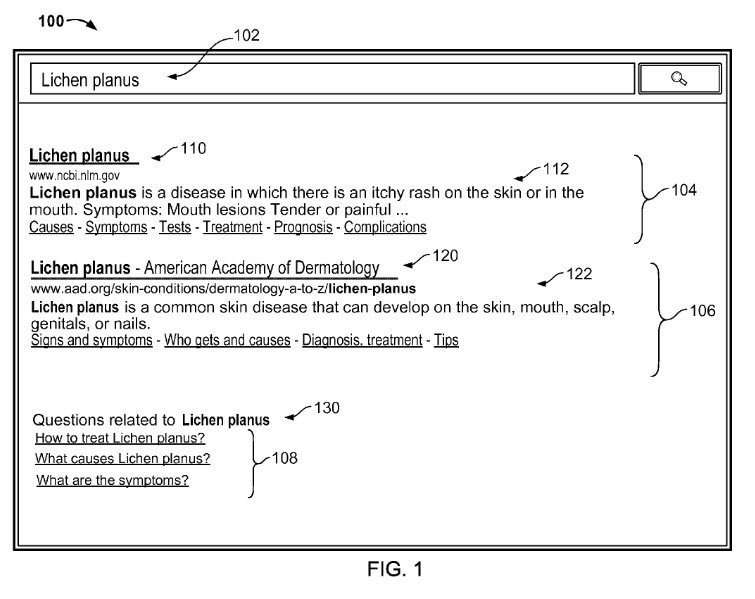
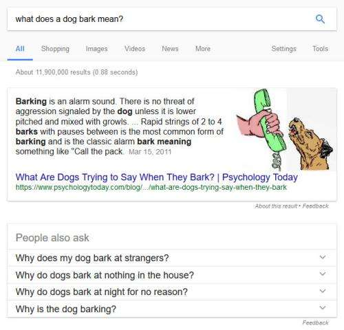

## Google Related Questions or People Also Ask Questions Patent

When you search at Google, the answers you receive sometimes include additional questions that often have the label above them, “People Also Ask.” I was curious if I might find a patent about these questions, and I saw that “people also ask” questions were sometimes referred to as “related questions.”

An article at Moz today on related questions was interesting: [Infinite ‘People Also Ask’ Boxes: Research and SEO Opportunities](https://moz.com/blog/infinite-people-also-ask-boxes). The answers about how those related questions are decided upon seem to have a simpler origin as described in Google’s patent. Still, it is interesting comparing the ideas from that post with the patent.

I searched through Google patent search for “related questions,” and I came up with a patent named “Generating related questions for search queries.” When I looked at the screenshots accompanying the patent, they appeared very similar to the “People also ask” type questions Google shows us today in search results.

The patent provides some information about how Google gets these “people also ask” or related questions.

## Choosing Topic Sets for SERPS

It appears that Google looks at a query it receives and, after receiving several search results, will decide upon one or more topic sets for each of the search result resources from “previously submitted search queries that have resulted in users selecting search results identifying the search result resource” and “selecting related questions from a question database using the topic sets.” The “people also ask” questions selected from those topic sets may get returned along with search results for the query searched for.

The related questions database includes previously submitted search queries in question form.

Deciding upon topic sets for each of the search result resources involves:

(1) Identifying qualified search queries for the search result resource – previously submitted search query that resulted in a user selecting a search result that identifies the search result resource;

(2) Ranking the qualified search queries based either on how many times each query has been submitted or based on how often users have selected a search result identifying the search result resource after submitting each query; and

(3) Selecting one or more highest-ranked qualified search queries as the topic sets for the search result resource.

## Comparing Questions with Each Other

The “people also ask” questions included with a set of search results can get compared with each other, and if they appear as equivalents of one another, the best version of that question might replace equivalent questions.

The patent gives us a reason for showing searchers these “people also ask” questions:

> Providing related questions to users can help users who use un-common keywords or terminology in their search query to identify keywords or terms that are more commonly used to describe their intent. The user experience can get improved by submitting the displayed content of a related question as a new search query and receiving a pre-determined, pre-formatted answer to the related question as part of a response from the search engine.

The people also ask patent is:

[Generating related questions for search queries](https://patents.google.com/patent/US9213748)
Inventors Yossi Matias, Dvir Keysar, Gal Chechik, Ziv Bar-Yossef, Tomer Shmiel
Publication number US9213748 B1
Granted date: Dec 15, 2015
Filing date Mar 14, 2013

Abstract

> Methods, systems, and apparatus, including computer programs encoded on computer storage media, are described for identifying related questions for a search query. One of the methods includes receiving a search query from a user device; obtaining a plurality of search results for the search query provided by a search engine, wherein each of the search results identifies a respective search result resource; determining one or more respective topic sets for each search result resource, wherein the topic sets for the search result resource are selected from previously submitted search queries that have resulted in users selecting search results identifying the search result resource; selecting related questions from a question database using the topic sets, and transmitting data identifying the related questions to the user device as part of a response to the search query.

## The Related Questions Database

The question database selected from queries in question form, and a query can get determined to have been in question form based upon many features that may have gotten associated with it. It might have:

The predetermined set of question terms can include one or more interrogative words. These may be interrogative determiners, interrogative pronouns, and interrogative pro-adverbs, other function words that are frequently used to ask a question,

It may also have punctuation marks, such as question marks.

It may match certain question query templates, such as “why is [X] used,” where [X] is a placeholder for one or more query terms.

The selected search queries may have to meet a threshold of being asked a certain number of times before it is selected as a potentially related question.

“People also ask” questions may also be taken from sources other than just queries and could include questions from question and answer websites.

## Related Questions Take-Aways

The patent tells us about the selection of search queries and sources of answers to those queries. When related questions are selected, they can get ranked more highly based on whether they were provided as questions that came with answers. “People also ask” questions may get promoted in rankings, and questions without answers may get demoted as choices of related questions.

A quality score for answers to people also ask questions may get based upon such things as:

(1) A quality score generated by the search engine for the resource from which the answer is derived. That is the page that is the answer source.

(2) The quality of the answer may get based in part on a ranking of a search result identifying the resource from which the answer is derived in a ranking of search results generated by the search engine in response to the question being submitted as a search query.

(3) The quality of the answer may get based in part on the length of the answer. This can mean the number of tokens, terms, or characters in the answer.

(4) If multiple answers are available for a given question, the quality of each answer can get based in part on the number or proportion of terms in the answer that are repeated in other answers for the question.

This Related Questions patent was updated via a continuation patent in 2017. I wrote about the new version and the differences it brought in the post [Google Related Questions now use a Question Graph](https://www.seobythesea.com/2018/02/related-questions-question-graph/)

Last Updated June 5, 2019
