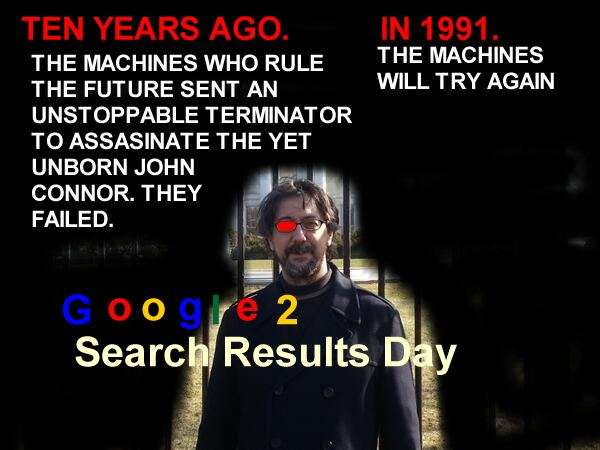

As part of the regular business analysis that I do on an ongoing basis, I like to keep an eye out for acquisitions made by search engines and look at the technology that those companies being acquired have filed patents for.

When I heard about [Google’s acquisition of Skybox](https://www.wsj.com/articles/amid-stratospheric-valuations-google-unearths-a-deal-with-skybox-1402864823), I jumped to the assumption that low-level orbiting satellites might be used as Google’s [Project Loon](https://loon.com/) to spread internet access to a wider audience across the globe. Or they might be used to make Google Maps a lot better with high resolution and frequently updated satellite images.

And then I looked at the patent filings assigned to Skybox Imaging, and quashed those assumptions, or put them off as secondary reasons why Google might have purchased the satellite company.

How much of an impact might high resolution and very frequently updated satellite images have upon a business analysis?

Can the number of cars in a store parking lot be correlated with that store’s week-over-week revenues in a way that can be useful to the store owner or others? Can fishing and farming activity be related to the environmental and economic health of a resource such as the Chesapeake Bay, and suggest changes that might benefit both? One of the Skybox imaging patent filings describes exactly that kind of analysis.

I joked with someone over the weekend that Skybox sounds suspiciously similar to Skynet, the machine intelligence protagonist in the Terminator movies, and that some of Google’s big projects seem to involve a lot of data collection, such as the data that self-driving cars collect, the growing number of sensors in Android phones, and the ability for people to collect data in Google Glass.

GPS information from phones helps Google estimate travel times and learn about detours on roadways. There are other things that Google can learn from the data it collects and will be collecting from the word around it.

The title of the first patent filing I looked at from Skybox had me thinking of what kinds of information these satellites might be collecting.

[Using Human Intelligence Tasks for Precise Image Analysis](http://appft.uspto.gov/netacgi/nph-Parser?Sect1=PTO1&Sect2=HITOFF&d=PG01&p=1&u=%2Fnetahtml%2FPTO%2Fsrchnum.html&r=1&f=G&l=50&s1=%2220130051661%22.PGNR.&OS=DN/20130051661&RS=DN/20130051661)
Invented by M. Dirk Robinson, Mark Robertson, Hadar Isaac, Oliver Guinan, Thomas Joseph Melendez, Daniel Berkenstock, Julian Mann
Assigned to Skybox Imaging, Inc.
US Patent Application 20130051661
Published February 28, 2013
Filed: August 26, 2011

Abstract

> Described are systems, methods, computer programs, and user interfaces for image location, acquisition, analysis, and data correlation that uses human-in-the-loop processing, Human Intelligence Tasks (HIT), and/or automated image processing.
>
> Results obtained using image analysis are correlated to non-spatial information useful for commerce and trade. For example, images of regions of interest of the earth are used to count items (e.g., cars in a store parking lot to predict store revenues), detect events (e.g., unloading of a container ship, or evaluating the completion of a construction project), or quantify items (e.g., the water level in a reservoir, the area of a farming plot).

The patent describes an imaging system that breaks the globe into polygons or sections that might be tracked for activity or “areas of interest on Earth.” Examples of such places listed in the patent include: “Home Depot store parking lots in California,” the “Port of Oakland,” and “Crystal Springs Reservoir.” Other parameters associated with those locations might include:

- The kind of data to be collected
- Time and Date for image collection
- Frequency of data to be derived from the images
- Confidence scores for that derived data

An example set of places where information might be tracked could be all of the Home Depots in California, and this visual system might count the number of consumers who visit Home Depots over time, and the number of delivery’s made to Home Depots

This image data could be augmented from other visual systems such as security cameras or Flickr or Google Maps (mentioned in the Skybox patent filing before Google acquired the company).

The data can be used in many different ways. The patent filing tells us:

> For example, the count of cars in a store parking lot can be correlated with the weekly sales revenues from that store. In another example, the length of time ships take to unload can be correlated with the volume of goods transported through a port. Another example is that the width of water in a reservoir can be correlated with the value of crops in an area downstream.
>
> The non-spatial correlation subsystem 140 collects correlation data over time. The collected data is used to create a prediction of future economic metrics based on previously collected correlations between image analysis data and economic data. for example, weekly sales revenues can be predicted from the count of the number of cars in a store’s parking lot.

The patent provides more details about visualization capabilities of the satellites, the collection of different types of images and data, and how that data might be used in ways that can be aggregated to make business and economic predictions.

Skybox presently only has one satellite in orbit, with stated plans of 24 in total. The patent filing is a reflection of the original intent of how these satellites might be used, and not necessarily Google’s. My image above jokes about the Skynet machine intelligence from the Terminator movies, but there are a lot of possibilities about how technology like this could be used.

We’ll see where Google takes us with it.
