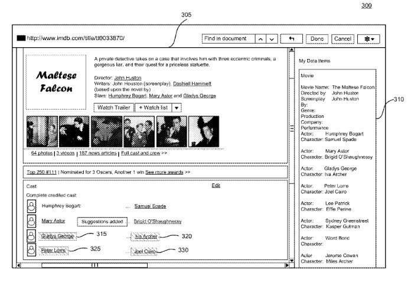
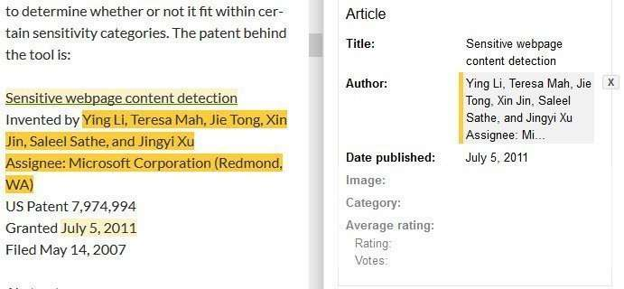

*added: 11/4/2015 – I tried using the Data Highlighter Tool again a few months ago, but changed my robots.txt file first, to stop it from blocking CSS and JS files on the site. After giving Google a chance to reindex the pages of my site without CSS and JS files blocked, I tried using the data highlighter tool. Unblocking those files made a difference in how well the tool worked. It understood the layout of content on my pages better, and it was able to better understand patterns on my pages, and correctly highlight the same types of data from one page to another. So, I recommend making sure that Google can crawl the CSS and JS files on your pages if you want to try to use the Data Highlighter tool from Google’s search console.*

I recently found a patent with two Google search engineers, Joshua Ain and Justin Boyan, listed as two of the three inventors. Last summer, at Google I/O in San Francisco, they joined together to talk about some tools that can more easily help webmasters add markup for structured data on the Web. The patent appears to be for Google’s Data Highlighter, which was one of those tools.

The patent is:

[Systems and methods for generating extraction models](https://patents.google.com/patent/US20140075299)
Invented by Joshua Daniel Ain, Ryan Levering, Justin Andrew Boyan
Publication number US20140075299 A1
Assigned to Google
Publication date: Mar 13, 2014
Filing date: Sep 13, 2012

It inspired me to try to add structured data markup to my website. A task is likely to fail for a few reasons.

I hadn’t read the patent yet last night, and I hadn’t done anything to improve the patterns found on my site, to make them more consistent. ***In other words, I learned the hard way, much like most non-developers, and non-programmers would.***

The video below is an introduction to several Google tools, including the Google Data highlighter.

An image from the patent shows the User Interface of the Data Markup Tool, which looks similar to the actual UI for the markup tool:

I’ve been writing about some patent filings from Google recently, that explore how data might be extracted from web pages and pulled into a knowledge base.

This patent is interesting because it turns things around by making it easier for site owners to tag content on a few pages of a site that could be extracted and marked up with tags that fit into one of many schema choices.

***Without having to be a programmer***, as Justin states in the video.

An aside from the patent about what a data extractor is:

> Specifically, structured data extractors, allow a user to acquire data from data sources, such as web pages, and to control the format of, analyze, and build upon the extracted data. Data extraction in such systems is accomplished through a machine-learning model called an extraction model.

## Data Extraction Lessons

My use of the data markup tool and my reading of the patent pointed out things to consider that might impact data being extracted for your site automatically.

***1. Make Sure your CSS and your Javscript files can be crawled by Google.***

We’ve been told repeatedly by Google Distinguished Engineer Matt Cutts that we shouldn’t block CSS and Java script from being crawled, and in this video from 2012, he tells us that we should make a special effort to make sure that they aren’t blocked:

If the CSS and Javascript on a page can change how content is displayed on your pages, that could have an impact on whether or not patterns involving that data might be crawled and tagged by Google.

***2. Use Consistent Patterns on your site, and Include Semantically Implied Related Content***

If you have a website for an apartment complex, and you list the amenities of that apartment tower, such as a dog park, a swimming pool, a cafe on the first floor, and an elevator that leads to the closest metro station, with an extensive underground metro (subway) presence, make sure those important facts are on the site so that they can be related to the apartment complex as facts for an object or entity to be indexed.

If you have multiple pages on your site where you use tags and patterns on your pages to present products, try to make sure that those patterns (such as a templated infobox) are the same from page to page.

If you call one type of thing a “product #” on one page, and a “part #” on another page, and a “piece number” on a third page, you’re going to confuse a data extractor that might be working automatically. You’re going to destroy any confidence the data markup tool might have when it tries to learn about patterns you have shown off with the tagging you’ve done in Webmaster Tools. You should change those to be consistent from one page to another.

The example pictured above is from my use of Article schema (incorrectly used to test the tool with, but purposefully unpublished), to mark up mentions of patent filings on SEO by the Sea, with patent filing titles marked as “Titles”, Inventors of the patent filings as “Authors”, and either the publication date for patent applications or the granted date for patents as “publication dates. In addition to some patents from the USPTO, I have some pages that list patents from WIPO, the World Intellectual Property Office.

Granted patents and patent applications from the USPTO have different looking numbers, with granted patents mostly being 7 digits long, often with two commas in them. Patent applications are 11 numbers long, with no commas, and are sometimes presented with a “US” at the front of them. WIPO patent numbers look even different. Some pages have either no patents on them, or have some big lists of patents, and some mentions of patent filings don’t include authors and/or publication dates.

I also don’t have consistent and similar labels for each of these items, which would be something to build into a template if you were planning on building a site, but is a lot more work applying to a site that someone took around 8 years to build in a mostly unstructured manner (yes, there is a semantic structure to HTML, but that doesn’t necessarily help a blogger who decides that consistent templates might be good after close to a decade. :)

If I have any expectations that my blog posts about patents would ever be indexed in a knowledge base on the semantic web, I would probably want to clean up most of these patterns to make it possible for a data extractor to do that. I suspect that all the potential patterns involving these many different types of patent filings would confuse. Enabling me to use a tagging and extracting tool doesn’t help, especially with so many inconsistencies.

***3. Apply the right schema markup, if available.***

It’s possible that if I were to do so much cleanup work, actually doing a little more to apply semantic markup to my content isn’t that much more work. But [Article Schema](https://schema.org/Article) might be the best choice for my blog posts. Instead of marking patent filing titles as “Title”, I could probably use the “about” property for patent filings listed in my posts.

The data markup tool doesn’t include all of the types of schema available at [schema.org](http://schema.org/). Updating it might be a good idea. Will people add more schema if there was some kind of carrot such a rich snippet attached? Or some other kind of benefit?

***4. Be careful not to tag old and different cached content from Google.***

The patent warns us that the tool might show cached content from the site for you to use the markup tool upon. If the site has changed recently, and Google hasn’t had a chance to update cached pages, you may want to hold off on tagging those pages. I noticed last night that pages I was being presented with that were cached. There are ways to strategically link from the home page or other popular pages on-site or off-site to deeper content on your site to make it more likely that deeper content on the site might get indexed faster, and cached copies updated.

## A Need for More Informational Content From Google?

Google has published a [Search Engine Optimization Starter’s Guide (pdf)](http://static.googleusercontent.com/media/www.google.com/en/us/webmasters/docs/search-engine-optimization-starter-guide.pdf) to help site owners. They could also offer tips and suggestions on the value of structuring the contents of a site intelligently, and possibly even as the site is initially built so that a tool such as the data markup tool can be more effective, or so that an automated data extraction process from Google is can be much more effective.

Google’s Webmaster Tools is often seen as an SEO tool, and Google’s Data Highlighter is part of the package of tools offered there. Maybe some Semantic Search help cold be added to a future Starter’s guide?

I think it would be a great addition.
