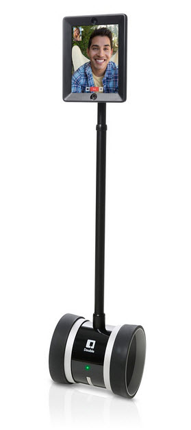
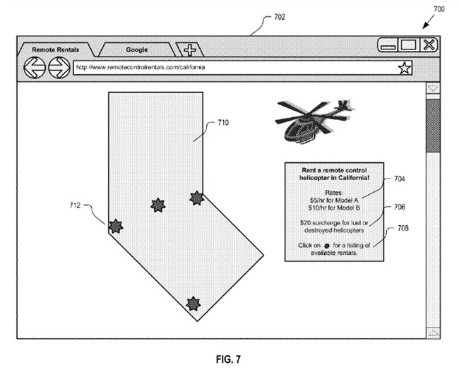
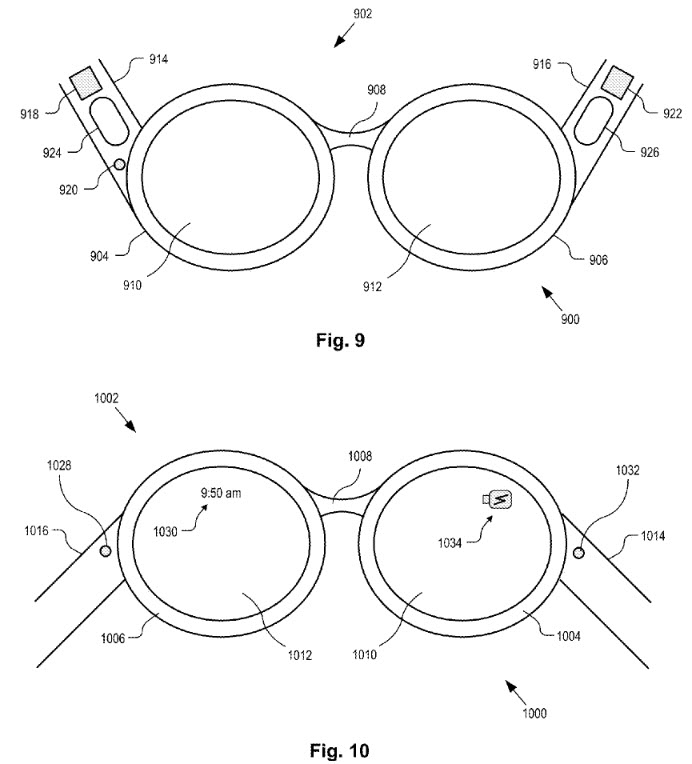

> Telepresence is not science fiction. We could have a remote-controlled economy by the twenty-first century if we start planning right now. The technical scope of such a project would be no greater than that of designing a new military aircraft.
>
> 
>
> _Double Robotics’ Double Telepresence Robot_
>
> A genuine telepresence system requires new ways to sense the various motions of a person’s hands. This means new motors, sensors, and lightweight actuators. Prototypes will be complex, but as designs mature, much of that complexity will move from hardware to easily copied computer software. The first ten years of telepresence research will see the development of basic instruments: geometry, mechanics, sensors, effectors, and control theory and its human interface.
>
> During the second decade we will work ‘to make the instruments rugged, reliable, and natural.
>
> Telepresence, By Marvin Minsky, OMNI magazine, June 1980

The following video is from someone other than Google, but it shows off how a telepresence device might work for a daily commute between Austin, Texas and Manhattan, New York.

Google was granted a patent on October 15th that describes the use of telepresence devices, and it gives them a slightly different look than the Double in the Video above. Actually, they look more like this:

I first saw mention of Telepresence Devices at Google a couple of years ago in the paper [Telepresence Robots Roam the Halls of My Office Building](http://130.243.105.49/~ali/hri2011ws/camera/HRI_Workshop_Tsui_final.pdf), which reminded me of a television network produced Made-For-TV-Movie, likely poorly produced and even more poorly acted.

These aren’t quite robots, but might be better described as “video conferencing on wheels.”

The patent is:

[Method and apparatus for telepresence sharing](http://patft.uspto.gov/netacgi/nph-Parser?Sect1=PTO2&Sect2=HITOFF&p=1&u=%2Fnetahtml%2FPTO%2Fsearch-adv.htm&r=1&f=G&l=50&d=PALL&S1=08860787&OS=PN/08860787&RS=PN/08860787)
Invented by Hartmut Neven
Assigned to Google
United States Patent 8,860,787
Neven October 14, 2014
Filed: May 11, 2011

Abstract

> A method and apparatus for telepresence sharing is described. The method may include providing an indication of a plurality of remote vehicles that are available for telepresence sharing to a user. The method may also include receiving a selection from the user to engage a remote vehicle from the plurality of remote vehicles in a telepresence sharing session. Furthermore, the method may also include providing a live video feed captured by the remote vehicle to a mobile device associated with the user.

This might be the ideal way to work in one part of the world and live in another. Except if you actually like being there in person, which many people probably do.

The patent does tell us that this kind of system could also be used to “capture video as it flies around a real-world location”, such as

- a historical landmark,
- a tourist location,
- a location where a news event is occurring, etc.

I could see going for a quick tour of the grand canyon remotely like this. though it definitely wouldn’t be for the exercise.

The patent does include pictures of eye glasses that might be worn while using one of these remote device that stylistically look a lot like Google Glass. Maybe there’s a possible tie-in.

Imagine all offices filled with people using telepresence devices, and commutes whittled away to almost nothing, except maybe for the time it might take to don a pair of video conferencing glasses.

Sounds good to me.
