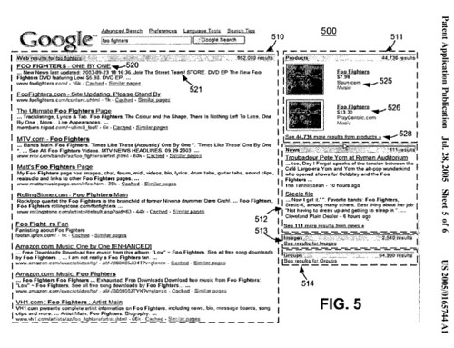

You may see a new look in Google search results very soon, if not at some point today, when universal search results start showing at Google.

Google had a lot of announcements during their [Searchology Day](https://searchengineland.com/google-searchology-day-recap-of-announcements-11230) presentation this morning. Danny Sullivan provides a detailed look at changes that we will see in search results in [Google 2.0: Google Universal Search](https://searchengineland.com/google-20-google-universal-search-11232).

During the Searchology event, Marisa Mayer presented Google’s Universal Search, which I found interesting because she’s one of the inventors listed on a patent application from Google published back in 2005 (and filed in 2003) on Universal Search.

The Universal Search presented today during Google’s webcast differs from the one described in the patent application in a few ways, but one of the main concepts is shared – that data from different genres, different databases, could be shown to searchers on the same page.

Some information about that one, and a screenshot of the 2005 version of Universal Search from Google below.

[Interface for a universal search](http://appft1.uspto.gov/netacgi/nph-Parser?Sect1=PTO2&Sect2=HITOFF&u=%2Fnetahtml%2FPTO%2Fsearch-adv.html&r=1&p=1&f=G&l=50&d=PG01&S1=20050165744.PGNR.&OS=dn/20050165744&RS=DN/20050165744)
Invented by Bret Taylor, Marissa Mayer, Orkut Buyukkokten
US Patent Application 20050165744
Published July 28, 2005
Filed: December 31, 2003

Abstract

> A search engine may perform a search for a user search query over a number of possible search categories. For example, the search query may be performed for general web documents, images, and news documents.
>
> The search engine ranks categories based on the search query and/or the documents returned for each category and presents the search results to the user by category. Higher ranking categories may be presented more prominently than lower ranking categories.

Here’s a screenshot from the patent application of a Universal Search results page:

Where this patent application differs from the Universal Search that was presented today is in the segmenting of categories into different areas. But we are given some insight into why some categories might be ranked higher than others with an example:

> For example, ranking component 402 may generally compare the search query to the contents of the documents in each list and base its ranking values on the closeness of the comparison.
>
> Consider the search query “buy athletic shoes.” For this search query, ranking component 402 may determine that the user is most likely interested in athletic shoes that are for sale.
>
> Accordingly, the ranking component may rank the “products” category highly. The links in the list of links that correspond to the products category are likely to be links that correspond to web pages that are offering shoes for sale.

As an aside, Danny mentions in his article that Infoseek received a patent on this type of information blending from multiple databases back in 1997.

Actually, Infoseek received a few patents on this type of information blending. A number of those had been assigned to Google on 10/05/2005, so it may be worth taking a little closer look at the assigned patents.

**Infoseek (Google) Patents on Multiple Database Results**

[Document retrieval over networks wherein ranking and relevance scores are computed at the client for multiple database documents](https://patents.google.com/patent/US5659732A/en)
Filed May 17, 1995
Granted August 19, 1997

Abstract

> A document search method using a plurality of databases available from one or more servers using one or more search engines. For each database, the number of records is determined and reported, as well as the frequency of search query term occurrences or hits, together with the identification of database records corresponding to the hits.
>
> Reports from a plurality of databases are furnished to a user terminal, a client, where client software computes a relevance score for each record based upon the number of records in the database, the number of records having at least one hit and the number of hits for each record.
>
> This local computation from uniform data allows all documents to be ranked consistently as if coming from a single database.

[Method for automatically selecting collections to search in full text searches](https://patents.google.com/patent/US5845278A/en)
Filed September 12, 1997
Granted December 1, 1998

Abstract

> A method of selecting a subset of a plurality of document collections for searching in response to a predetermined query is based on accessing a meta-information data file that describes the query significant search terms that are present in a particular document collection correlated to normalized document usage frequencies of such terms within the documents of each document collection.
>
> By access to the meta-information data file, a relevance score for each of the document collections is determined. The method then returns an identification of the subset of the plurality of document collections having the highest relevance scores for use in evaluating the predetermined query.
>
> The meta-information data file may be constructed to include document normalized term frequencies and other contextual information that can be evaluated in the application of a query against a particular document collection. This other contextual information may include term proximity, capitalization, and phraseology as well as document specific information such as, but not limited to collection name, document type, document title, authors, date of publication, publisher, keywords, summary description of contents, price, language, country of publication, publication name.
>
> Statistical data for the collection may include such as, but not limited to number of documents in the collection, the total size of the collection, the average document size and average number of words in the base document collection.

[Performing automated document collection and selection by providing a meta-index with meta-index values indentifying corresponding document collections](https://patents.google.com/patent/US5983216A/en)
Filed September 12, 1997
Granted November 9, 1999

Abstract

> A method of performing automated collection selection relative to a plurality of document collections, each including one or more documents, using a list of qualified terms developed from an input query text.
>
> The method comprises the steps of:
>
> (a) parsing the input query text to select single-word terms and multiple-word phrase terms from the query text by exclusion of predetermined context-free single-word terms and punctuation;
>
> (b) applying each such selected term against a meta-index descriptive of the document collections;
>
> (c) determining cumulative rankings for the document collections relative to each such selected term normalized against the plurality of document collections; and
>
> (d) selecting a set of the document collections having the highest relative cumulative rankings.

[Methods for iteratively and interactively performing collection selection in full text searches](http://patft.uspto.gov/netacgi/nph-Parser?Sect1=PTO2&Sect2=HITOFF&u=%2Fnetahtml%2FPTO%2Fsearch-adv.htm&r=1&p=1&f=G&l=50&d=PTXT&S1=6018733.PN.&OS=pn/6018733&RS=PN/6018733)
Filed September 12, 1997
Granted January 25, 2000

Abstract

> A method of selecting the likely most relevant database collections for document searching based on an ad hoc query where each of the databases includes a plurality of documents.
>
> Iterative collection selection processing of the databases is performed to obtain consistent relative-ranking collection selection results for each iteration.
>
> The method uses a collection selection query and performs the repetitive steps of determining an inverse collection frequency and a document frequency for each database;
>
> determining a ranking value for each database;
>
> selecting a subset of the set of databases based on predetermined criteria dependant on the ranking value for each the database.
>
> The method provides for automated and manual descriptions, boolean selection terms combined with soft terms, and uses term proximity, capitalization, phraseology and other information in establishing a relevance ranking of the collections with respect to the ad hoc query.

Added: Google’s official posts on Universal Search:

- [Google Begins Move to Universal Search](http://googlepress.blogspot.com/2007/05/google-begins-move-to-universal-search_16.html)
- [Behind the scenes with universal search](https://googleblog.blogspot.com/2007/05/behind-scenes-with-universal-search.html)
- [Universal search: The best answer is still the best answer](https://googleblog.blogspot.com/2007/05/universal-search-best-answer-is-still.html)

Google updated their Universal Search patent in 2019. I wrote about it in [Universal Search Updated at Google](https://www.seobythesea.com/2019/01/universal-search-updated-at-google/)
