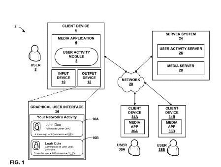
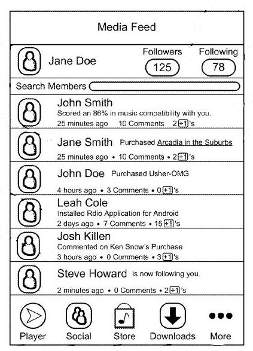
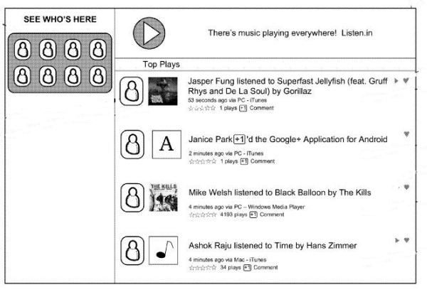

How active is Google Plus? How active do you want it to be? One of the criticisms of the site is that its a ghost town, where nothing ever goes on. I can’t say that’s been my experience, but I can see how people can make those claims.

Would you like to see an activity stream that tells you when people you are connected to endorses something, makes a comment somewhere, downloads a song. installs a program or watches a video? Presently we see things that people want to share, but there’s potentially a lot of activity that goes on with the people we connect to that isn’t being reported. I’m not really convinced that I want to see a message everytime someone uploads pictures or downloads an electronic book.

A pending patent application from Google does describe such an activity stream, and I hope that if it’s something offered at Google plus that’s it’s easy to opt out of. I’ve seen enough of this kind of sharing at Facebook, and it reminded me of the kinds of activities I’ve seen there in the past.

The patent application is:

[Social Discovery of User Activity for Media Content](http://appft.uspto.gov/netacgi/nph-Parser?Sect1=PTO1&Sect2=HITOFF&d=PG01&p=1&u=%2Fnetahtml%2FPTO%2Fsrchnum.html&r=1&f=G&l=50&s1=%2220130061296%22.PGNR.&OS=DN/20130061296&RS=DN/20130061296)
Invented by Raymond Reddy and Robert Sang-heun Kim
Assigned to Google
US Patent Application 20130061296
Published March 7, 2013
Filed: July 17, 2012

Abstract

> Aspects of the present disclosure provide techniques that may enable user activity information to be automatically generated and shared with other users of a social network. In one example, a method of automatically publishing, to one or more social network services, information about user activities regarding media content items includes receiving user activity information regarding a media content item, wherein a user is a member of one or more social network services, and the user activity information is generated in response to one or more activities taken by the user with respect to the media content item.
>
> The method may also include receiving an indication of one or more users of the one or more social network services to whom the user activity information is to be made accessible, and automatically publishing the user activity information to the one or more social network services.

The images from the patent show off some of the kind of information that might displayed in a media activity stream:

Here’s another screenshot that focuses more upon music:

We’re told in the patent filing that this media feed could be a stand alone application that could be associated with our choice of social networks, and given the examples of “Google+, Facebook, LinkedIn” as some possible choices of networks, and people whom we might want to share this kind of information with. I’m not sure that it would work well as an independent application though.

This stream of reported activity would enable you to take actions in addition to just watching a stream of what other people are doing. For instance, you could “+1” someone’s activity, or if audio or video was being played, you could watch or listen to the whole thing or to a preview. If an app of some type is involved, you could click on a play button which could bring you to a page where you could learn more about the app.

Would you use a media feed like this for one of your social networks? Would it be the kind of thing that you would want added to Google Plus?
