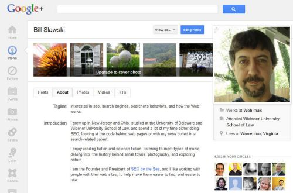

A newly published patent application from Google describes how a combination of different types of Google-generated profiles associated with a searcher might influence the results that they see. The description in the patent filing is substantially the same as some I’ve written about in the past involving personalization from Google, in my 2006 post [Google Personalization Methods](https://www.seobythesea.com/2006/10/google-personalization-methods/).

But I couldn’t help but think of the role that Google Plus might play in personalized search from Google as well while reading through the patent. Is information from my Google Plus profile used in personalization? Is other Google Plus information part of personalized search?

To recap the area that the patent filing covers, it begins by telling us that the purpose behind the personalized search is to help in filtering the very wide range of relevant results we might see for a query. Since most queries are usually fairly short (2-3 words), the results of such a query might return an ever-growing number of results as the Web continues to expand. A searcher might be overwhelmed by the number of results they see if those aren’t organized based upon things like their relevance to a user’s query and their importance under something like PageRank.

And yet even PageRank has limitations. As the patent filing notes:

> In reality, a user like the random surfer never exists. Every user has his preferences when he submits a query to a search engine. The quality of the search results returned by the engine has to be evaluated by its users’ satisfaction. When a user’s preferences can be well defined by the query itself, or when the user’s preference is similar to the random surfer’s preference concerning a specific query, the user is more likely to be satisfied with the search results.
>
> However, if the user’s preference is significantly biased by some personal factors that are not reflected in a search query itself, or if the user’s preference is quite different from the random user’s preference, the search results from the same search engine may be less useful to the user, if not useless.

For example, someone who enters the term “blackberry” into a Google search box might see a bunch of results related to the type of phone, without any fruit-related content insight. But someone who has a history of searches for food and cooking might be much more interested in results that have nothing to do with phones. We’re told that a search engine shouldn’t make it hard for searchers to find the types of things they might be looking for by forcing them to drill down deeper into search results or to refine their queries.

A user profile might be attached to a searcher that might come from sources like:

- Previous search queries submitted by the user,
- Links from or to documents identified by the previous queries,
- Sampled content from the identified documents
- Personal information implicitly or explicitly provided by the user.

When I search for “blackberry,” I just see phone-based results. Then again, I’ve been looking at a lot of phone-related pages over the past few months while considering a new phone to purchase, and I’ve even posted a few posts at Google Plus related to mobile phones. I’ve looked at a lot fewer pages involving food and recipes, and I don’t think I’ve posted more than one or two posts about food.

The steps that might be involved in personalization, from a high level, would include the following:

1. The search engine receives a query from a searcher
2. The search engine identifies a set of documents matching the query
3. The initial rankings for pages use PageRank and text associated with both the document and the search query
4. The search engine also generates a “personalized” profile (likely before the search in question) for the searcher and correlates the user profile with each of the identified documents
5. That correlation between documents and the user profile produces a profile rank for each of the documents, indicating how relevant they might be to the searcher
6. The search engine would then combine each document’s generic rank and profile rank into a personalized rank
7. The documents would then be reordered based upon their personalized ranks, and displayed

Instead of using a single focus for a generated user profile, those profiles might be made up of many sub-profiles, each of which may characterize a searcher’s interest from different perspectives. These could include:

A ***term-based profile*** with a number of terms, each term carrying a weight indicative of its importance relative to other terms.

A ***category-based profile*** using multiple categories, possibly organized into a hierarchical map (like the hierarchy you see DMOZ organized into).

A ***link-based profile*** with several links that might be directly or indirectly related to pages or documents identified in a user’s search history, with each link having a weight indicating the importance of the link (like PageRank).

The patent filing is:

[Personalization of Web Search Results Using Term, Category, and Link-Based User Profiles](http://appft.uspto.gov/netacgi/nph-Parser?Sect1=PTO1&Sect2=HITOFF&d=PG01&p=1&u=%2Fnetahtml%2FPTO%2Fsrchnum.html&r=1&f=G&l=50&s1=%2220120233142%22.PGNR.&OS=DN/20120233142&RS=DN/20120233142)
Invented by Stephen R. Lawrence
US Patent Application 20120233142
Published September 13, 2012
Filed: November 11, 2011

Abstract

> A system and method for creating a user profile and for using the user profile to order search results returned by a search engine. The user profile is based on search queries submitted by a user, the user’s specific interaction with the documents identified by the search engine, and personal information provided by the user. Terms for the user profile may be selected from the documents accessed by the user by performing paragraph sampling or context analysis.
>
> Generic scores associated with the search results are modulated by the user profile to measure their relevance to a user’s preference and interest. The search results are re-ordered accordingly so that the most relevant results appear on the top of the list. User profiles can be created and/or stored on the client-side or server-side of a client-server network environment.

The claims section of this patent filing is different from those in the patent applications I wrote about in 2006. This patent filing is a continuation patent of two others that were abandoned by Google. The first was filed under the name “Personalization of Web Search,” which was filed in September of 2003. The second shares the same name as this present one and was filed on May 12, 2010. Looking quickly at the patent office’s database for the history of those versions of the patent, both had some issues that challenged the language of the claims within them.

The claims in this newer version don’t explicitly point to or describe the use of information from Google Plus, and yet reading through them it seems that Google Plus could be used to add to the information that Google might look at to personalize Web search results.

The patent filing tells us that people don’t usually share or update their profiles on the Web very frequently, and don’t always do a great job of sharing things that they are interested in, such as interests and likes and so on. How accurate and up-to-date are your profiles at places like Facebook?

But it also tells us that the kind of demographic information that might appear in profiles might still be very useful, such as information about education, employment, and location.

There’s a definite preference from Google to look at things like search history, including the things we search for, the things we click upon, what we might bookmark, and more in patents from Google that involve personalization.

Google could use information about the things we write about and the links we share at Google Plus quite as easily as it might use our Web history to learn about our interests and preferences. It might also look at our interactions with others on the social network as well, and the people we interact with.

While our interactions on other social networks outside of Google Plus might also be considered as well, it’s much easier for Google to take information about our social interactions on Google Plus and use it to add to a user profile that might be used to create a personalized rank for what we see.

Might Google be using Google Plus not only to help determine what we see in Search Plus Your World results based upon our social activities but also in the personalization of those results?

If not now, I would think there’s a very real possibility of it happening soon.
