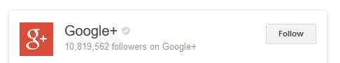
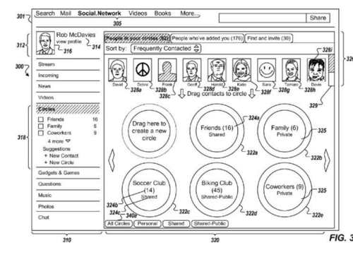
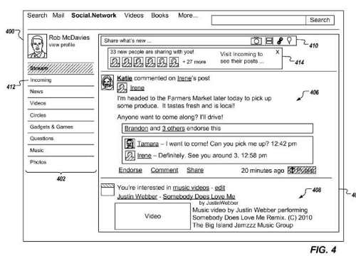

A Google patent granted earlier this month looks at how content might be ranked by Google based upon social interactions. It discusses ranking that content based upon social interactions within the context of Google+ and the social circles you may have been placed within by someone who added you to Google+.

The patent looks at digital content that might be shown on Google+ Stream pages to members of the social networking service, and determines, based upon “close-ties” scores for that digital content, what to display to members of the network looking at content on Streams pages.

The patent also describes showing content related to searches on the social network, and ranking content in response to queries in those searches, based upon these social interaction scores.

These scores determine which items might be boosted and displayed within a certain “threshold time period” of digital content having been added to the social network.The patent talks a lot about social circles, When you add someone as a contact at Google+, you decide what circle they are added to. When you create content on Google+ and share content, you decide whom you are sharing that with from the circles that you’ve created. That can influence what people see when they look at content on Google+. To a degree, this patent is a little like Facebook’s Edgerank, the algorithm that determines what stories you see in Facebook’s News Feed.

The patent is:

[Scoring content based on social interaction](http://patft.uspto.gov/netacgi/nph-Parser?Sect1=PTO1&Sect2=HITOFF&d=PALL&p=1&u=%2Fnetahtml%2FPTO%2Fsrchnum.htm&r=1&f=G&l=50&s1=9,098,176.PN.&OS=PN/9,098,176&RS=PN/9,098,176)
Invented by: Benjamin Tauber, Sachin Jain, Boris Mazniker, Shimrit Ben-Yair, and Simon Tong
Assignee: Google Inc.
US Patent 9,098,176
Granted August 4, 2015
Filed: March 13, 2013

Abstract

> Methods, systems, and apparatus, including computer programs encoded on computer storage medium, for identifying a set of items of digital content displayed to a user; processing the set of items to identify a set of boost items, items within the set of boost items to be prominently displayed, processing comprising: receiving a close-ties score associated with a respective item, the close-ties score representing a relationship between the user and other users associated with the respective item and an importance of a social circle associated with the item to the user, determining that the close-ties score associated with the respective item exceeds a threshold close-ties score, and in response to determining that the close-ties score exceeds the threshold close-ties score, adding the respective item to the set of boost items; providing instructions for boosting a display of items in the set of boost items in a page displayed to the user.

Some items that stand out in the patent:

## Unread Content

Unread items can be boosted to be displayed more prominently in streams pages or search results to a user.

## Social Circles

The patent has a large focus upon circles, and it discusses them and their importance a great deal.

Social circles are considered categories, which contacts may be assigned to give better control over the distribution and visibility of social networking items and/or other digital content. Circles act as channels for the distribution of digital content.

Some people might set up in circles that define them as a grouping of a set of contacts, such as a “co-workers” circle. This would make it easier to contact co-workers, and not send content to people whom aren’t co-workers.

Social circles are personal circles, which are created by and known only to the user who creates them.

## Shared Public and Shared Private Circles

Circles can be shared public circles or shared private circles. A public circle sounds like what a community is now at Google+ – People know what the circle is for, and can request to join.

## Default Social Circles

Some default social circles may be provided, such as “family,” “friends,” and “co-workers.”

## Social Affinity Score

A social affinity score might be used to determine if content is targeted at specific people, like members of specific social circles.

## Relevance based upon Relationships

A close-ties score can reflect how relevant the digital item might be to a potential viewer based upon the relationships between that user, and the person who authored the content, and possibly one or more other users who may be somehow associated with the item.

## Mentions

The score for a piece of digital content might be determined in part based upon whether or not there may have been a “mention” (+FirstName Lastname) of the viewer.

## Bonuses or Penalties

Bonuses and or Penalties may be used in this scoring based on social interactions. A bonus = the digital content may be important to the user. “Bonus values can be added to the close-ties score if a certain number of images and/or videos are included in the item and/or if the author user rarely distributes items through the social networking service.” A Penalty = The digital content may not be important to the user. So, if the item was distributed widely within a certain time period, it wasn’t aimed at that viewer.

## Private Interactions versus Public Interactions

Social interactions from the user to others within the social networking service, might be viewed as private and public interactions. Private interactions are interactions that aren’t disclosed to others in the social networking service and public interactions include interactions are disclosed to others. Private interactions can include private comments, private endorsements to items from a user who distributed them. This has me thinking about messages in Google+ that were intended only for me, and how they tend to be highlighted.

## Take-Aways

The patent also talks about an interaction score that can determine how frequently views of content are shown and refreshed for different viewers, and whether certain content might be boosted and shown more frequently, or less frequently, based upon things such as whether or not it’s been read before by the viewer.

I sometimes receive notifications at Google+ that may mention my name or are from a community that I joined that I would like to save and return to later. Sometimes there isn’t enough time to write a lengthy response to something you seen that it deserves. I sometimes wish those had been sent to me through email, which would give me more time to respond. Or I wish Google allowed you to save a certain number of notifications that you could respond to, without having to click on the “previously read” links at the bottom of notifications.

I have noticed that if I write longer introductions and comments on things I post or share to Google+, that those tend to be better received, which makes sense. Share your opinion and insights and people seem to appreciate those.
