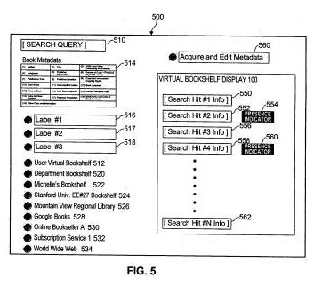

Some surprising news came out a few weeks ago that Microsoft was canceling their book scanning and search program.

Google’s book search continues on, and provides an opportunity to [find](https://googleblog.blogspot.com/2006/08/download-classics.html) digital copies of books online.

You can also create a library of books of your own choosing at Google, with some aspects of a virtual bookshelf built into the presentation of those books. There are a number of virtual bookshelf sites online, many with social networking features added to them, that do. I recently explored a few of them, and here are some of the ones that I came across:

- [Good Reads](https://www.goodreads.com/)
- [Library Thing](https://www.librarything.com/)
- [Shelfari](https://www.goodreads.com/?shelfari_flash=true)
- [Revish](http://getdigsitevalue.net/)
- Bookglutton
- WhatsOnMyBookshelf
- Bibliophil
- Chain Reading
- Reader2
- BookJetty

A patent application for a virtual bookshelf program from Google was published last month, and it provides us with a chance to see how Google might integrate its book search, and [Google Books Library Project](http://books.google.com/googlebooks/library/index.html) with a personal library feature that allows us to show the books that we’ve read, share reviews with others, and track and find books that we might want to read in the future.

The patent application is:

[Computer-implemented interactive, virtual bookshelf system and method](http://appft1.uspto.gov/netacgi/nph-Parser?Sect1=PTO2&Sect2=HITOFF&u=%2Fnetahtml%2FPTO%2Fsearch-adv.html&r=1&p=1&f=G&l=50&d=PG01&S1=20080114729.PGNR.&OS=dn/20080114729&RS=DN/20080114729)
Invented by T.V. Raman, M.S. Krishnamoorthy
Assigned to Google
US Patent Application 20080114729
Published May 15, 2008
Filed November 13, 2006

Abstract

> A computer-implemented method and system for realizing an interactive, virtual bookshelf representing physical books and digitally stored books of the user. Using a search query, the Web is searched using search metadata to identify a desired book.
>
> Library metadata corresponding to the physical books and digitally stored books of the user is then searched using the search metadata to determine whether the desired book is present in the virtual on-line bookshelf. Results indicative of whether the desired book is present on the virtual on-line bookshelf can be displayed.

Some of the details:

Someone who owns a virtual bookshelf can list and track the physical and the digital copies of books that they own on their bookshelf.

If they don’t own a specific book, they can search the web, as well as other Google virtual bookshelves – including the shelves of libraries – to find out more about those books, and perhaps to purchase books from online sellers.

The bookshelf system provides a few different ways to annotate the books that you have on your virtual shelf, including labels (tags) and reviews.

The concept of shared, online vitual bookshelf communities are envisioned in this patent application.

The term “book” in this bookshelf may mean more than just physical copies of books, and may also include magazines, newspapers, and other print artifacts as well as digital copies of books.

Each book in the bookshelf can contain associated book metadata, This book metadata can include, but is not required or limited to:

(1) Author;
(2) Title;
(3) ISBN (or other cataloging information);
(4) Language;
(5) Publisher information;
(6) Physical form or digital format;
(7) Publication date;
(8) Location of the publisher;
(9) Copyright information and copying rights;
(10) User notes about the book or its contents;
(11) User applied labels used for search or creating collection hierarchy;
(12) Information about when the book was acquired;
(13) Price or cost;
(14) Information of how the book was acquired (purchased, borrowed, received as a gift, found, etc);
(15) Current status of physical copy or digitally-stored copy (e.g. available, lent to another, reserved, etc);
(16) Links to other reviews;
(17) Personal annotations;
(18) Bookmarks to specific places or parts of the book (such as specific lines/pages); and,
(19) Other data or properties of the book or annotations of the user.

This kind of metadata is search able, and can help someone find or obtain a copy of a book in other bookshelves, or on the Web.

The metadata comes primarily from online sources, such as Google Book Search.

Someone can remove books from their virtual bookshelf for a number of reasons, such as “a sale, disposal, loss, damage or trade of the physical or digitally stored copy of the book.”

A bookshelf owner can specify access rights to their bookshelves to third party users of some or all of the contents of their virtual bookshelf.

In addition to visual indicators of which books are on the bookshelves, the system may also provide audible indicator or representations, for visitors to the bookshelf who may be sight impaired or blind, or does not want to rely on visual queues.

This system aims at making it as easy as possible to list books, and to loan or purchase books from other sources, and instead of having to add metadata by hand for a specific book, a user may be able to grab that meta data information about specific books that they want to add to their bookshelves through a web search on the book.

The virtual bookshelf would include a search interface that could be used to find information about books from a number of sources. Some examples might include:

(1) Shared virtual bookshelves of friends or colleagues,
(2) Group bookshelves
(3) Information on the world wide web
(4) Results of scanning books available via Google Books and others electronic repositories
(5) Electronic libraries available to the organization of which the user is associated,
(6) Other sources of electronic information having digitized works (digitally stored books) such as on line booksellers, specialized online databases and proprietary database collections.

A drop and drag feature of the virtual bookshelf would allow a searcher to grab a visual representation of a book as well as its associated library metadata.

An example of a couple of different uses for a virtual bookshelf, from the patent filing:

> In this fashion, virtual lending libraries and cooperatives can be created online.
>
> It also allows for all types of sharing arrangements, such as a professor having a virtual bookshelf accessible to all of the students of a course so that the assigned course readings are on the virtual bookshelf for the course and contained physically in a university lending library or course bookshelf. A similar approach can be used for business and technical teams that span several virtual bookshelves of physical collections of books spaced apart geographically or stored electronically on different servers.
>
> A software component AccessControl allows each user to selectively provide access rights to other users so that they can control and specify the access and sharing of all or parts of their virtual book shelf to specified users. Different access rights and levels can be specified by the user of a virtual bookshelf to 3rd parties based on individual or group levels.

**Conclusion**

Many of the virtual bookshelf sites that I list at the start of this post are pretty good.

Google has the potential to add features that most of those sites don’t possess, such as a quick importing of metadata for books from searches from many different sources, and the potential to see which books might be available for loan or purchase from booksellers, libraries, and other virtual bookshelf owners.
