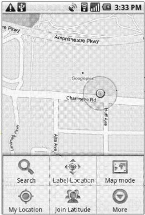
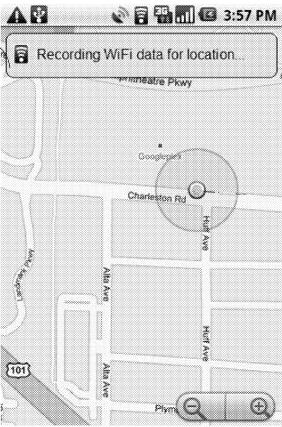
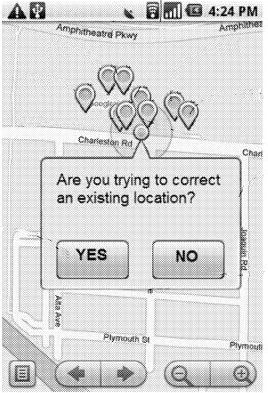
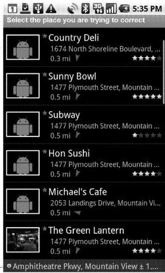
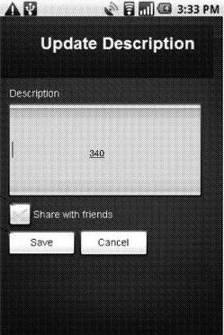
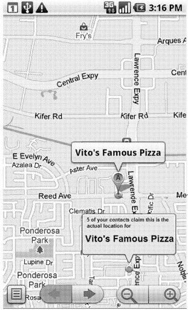
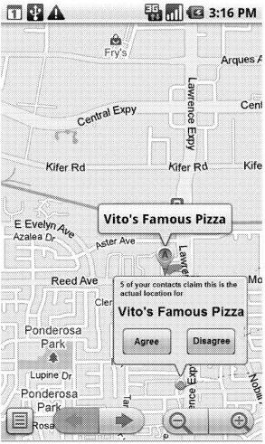

## Do Requests for Driving Directions Count in Local Maps Rankings of Businesses?

I love local search. It follows many practices similar to Web search, though different often in ways that do reflect an attempt to map the real world. Google’s Streetview cars are a little like Google’s web crawler Googlebot. Instead of collecting URLs for Websites, Google Maps collects addresses to associate with businesses, nonprofits, government offices, parks, landmarks, and many other destinations. It has its challenges as well, such as the street views car being turned away at sentry guard booths for military bases, or not driving down “private” roads. Google Maps also can’t use latitude and longitude coordinates in [places like China](https://www.seobythesea.com/2007/03/google-local-search-in-china-export-restrictions-filtering-sensitive-keywords-and-limited-data/) since their export and use is classified by that country as if they were munitions.

I’m also often frustrated by local searches. Driving directions from Google often begin by telling you to go “east” or “west” on your first turn. I’m not [Mason](https://en.wikipedia.org/wiki/Charles_Mason) or [Dixon](https://en.wikipedia.org/wiki/Jeremiah_Dixon), [Lewis or Clark](http://www.lewis-clark.org/), and I don’t carry an in-car compass with me when I drive. I often have no problems with driving directions other than that, for the first 99% of the trip, and then have problems with the last few hundred feet.

**Updating Google Maps**

Sometimes places don’t exist where Google Maps driving directions say they do. That can happen when places close and it’s not reported to maps, or places move and don’t update their address information on the Web, or sometimes places just aren’t where Google Maps say they are. Last year, I tried to find a local restaurant last year, used driving directions, and drove around in circles until finally giving up. I later found that the place had closed, but I wasn’t sure of the right way to try to report my inability to find it to Google when I was driving around since I wasn’t sure that it had closed at that time.

A Google patent application published last week describes a solution to reporting incorrect addresses that use GPS and Social Networking to sometimes provide new addresses from others who have tagged the location of a place. I could have used this about a month ago, to try to find the right location for a place I was trying to visit. Getting proper driving directions can make a difference when you are trying to find a place that you have never visited before.

It’s costly to send “expert observers” out to update mapped locations, which is the traditional approach that map makers often employ. Because of that, some map makers don’t update location information very frequently, especially with printed copies of maps. With online mapping services and portable navigation services, though, we expect up-to-date and timely information regarding the locations of businesses.

Many online mapping services provide for individual users to make suggestions for corrections to maps, but those often have to be reviewed and approved by an expert reviewer. Some of those systems might accept changes from users without review who have had many suggestions approved in the past and have built up some level of credibility.

But what if a user of a mapping service used driving directions and arrived at a destination on a map, and the place that was supposed to be there wasn’t, and they reported it on their mobile phone while they were there. As in the screenshot below from the patent filing, those systems can be tracked in many ways, including using GPS or cell tower triangulation or wifi location reporting.

Imagine that not only could you report a missing destination, but that you could send a correction into the map, have local contacts of yours queried for the right driving directions, and possibly find the place you were looking for while also helping to update the mapping service.

The images below are screenshots from the patent filing, that do a decent job of showing how such a system could work:

The system might help you try to find the place you are looking for by displaying a list of destinations nearby:

This system allows you to enter information about the destination that you are at, including title and description as well:

You may see information displayed from other people who have used the mapping service and have tagged the location of your intended destination at a different place, or who are contacted by the system and asked to give their input about the place you’re trying to visit.

You then can agree or disagree with the other people who have tagged a different location for your destination.

The patent application is:

[Trusted Maps: Updating Map Locations Using Trust-Based Social Graphs](http://appft.uspto.gov/netacgi/nph-Parser?Sect1=PTO1&Sect2=HITOFF&d=PG01&p=1&u=%2Fnetahtml%2FPTO%2Fsrchnum.html&r=1&f=G&l=50&s1=%2220110238735%22.PGNR.&OS=DN/20110238735&RS=DN/20110238735)
Invented by Chaitanya Gharpure, Charles L. Chen, and Tiruvilwamalai Venkatraman Raman
Assigned to Google
US Patent Application 20110238735
Published September 29, 2011
Filed: March 29, 2010

Abstract

> A system and method for updating and correcting the location of geospatial entities, the method comprising receiving at a server from a mobile device operated by a first user, a proposed location for a geospatial entity, the proposed location determined by a wireless location system, and based upon a current location of the mobile device; providing information about the proposed location for the geospatial entity to the first plurality of other users; receiving votes from the first plurality of users as to whether the proposed location is correct and responsive to the received votes, determining whether to update the location information for the geospatial entity.

The patent application describes sending out requests to people whom you might know through a social network. The patent mentions Orkut, though something like this might be tied to the Google Places recommendation service, or possibly even Google Plus at some point. The “trust metric” mentioned in the title of the patent filing might be the number of votes agreeing with a proposed location, or a certain percentage of votes. Other groups of users who may not be contacts of yours may also be asked about the location as well.

**Driving Directions as Ranking Signals**

Last night, I ran across a paper last night that describes the possibility of including requests for driving directions as a ranking signal for some types of businesses. The paper is [HyperLocal, Directions Based Ranking of Places](http://www.vldb.org/pvldb/vol4/p290-venetis.pdf) (pdf).

Part of the abstract from the paper tells us:

> Specifically, the paper proposes a framework that takes a user location and a collection of nearby places as arguments, producing a ranking of the places. The framework enables a range of aspects of directions queries to be exploited for the ranking of places, including the frequency with which places have been referred to in directions queries. Next, the paper proposes an algorithm and accompanying data structures capable of ranking places in response to hyper-local web queries. Finally, an empirical study with vast directions query logs offers insight into the potential of directions queries for the ranking of places. It suggests that the proposed algorithm is suitable for use in real web search engines.

Of course, data like driving directions as a potential ranking signal is likely much more appropriate for listings of businesses that people will visit in person than businesses with a local presence that might provide a service or deliver goods in specific areas.

If you’re interested in how local search works, and how driving directions might be used in ranking businesses, this paper is worth spending some time with.

Last Updated June 9, 2019
