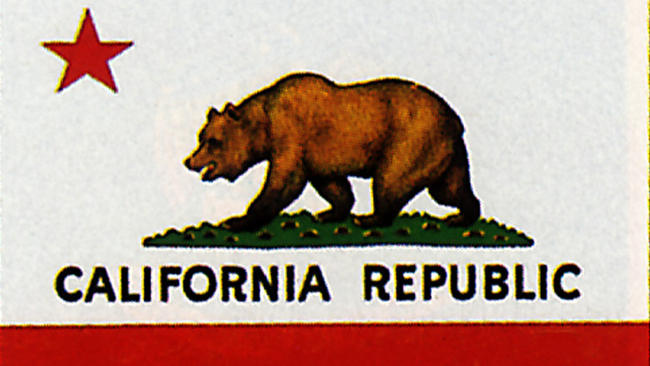

## An Extension to a Web Vocaulary Schema from GS1

I noticed a blog post published yesterday, November 2, 2016, and it looked helpful: [Use JSON-LD to add Schema.org to your Website](https://yoast.com/json-ld/). Schema and structured data seem to be growing in importance on the Web, as we see more knowledge panels and rich snippets and product search results. I’ve been looking at [Knowledge Panels in Site Audits](https://www.seobythesea.com/2016/10/knowledge-panels-in-site-audits/). JSON-LD seems to favor Web vocabulary Schema by Google in adding structured data on your web pages. See: [What is JSON-LD? A Talk with Gregg Kellogg](http://www.seoskeptic.com/what-is-json-ld/).

If you do SEO and aren’t familiar with [GS1](https://www.gs1.org/), you probably should be. They invented the use of [bar codes](https://www.gs1.org/standards/barcodes) in shopping. They also came up with GTINS ([Global Trade Item Numbers](https://www.gs1.org/standards/id-keys/gtin)) which are used online at places such as eBay and Amazon, and Google Product Search. A recent blog post by GS1 Vice President Rich Richardson is also worth reading: [Why bar code numbers matter](https://www.digitalcommerce360.com/internet-retailer/#pg8).

In February, GS1 published an extension to a web vocabulary Schema for products. Extensions like this are how to Search and SEO is growing. The Schema blog told us about it in:

[GS1 Web vocabulary: welcoming the first schema.org External Extension](http://blog.schema.org/2016/02/gs1-milestone-first-schemaorg-external.html) We are told there that the benefits of the new extension are in: “significantly more detailed online product descriptions.” That could potentially lead to good things for the search.

You can see this Web Vocabulary Schema here:

[GS1 Web Vocabulary](https://www.gs1.org/voc/)

GS1 is holding GS1 Web Vocabulary Workshops> in California in November in San Diego and San Jose. The cost of the Workshops is $149.00 each.

Here is the agenda for the Workshops:

GS1 Standards & Identifiers

- UPC assignment rules and identifiers that are/aren’t UPCs
- New industries examining GS1 identifiers

GS1 Attributes

- Attribute dictionaries
- GS1 attributes and complimentary attributes
- Catalog databases / GDSN

GTIN Validation & Authentication

- DataHub | Company

Q&A

The Lotico San Diego Semantic Web Meetup Group has a lunchtime Networking gathering after the San Diego workshop. And would look forward to your joining them in talking about the new schema. You can RSVP to attend on their event page: Semantic Web/ e-commerce/SEO networking lunch – post-GS1 e-commerce workshop.
