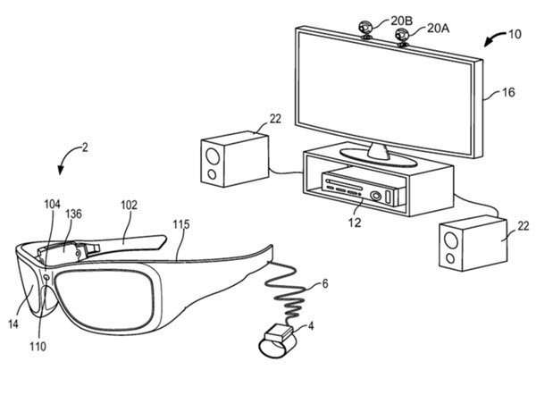
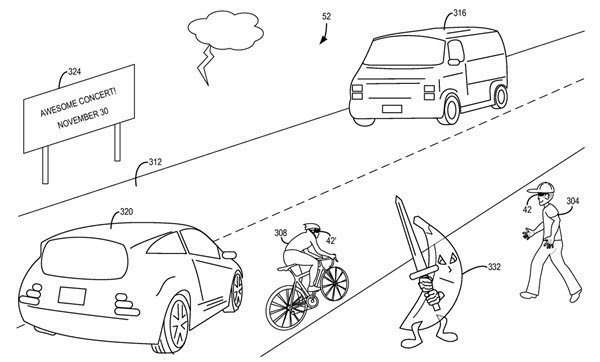
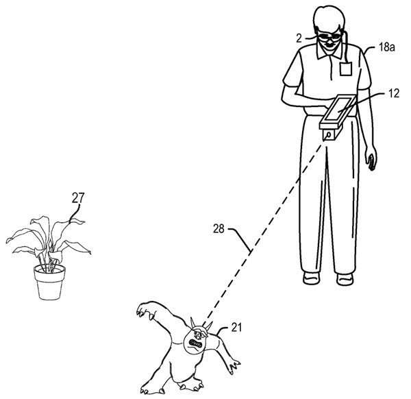
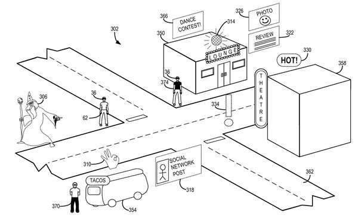

I’ve written about some of the patents involved in Google’s [Project Glass](https://www.seobythesea.com/2013/01/google-glass-hardware-patents/) in the past, and very recently about the Google Ventures’ funded [Magic Leap](https://www.seobythesea.com/2015/01/magic-leap-augmented-reality-semantic-robots/). Project Glass still exists, but it appears to now have [new leadership and a new direction](https://www.cnet.com/news/google-restructures-glass-project-gives-nest-co-founder-oversight/).

_From “Exercising applications for personal audio/visual system” US8847988 B2_

And then seemingly out of nowhere Microsoft announces a pair of goggles that they’ve been developing secretly, named the Hololens. And they’ve been feeding news sources some interesting information about them, like the article at Wired titled, “[Project HoloLens: Our Exclusive Hands-On With Microsoft’s Holographic Goggles](https://www.wired.com/2015/01/microsoft-hands-on/)“.

## Augmented Reality Exercise Glasses?

The Wired magazine article tells us that Alex Kipman, one of the inventors of the Kinect, is one of the chief inventors of the Hololens. So I started searching at the USPTO web site for patents co-invented by him which mentioned things like a “mixed reality display device.” The patent that image above is from is innocently named “[Exercising applications for personal audio/visual system](https://patents.google.com/patent/US8847988)“, and tells us in its abstract that:

> The technology described herein includes a see-through, near-eye, mixed reality display device for providing customized experiences for a user. The personal A/V apparatus serves as an exercise program that is always with the user, motivates the user, visually tells the user how to exercise, and lets the user exercise with other people who are not present

So the Hololens is an exercise program that you can easily carry around with you and lets you exercise with people who aren’t there.

## Mixing Reality with Virtual Images

_Augmented Reality displayed in Microsoft’s Patent, ‘Mixed reality display accommodation’_

The patent [Mixed reality display accommodation](https://patents.google.com/patent/US20140192084) hints at much more than an exercise program, and defines its invention in much more detail:

> A mixed reality accommodation system and related methods are provided. In one example, a head-mounted display device includes a plurality of sensors and a display system for presenting holographic objects. A mixed-reality safety program is configured to receive a holographic object and associated content provider ID from a source.
>
> The program assigns a trust level to the object based on the content provider ID. If the trust level is less than a threshold, the object is displayed according to the first set of safety rules that provide a protective level of display restrictions.
>
> If the trust level is greater than or equal to the threshold, the object is displayed according to the second set of safety rules that provide a permissive level of display restrictions that are less than the protective level of display restrictions.

Some of that trust level language reminds me of what we would hear coming from our TVs when bad things would happen on the holodeck in Star Trek.

I enjoyed some of the odd patent images from these patents too, which I found to be much better than simple flow charts.

## Transforming Reality into Virtual Objects

_Grabbing a real world object while wearing the glasses may make it appear to have transformed into something else._

From the patent [Direct interaction system mixed reality environments](https://patents.google.com/patent/US20140168261), we learn of another potential capability of the goggles:

> The head-mounted display device can create a three-dimensional map of the surroundings within which virtual and real objects may be seen. Users can interact with virtual objects by selecting them, for example by looking at a virtual object.
>
> Once selected, a user may thereafter manipulate or move the virtual object, for example by grabbing and moving it or performing some other predefined gesture concerning the object.

## Geolocation and Augmented Reality

Another patent talks about Geo-location, and setting locations up for different moods under an augmented reality approach. So we could possibly see scenes such as:

_Taking a walk with these glasses on might lead to some surprises._

That patent is on [Mixed reality filtering](https://patents.google.com/patent/US20140204117). This patent could easily be re-written into a Star Trek episode as well, as in when the Holodeck might be overwhelming:

> Large amounts of virtual reality information may be available for presentation to a user. Some of this information may be associated with a particular location that may be within view of the user.
>
> With so much virtual reality information available, managing the presentation of this information to a user, and the user’s interaction with such information can prove challenging.

Several other Microsoft patents looked clearly like they were related as well, including some that seemed very useful, like one on a [Wearable food nutrition feedback system](https://patents.google.com/patent/WO2014085764A1). Rather than give those away here, I’m interested in seeing how Microsoft might introduce those features to potential buyers of the glasses.

## Augmented Reality and Advertisements

A new patent that was granted today, that doesn’t have chief inventor Alex Kipman’s name on it. It sounds very much like it should go with these patents, but it introduces a different element that the others are missing. The patent is:

[Augmenting a field of view](http://patft.uspto.gov/netacgi/nph-Parser?Sect1=PTO2&Sect2=HITOFF&p=1&u=%2Fnetahtml%2FPTO%2Fsearch-adv.htm&r=1&f=G&l=50&d=PALL&S1=08943420&OS=PN/08943420&RS=PN/08943420) (8,943,420)

The abstract tells us:

> The claimed subject matter relates to an architecture that can enhance an experience associated with indicia related to a local environment. In particular, the architecture can receive an image that depicts a view of the local environment including a set of entities represented in the image.

> One or more of the entities can be matched or correlated to modeled entities included in a geospatial model of the environment, potentially based upon location and direction, to scope or frame the view depicted in the image to a modeled view. Also, the architecture can select additional content that can be presented.

> The additional content typically relates to services or data associated with modeled entities included in the geospatial model or associated with modeled entities included in an image-based data store.

## Take Aways

This patent refers to the possibility that some of the augmented reality presented to a viewer using the goggles might be based upon an advertising model that advertisers would be able to bid upon.

I can’t remember any ads on the Star Trek Holodeck, or even hinted at in Project Glass, or what we’ve seen so far of Magic Leap.

And we might not through the Hololens Glasses either. But the possibility of being presented with ads does exist.
