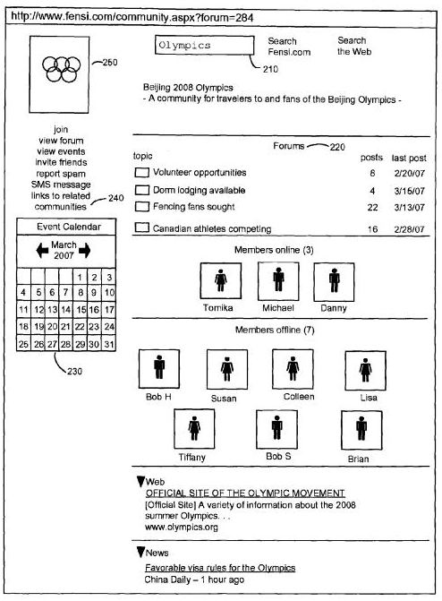

A trio of recently published patent applications from Google, originally filed in 2007, provide a hint at a possible social network from Google, but possibly more importantly give us some insights into how Google might rank objects in social networks such as:

- Communities,
- Forums,
- Members,
- Postings,
- Photographs,
- Blogs,
- Albums,
- Media files,
- Articles, and;
- Documents.

[Ranking Social Network Objects](http://appft.uspto.gov/netacgi/nph-Parser?Sect1=PTO2&Sect2=HITOFF&u=%2Fnetahtml%2FPTO%2Fsearch-adv.html&r=1&p=1&f=G&l=50&d=PG01&S1=20110022602.PGNR.&OS=dn/20110022602&RS=DN/20110022602), invented by Qingshan Luo, Hang Cui, Bo Zhang, and Dong Zhang, and published January 27, 2011, focuses primarily upon how these different objects might be ranked when found in a social network based upon the type of object involved.

When a search engine ranks a web page, a blog post, or a news article, it can look at things like how often certain keywords appear within those documents. In addition, it can see how many pages link to those pages, and look at many other signals that might help rank how they appear in search results.

Within social networks, a different set of signals may apply. For example, a social network user may be given a rank based upon things like how many “friends” or “fans” they may have, how many times their profiles were viewed, and even whether or not they have a photo.

A forum topic might be ranked by things like the number of replies and number of views, the time of a reply or view, and the relative importance of replies and views. An alternative and simpler approach might be based upon the time of the publication of a post, and how fresh it is.

A “Community” within a social network might be ranked based upon its posts, looking at something like the PageRank of each individual post within that community, and the total number of posts. In addition, it may be ranked based upon its members, looking at how many members it might have, their individual rankings, how long they’ve been members, and rankings of communities might be boosted based upon how recently the last post or reply might have been made in a forum or blog or community.

Two related patent filings make it look like Google was planning a social network that may look something like this:

The patent applications were originally filed on August 17, 2007. The others focus more upon how a specific social network might work:

- [Multi-Community Content Sharing in Online Social Networks](http://appft.uspto.gov/netacgi/nph-Parser?Sect1=PTO2&Sect2=HITOFF&u=%2Fnetahtml%2FPTO%2Fsearch-adv.html&r=1&p=1&f=G&l=50&d=PG01&S1=20110010384.PGNR.&OS=dn/20110010384&RS=DN/20110010384)
- [Dynamically Naming Communities within Online Social Networks](http://appft.uspto.gov/netacgi/nph-Parser?Sect1=PTO2&Sect2=HITOFF&u=%2Fnetahtml%2FPTO%2Fsearch-adv.html&r=1&p=1&f=G&l=50&d=PG01&S1=20110022621.PGNR.&OS=dn/20110022621&RS=DN/20110022621)

Some of the features described in these patent filings may make their way into a rumored [Google +1](https://techcrunch.com/2010/12/04/google-plus-one-iphone-facebook-loop/) social network.

What do you think Google’s social network might look like?
