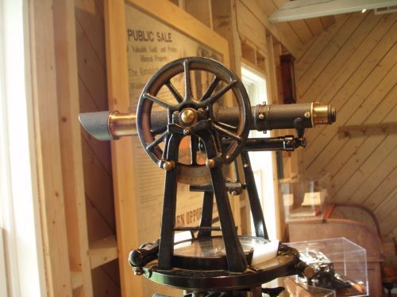
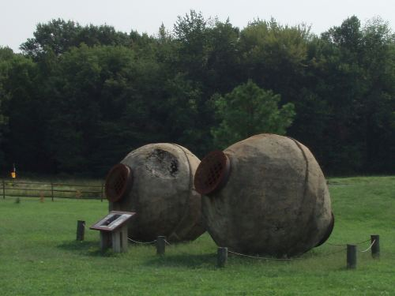

As much as I love exploring search engines and how they tick, sometimes it’s good to get away from behind the monitor and go exploring outdoors.

I’ve been writing recently about how search engines might mine data found on the Web and in their log files to learn more about the intent behind searcher’s queries. Still, I learned a little about a different kind of mining this past weekend with a local Gold Mining Camp Museum trip.

The earliest history of [gold mining in Virginia](http://web.archive.org/web/20121203135809/http://www.dmme.virginia.gov/DMR3/gold.shtml) dates back to 1804, and miners dug ore out of Virginia’s mines until World War II, though many speculators moved out West during the California Gold Rush. In the early 1800s, Virginia and surrounding southern states were the major gold-producing region in the United States.

A fascinating sight at the Museum was a couple of devices known locally as “Hornet’s Balls.”

These hornet’s balls were found at an old mine located about a mile away from the museum, and for some reason, they captured my attention. About 7 feet tall and 20 feet around, they would be filled with ore and rolled to help the ore break up so that gold could be more easily extracted from the rock.

These devices’ names came from the sound that they make when they are rolled around – like the noise made by hornets. I tried to find out more about the name but didn’t find much – the term itself appears to be a local one.

The first printed reference to gold in Virginia was a 1782 discovery of a 4-pound gold-bearing rock by Thomas Jefferson along the Rappahannock River. The gold mining industry in Virginia was most active just before the California gold rush.

Toward the end of the Civil War, Union troops destroyed many gold mines to damage the South’s economy. During World War II, many mines were shut down so that labor could be focused upon the war effort.

There’s probably a lesson to be learned about how an industry can be tugged at by outside forces. According to a [document](http://web.archive.org/web/20121124082143/http://www.dmme.virginia.gov/DMR3/dmrpdfs/GOLD.pdf) (pdf) from the Virginia Division of Mineral Resources, gold production in the US has been increasing since the 70s and 80s after several innovations in gold extraction were developed that makes it easier to process ore at lower costs.

I don’t know if that means that gold mining might return to Virginia someday, though I’d love to see one of these hornet’s balls in action.
